# data/raw 原始文件说明与复现状态

- 生成时间：2026-09-21T17:42:19+08:00
- 扫描目录：`D:\Competition\ZY_Project\选题五\mainProj\data\raw`
- 生成脚本：`mainProj/scripts/raw_data_dictionary_report.py`，版本 `1.1.0`
- 项目结构报告：`mainProj/docs/project_structure_report.md`
- 元数据来源：优先复用 `D:\Competition\ZY_Project\选题五\mainProj\docs\raw_data_inventory_report.md` 中的行数、列数和 SHA-256；CSV 正文只读取表头。
- 解释原则：WRDS/Compustat/CRSP 字段优先使用本地 PDF 字典；无本地字典的供应商字段明确标注为字段名/项目用法推断，需供应商字典核验。

## 一、总览

- CSV 文件：20 个
- PDF 字典：5 个
- raw 目录内辅助脚本：2 个
- 重要提醒：文件存在不等于官方论文复现已经完成；当前项目已经跑通的是 Python 研究原型。

| 文件 | 类型 | 大小 | 行数 | 列数 | SHA-256 | 说明 |
|---|---|---:|---:|---:|---|---|
| `13f/13ftype1.csv` | CSV | 38.14 MiB | 512,040 | 8 | `c092d7a256bd9813ce96d8d0bce65015d7e1f33e296dfeb923d980ac03176ba3` | 13F Type 1 管理人主表 |
| `13f/s34.csv` | CSV | 18.35 GiB | 127,142,721 | 22 | `88070eb7af9f264f0533d2719b0410a57531466439b356408c773cebbfc4ddc6` | WRDS 13F s34 合并持仓表 |
| `13f/stock_ownership_summary_csv.csv` | CSV | 210.43 MiB | 1,813,910 | 18 | `f4de655051d1ad0ab32fd301549b941e9b228af2b1977721c5c6167797fdd005` | 13F 机构持股汇总表副本 |
| `13f/stockownershipsummary.csv` | CSV | 210.43 MiB | 1,813,910 | 18 | `f4de655051d1ad0ab32fd301549b941e9b228af2b1977721c5c6167797fdd005` | 13F 机构持股汇总表副本 |
| `13f/type1.csv` | CSV | 38.14 MiB | 512,040 | 8 | `c092d7a256bd9813ce96d8d0bce65015d7e1f33e296dfeb923d980ac03176ba3` | 13F Type 1 管理人主表 |
| `13f/type2.csv` | CSV | 133.23 MiB | 1,977,948 | 12 | `2702bd9a299864160febfd08a89c7177478fa9aa00398da9149f6fb97cab187c` | 13F Type 2 证券主表 |
| `13f/type3.csv` | CSV | 5.10 GiB | 127,140,268 | 8 | `d20cb39fc790c0cc77979128c313ee9cdb4efb82b64ee3a3647f340354893df5` | 13F Type 3 机构-证券持仓明细 |
| `13f/type4.csv` | CSV | 3.36 GiB | 107,264,129 | 5 | `b9ba9b31d42f9597047987b8477bee4bb90359c62ed187a1769f3e461e0a9fc6` | 13F Type 4 持仓变化表 |
| `American Equities.csv` | CSV | 21.78 GiB | 64,161,557 | 57 | `9127d1833efa49490443ba753696c87997392e8306f8ded2bccd217b7f3de704` | Markit/S&P Securities Finance American Equities 日频证券借贷数据 |
| `compustat_supplemental_short_interest.csv.csv` | CSV | 411.98 MiB | 5,298,058 | 9 | `5aabd70be5e172ca02b43a26acb0cc96fd826e571a94a5bc5086e75657899c23` | Compustat Supplemental Short Interest 月度/半月度空头兴趣数据 |
| `keydevelopment.csv` | CSV | 44.01 GiB | 47,767,574 | 26 | `e8f21aec8be8652baa919be210e764cdc8acba292d7e097080a378bb4f7d5e4a` | Capital IQ Key Developments 公司事件数据 |
| `link.csv` | CSV | 48.83 MiB | 110,053 | 47 | `fcec8fc3cb86e587fe89e9430519c2534d1b3e5049e87d2fd9d2ce88931da552` | Compustat-CRSP link-like 公司证券链接表 |
| `output_head.csv` | CSV | 2.70 KiB | 9 | 57 | `8780b6fd11595bf8492834f5585b0cb217a2992b301d36d5db510a8626426a65` | American Equities.csv 的前若干行样例输出 |
| `stockownershipsummary.csv` | CSV | 210.43 MiB | 1,813,910 | 18 | `f4de655051d1ad0ab32fd301549b941e9b228af2b1977721c5c6167797fdd005` | 13F 机构持股汇总表 |
| `属性/CRSP_Stock Header Information(new).csv` | CSV | 9.64 MiB | 40,518 | 36 | `d4c5880976f44067ce56df239fdafca3efc66ff420f24044f6e68abb253c5b59` | CRSP CIZ Stock Header Information |
| `日频/crsp0025(daily).csv` | CSV | 26.44 GiB | 49,886,907 | 94 | `9fc00f674babae26553a4d78a521bb84fb4df98a181d6cc6db499bd58f175ff8` | CRSP CIZ Daily Stock File 分片 1 |
| `日频/crsp2599(daily).csv` | CSV | 29.78 GiB | 60,398,762 | 94 | `5e6148942c8fb66bb96075bac075d950faff5d5f4effae5af799ee0736c9562d` | CRSP CIZ Daily Stock File 分片 2 |
| `月频/Comp_Quarterly6126.csv` | CSV | 4.25 GiB | 2,110,695 | 679 | `894a434adc17311ec00e7bbbd6ae576a5a18a48bc9ee6af0a9f70fd23763cf43` | Compustat Fundamentals Quarterly |
| `股利分配/CRSP_Distribution.csv` | CSV | 123.41 MiB | 1,101,681 | 22 | `6a978df83062f2e97538383d0927dcd41a386fa6375d47ba3aaa8d9da76c9287` | CRSP CIZ Distribution Information |
| `退市/crsp_Delisting.csv` | CSV | 3.44 MiB | 29,833 | 22 | `a9800152e2a5a422a96f85deb138b0a24fe4afb5ab3f98c6c815d72977f0213f` | CRSP CIZ Delisting Information |
| `属性/CRSP_Stock Header Information(new).pdf` | PDF | 47.73 KiB | — | — | `23cace5a6e602f1e7d0c22f8053494780c39943a5f97e1c29b7ab3479a09fec0` | CRSP Stock Header Information 字段字典 PDF |
| `日频/crsp2525(daily).pdf` | PDF | 69.41 KiB | — | — | `28c11082154c98ed2c6b33cabab5d3e732269c5944a6e952e80f9e5d5ba07a3d` | CRSP Daily Stock File 字段字典 PDF |
| `月频/Comp_Quarterly6126.pdf` | PDF | 400.37 KiB | — | — | `ff9337996434abdbfc24e77468530f2e3c2192ea7187e67900bda26cdd455396` | Compustat Fundamentals Quarterly 字段字典 PDF |
| `股利分配/CRSP_Distribution.pdf` | PDF | 593.10 KiB | — | — | `e21f15d78fbb88caf580b01ffdab0e8dbe2fdae71d1d6313cbe46db5c8a2a4bd` | CRSP Distribution 字段字典 PDF |
| `退市/crsp_Delisting.pdf` | PDF | 44.39 KiB | — | — | `46a1fde4bd8cfe06da61a1cf1142365e41a10669cb486a79d336117e18c6d432` | CRSP Delisting 字段字典 PDF |
| `peek_line.py` | 辅助脚本 | 583.00 B | — | — | `未计算` | Markit 行数统计辅助脚本 |
| `peek_row.py` | 辅助脚本 | 1.16 KiB | — | — | `未计算` | Markit 表头/样例导出辅助脚本 |

## 二、重复与规范输入

- `13f/13ftype1.csv` 与 `13f/type1.csv` 内容哈希相同；建议后续以 `13f/type1.csv` 为规范输入。
- `13f/stock_ownership_summary_csv.csv`、`13f/stockownershipsummary.csv` 与根目录 `stockownershipsummary.csv` 内容哈希相同；建议后续以根目录 `stockownershipsummary.csv` 为规范输入。
- `output_head.csv` 是 `American Equities.csv` 的调试样例，不是独立原始数据源。
- `peek_line.py` 与 `peek_row.py` 是辅助脚本，误放在 raw 目录下；本报告记录它们，但不把它们算作论文数据输入。

## 三、复现完成情况矩阵

| 数据需求 | 当前状态 | 本地证据 | 复现含义 |
|---|---|---|---|
| Markit/S&P Securities Finance American Equities | **已取得** | `American Equities.csv` | 核心借券费原始文件存在；IndicativeFee 等字段仍需供应商口径最终核验。 |
| CRSP 日频股票文件 | **已取得并用于 Python 原型** | `日频/crsp0025(daily).csv`, `日频/crsp2599(daily).csv` | 已构建 CRSP 月度普通股面板；CIZ 普通股筛选需说明其与旧版 share code 的差别。 |
| CRSP Stock Header | **已取得并用于 Python 原型** | `属性/CRSP_Stock Header Information(new).csv` | 用于历史 CUSIP 和证券属性映射。 |
| CRSP Distribution | **已取得** | `股利分配/CRSP_Distribution.csv` | 可用于分红/拆股事件核验；当前主原型未单独读入。 |
| CRSP Delisting | **已取得但未完整并入原型** | `退市/crsp_Delisting.csv` | 官方级复现需要把 DelRet 正确并入收益。 |
| Compustat Quarterly | **已取得** | `月频/Comp_Quarterly6126.csv` | 是季度 fundq，不是论文所需 annual funda 的完整替代。 |
| CCM/link-like 表 | **基本具备** | `link.csv` | 可支持 gvkey-PERMNO 链接；使用时必须按有效日期。 |
| Compustat supplemental short interest | **已取得** | `compustat_supplemental_short_interest.csv.csv` | 可支持 Table IX 类扩展；字段单位与频率需核验。 |
| 13F 机构持股 | **已取得** | `13f/` 多个 type/s34/summary 文件 | 可支持机构持股分母和集中度审计；需处理重复、修正件和 point-in-time。 |
| Capital IQ Key Developments | **已取得但当前未使用** | `keydevelopment.csv` | 可作为事件研究扩展，非当前论文复现必需输入。 |
| 官方 JKMP 打包输入 | **缺失** | `usa.csv`, `usa_dsf.csv`, `world_ret_monthly.csv` 等未发现 | 因此不能声称官方 JKMP 全量复现完成。 |
| OSAP/Chen-Zimmermann 论文 exact vintage 信号面板 | **缺失/未确认** | 未在 `data/raw` 发现 `signed_predictors_dl_wide.zip` | 无法直接复刻 162 个异象完整组合。 |
| DGTW/因子收益成品 | **缺失** | 未发现成品 DGTW 或因子收益文件 | 后续需自建或补齐。 |
| Compustat Annual 与 Pension Annual | **缺失** | 仅发现 quarterly fundq | 严格账面权益/DGTW 构造仍不完整。 |
| R/Rscript 与 HPC/SLURM 官方环境 | **缺失/未配置** | 当前项目是 Python 原型 | 不等同于官方复制包运行环境。 |
## 四、描述性统计与分析图表

本节把 `reports/figures/` 中已有图表统一登记。图表只链接现有 PNG，不复制数据或图片；“规范”表示当前主流程生成的正式输出，“机制验证原型”表示用于检查借券费进入优化目标的 Python 原型，“历史/测试”不进入主结论。

- 图表目录：`D:\Competition\ZY_Project\选题五\mainProj\reports\figures`
- 实际发现 PNG：17 个
- 已登记图表：17 个

| 图表 | 类别 | 来源数据 | 生成脚本 | 状态 |
|---|---|---|---|---|
| `markit/crsp_fee_by_size_group.png` | CRSP 横截面费用 | `data/prod/crsp_fee_by_size_group.csv` | `scripts/make_research_reports.py` | **规范描述性图表；文件存在** |
| `markit/fee_log_histogram.png` | Markit 分布诊断 | `data/mid/markit/ 与 data/prod/markit_fee_descriptive.csv` | `scripts/markit_coverage.py` | **规范描述性图表；文件存在** |
| `markit/fee_rank_group_boxplot.png` | Markit 分组诊断 | `data/mid/markit/ 与 data/prod/markit_fee_descriptive.csv` | `scripts/markit_coverage.py` | **规范诊断图；文件存在** |
| `markit/fee_timeseries.png` | Markit 时间序列 | `data/prod/markit_fee_timeseries.csv` | `scripts/markit_coverage.py` | **规范描述性图表；文件存在** |
| `presentation/fig01_coverage_heatmap.png` | 数据覆盖与匹配 | `data/prod/markit_coverage.csv 与 data/prod/crsp_markit_matching_summary.csv` | `scripts/make_presentation_visuals.py` | **规范汇报图表；文件存在** |
| `presentation/fig02_sample_timeline.png` | 样本规模时间线 | `data/prod/markit_stock_monthly.parquet 与 data/prod/crsp_monthly_panel.parquet` | `scripts/make_presentation_visuals.py` | **规范汇报图表；文件存在** |
| `presentation/fig03_fee_timeseries_annotated.png` | 费用动态 | `data/prod/markit_fee_timeseries.csv` | `scripts/make_presentation_visuals.py` | **规范汇报图表；文件存在** |
| `presentation/fig04_key_year_fee_distributions.png` | 关键年份横截面 | `data/prod/markit_stock_monthly.parquet` | `scripts/make_presentation_visuals.py` | **规范描述性图表；文件存在** |
| `presentation/fig05_fee_by_size_group.png` | 市值梯度 | `data/prod/crsp_fee_by_size_group.csv` | `scripts/make_presentation_visuals.py` | **规范描述性图表；文件存在** |
| `presentation/fig06_variance_persistence.png` | 方差分解与持续性 | `data/prod/markit_fee_variance_decomposition.csv 与 data/prod/markit_fee_persistence.csv` | `scripts/make_presentation_visuals.py` | **规范描述性图表；文件存在** |
| `presentation/fig07_crsp_markit_funnel.png` | 样本筛选漏斗 | `data/prod/crsp_monthly_panel.parquet` | `scripts/make_presentation_visuals.py` | **规范数据审计图；文件存在** |
| `presentation/fig08_m0_m3_dashboard.png` | M0-M3 原型结果 | `data/prod/prototype_summary.csv` | `scripts/make_presentation_visuals.py` | **机制验证原型；文件存在** |
| `presentation/fig09_m2_m3_core_comparison.png` | M2-M3 机制比较 | `data/prod/prototype_monthly_metrics.csv 与 data/prod/prototype_summary.csv` | `scripts/make_presentation_visuals.py` | **机制验证原型；文件存在** |
| `presentation/fig10_sensitivity_panel.png` | M2-M3 敏感性 | `data/prod/prototype_sensitivity.csv` | `scripts/make_presentation_visuals.py` | **机制验证原型；文件存在** |
| `presentation/fig11_m0_m3_method_flow.png` | 方法流程 | `scripts/run_m0_m3_prototype.py 与 data/prod/prototype_metadata.json` | `scripts/make_presentation_visuals.py` | **方法说明图；文件存在** |
| `prototype/m0_m3_cumulative_net_returns.png` | M0-M3 累计结果 | `data/prod/prototype_monthly_metrics.csv` | `scripts/run_m0_m3_prototype.py` | **规范原型图表；文件存在** |
| `prototype_test3/m0_m3_cumulative_net_returns.png` | M0-M3 测试结果 | `data/prod/test_proto3/prototype_monthly_metrics.csv` | `scripts/run_m0_m3_prototype.py` | **历史/测试图表；文件存在** |

### 4.1 `markit/crsp_fee_by_size_group.png`

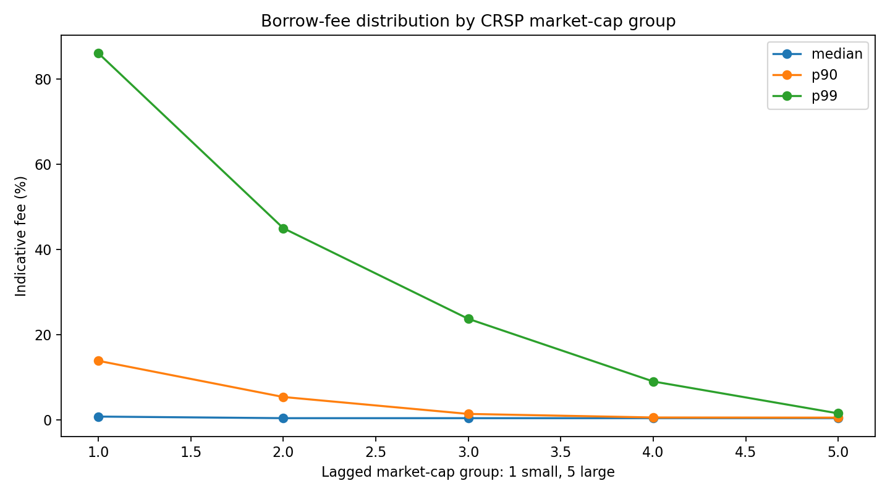

- 文件状态：**存在**
- 图表类别：CRSP 横截面费用
- 来源数据：`data/prod/crsp_fee_by_size_group.csv`
- 生成脚本：`scripts/make_research_reports.py`
- 规范状态：规范描述性图表
- 展示什么：按 CRSP 滞后市值五组展示借券费的中位数、90 分位和 99 分位。
- 怎么读：横轴从小市值组到大市值组，纵轴为年化 Indicative fee 百分比；重点比较不同分位数的斜率和尾部高度。
- 主要解读：小市值股票的费用中位数和高分位通常更高，说明借券成本的横截面差异可能与规模和可借性有关。
- 解释边界：这是 CRSP 合格股票样本的市值分组描述，不是控制其他特征后的因果估计，也不等于论文中的 alpha 检验。

### 4.2 `markit/fee_log_histogram.png`

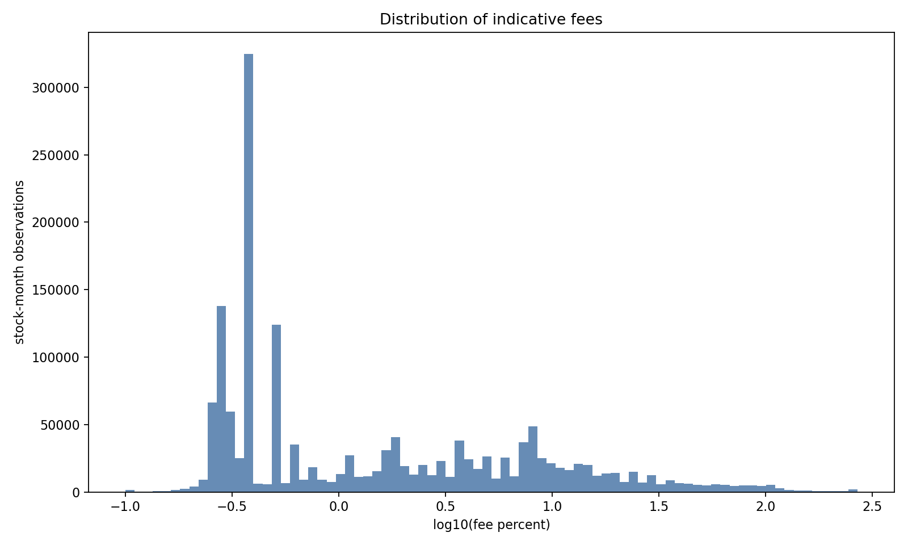

- 文件状态：**存在**
- 图表类别：Markit 分布诊断
- 来源数据：`data/mid/markit/ 与 data/prod/markit_fee_descriptive.csv`
- 生成脚本：`scripts/markit_coverage.py`
- 规范状态：规范描述性图表
- 展示什么：展示 Indicative fee 百分比的对数分布，观察主体区间和右尾。
- 怎么读：横轴是 fee percent 的 log10 变换，纵轴是股票-月份观察数；对数尺度下横向距离代表数量级差异。
- 主要解读：费用分布明显右偏，少量极高费用观察会拉高均值，因此中位数、分位数和尾部指标比均值更适合一起报告。
- 解释边界：绘图将下界限制为正值，并把上界裁到 99.9% 分位附近；图形用于看形状，不代表未裁剪的完整极端值分布。

### 4.3 `markit/fee_rank_group_boxplot.png`

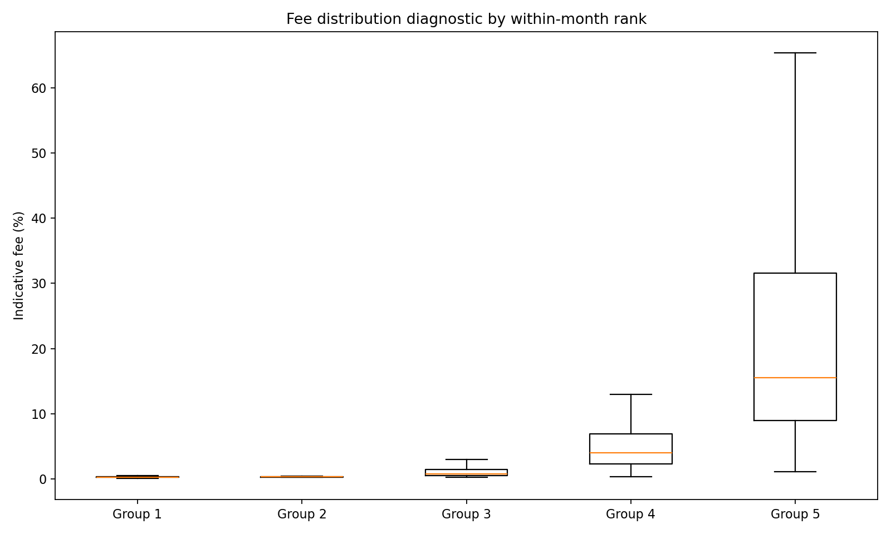

- 文件状态：**存在**
- 图表类别：Markit 分组诊断
- 来源数据：`data/mid/markit/ 与 data/prod/markit_fee_descriptive.csv`
- 生成脚本：`scripts/markit_coverage.py`
- 规范状态：规范诊断图
- 展示什么：按月内费用排名构造的五组箱线图，用于检查费用排序后的分布差异。
- 怎么读：箱体表示组内四分位区间，中线表示中位数；各组是每月内部排名组，不是市值组。
- 主要解读：该图检查费用排序和极端值是否稳定，帮助判断费用信号是否有明显横截面层次。
- 解释边界：不能把 Group 1 至 Group 5 解释为小盘到大盘；它不是因子收益或投资组合回测结果。

### 4.4 `markit/fee_timeseries.png`

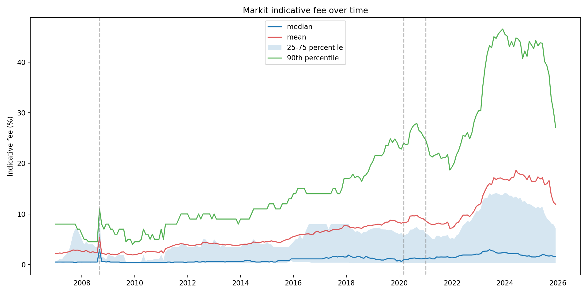

- 文件状态：**存在**
- 图表类别：Markit 时间序列
- 来源数据：`data/prod/markit_fee_timeseries.csv`
- 生成脚本：`scripts/markit_coverage.py`
- 规范状态：规范描述性图表
- 展示什么：展示费用中位数、均值、25-75 分位区间和 90 分位随月份的变化。
- 怎么读：先看中位数和四分位带的长期水平，再看均值和 90 分位是否在危机或高费用阶段明显抬升。
- 主要解读：费用不是固定常数，而是随时间和市场状态变化的持有成本；均值与高分位的分离体现右尾风险。
- 解释边界：事件线只是时间定位，不构成事件研究；2026 年若出现只代表部分年度的观察。

### 4.5 `presentation/fig01_coverage_heatmap.png`

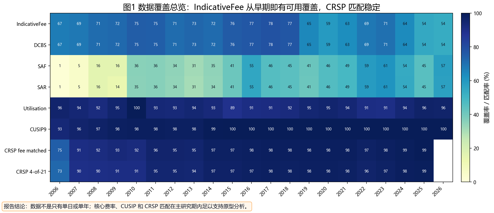

- 文件状态：**存在**
- 图表类别：数据覆盖与匹配
- 来源数据：`data/prod/markit_coverage.csv 与 data/prod/crsp_markit_matching_summary.csv`
- 生成脚本：`scripts/make_presentation_visuals.py`
- 规范状态：规范汇报图表
- 展示什么：按年份汇总 IndicativeFee、供需字段、CUSIP9 和 CRSP-Markit 匹配覆盖率。
- 怎么读：颜色越深表示覆盖或匹配比例越高；需要区分 Markit 字段覆盖和 CRSP 样本匹配，它们不是同一个分母。
- 主要解读：核心费用字段和匹配结果在主要研究区间内具备持续覆盖，支持继续做样本构建和机制原型。
- 解释边界：2026 年可能是部分年度；覆盖率高不等于字段单位、经济含义和匹配误差已经完全核验。

### 4.6 `presentation/fig02_sample_timeline.png`

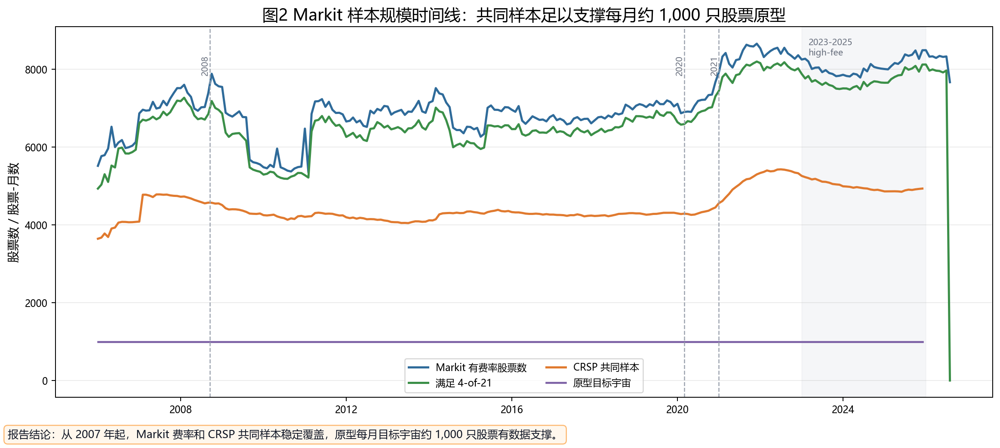

- 文件状态：**存在**
- 图表类别：样本规模时间线
- 来源数据：`data/prod/markit_stock_monthly.parquet 与 data/prod/crsp_monthly_panel.parquet`
- 生成脚本：`scripts/make_presentation_visuals.py`
- 规范状态：规范汇报图表
- 展示什么：比较 Markit 有费用股票、满足 4-of-21 条件的股票、CRSP 共同样本和原型目标宇宙的月度规模。
- 怎么读：观察各条线的长期水平、突变和彼此之间的筛选损耗；不要把股票数和股票-月份数混为一谈。
- 主要解读：主要研究期内共同样本规模足以支撑每月约 1,000 只股票的原型选择。
- 解释边界：不同曲线的定义和筛选条件不同，不能只根据曲线高度判断数据质量；2026 年为不完整样本期。

### 4.7 `presentation/fig03_fee_timeseries_annotated.png`

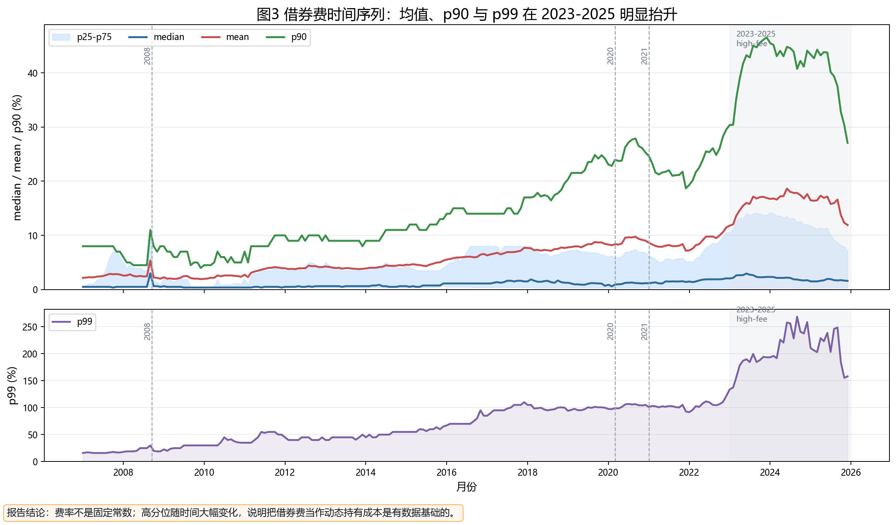

- 文件状态：**存在**
- 图表类别：费用动态
- 来源数据：`data/prod/markit_fee_timeseries.csv`
- 生成脚本：`scripts/make_presentation_visuals.py`
- 规范状态：规范汇报图表
- 展示什么：将费用中位数、均值、90 分位、99 分位和四分位带放在同一时间轴，并标注重要市场阶段。
- 怎么读：中位数反映典型股票，90/99 分位反映尾部；均值高于中位数时说明右尾对总体均值有影响。
- 主要解读：高费用阶段主要体现在高分位和均值的抬升，说明借券成本具有状态依赖和尾部风险。
- 解释边界：时间共变不能单独证明费用导致收益或异象；事件标注用于描述背景，不是正式识别设计。

### 4.8 `presentation/fig04_key_year_fee_distributions.png`

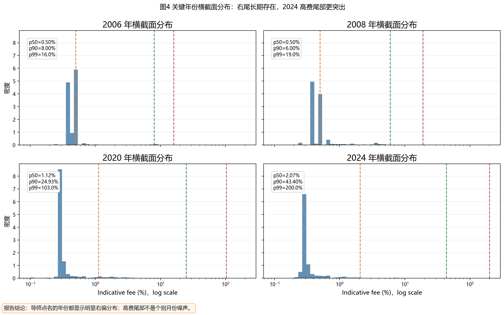

- 文件状态：**存在**
- 图表类别：关键年份横截面
- 来源数据：`data/prod/markit_stock_monthly.parquet`
- 生成脚本：`scripts/make_presentation_visuals.py`
- 规范状态：规范描述性图表
- 展示什么：比较 2006、2008、2020 和 2024 年的月度费用横截面分布。
- 怎么读：横轴为对数尺度；虚线分别标记中位数、90 分位和 99 分位，重点看分布整体移动还是只有尾部扩张。
- 主要解读：不同年份均存在右偏，2024 年高费用尾部更突出，说明尾部变化不能被单个平均值概括。
- 解释边界：每个面板是年度内股票-月份观察的合并分布，不是同一批股票的平衡面板，也不进行因果比较。

### 4.9 `presentation/fig05_fee_by_size_group.png`

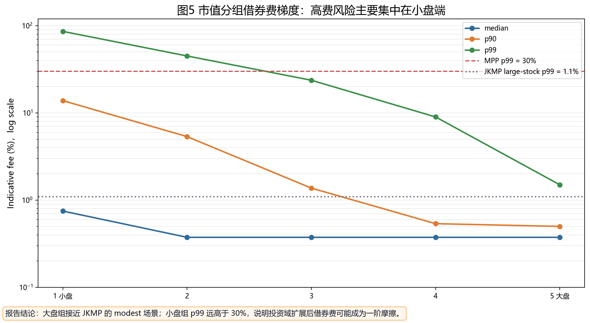

- 文件状态：**存在**
- 图表类别：市值梯度
- 来源数据：`data/prod/crsp_fee_by_size_group.csv`
- 生成脚本：`scripts/make_presentation_visuals.py`
- 规范状态：规范描述性图表
- 展示什么：展示五个 CRSP 市值组的中位数、90 分位和 99 分位，并加入外部文献口径参考线。
- 怎么读：使用对数纵轴比较不同数量级；先看组间梯度，再看小盘组的尾部是否远高于大盘组。
- 主要解读：借券费尾部风险集中在小市值端；大市值组更接近外部文献中较温和的费用情景。
- 解释边界：MPP 和 JKMP 参考线不一定与当前样本、字段定义和筛选口径完全一致，只能作背景比较，不能视为同口径检验。

### 4.10 `presentation/fig06_variance_persistence.png`

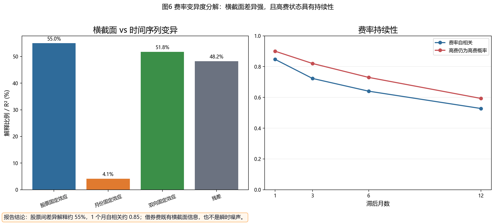

- 文件状态：**存在**
- 图表类别：方差分解与持续性
- 来源数据：`data/prod/markit_fee_variance_decomposition.csv 与 data/prod/markit_fee_persistence.csv`
- 生成脚本：`scripts/make_presentation_visuals.py`
- 规范状态：规范描述性图表
- 展示什么：左侧展示股票固定效应、月份固定效应和双向分解，右侧展示费用自相关及高费用状态持续概率。
- 怎么读：左图看横截面和时间维度对费用变异的描述性贡献；右图看滞后月数增加后相关性和高费状态延续率如何下降。
- 主要解读：费用既有稳定的股票间差异，也有显著的时间持续性，不像纯粹的瞬时噪声。
- 解释边界：这是描述性分解，不是结构模型或因果识别；固定效应分解的数值依赖样本、缺失处理和当前实现方式。

### 4.11 `presentation/fig07_crsp_markit_funnel.png`

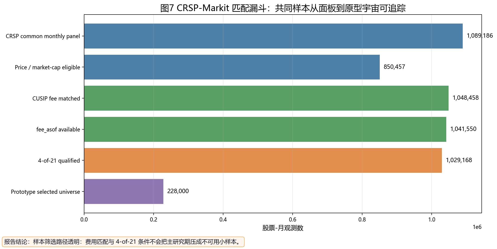

- 文件状态：**存在**
- 图表类别：样本筛选漏斗
- 来源数据：`data/prod/crsp_monthly_panel.parquet`
- 生成脚本：`scripts/make_presentation_visuals.py`
- 规范状态：规范数据审计图
- 展示什么：展示 CRSP 月度面板、价格市值资格、费用匹配、fee_asof、4-of-21 条件和原型宇宙的逐层数量。
- 怎么读：从上到下阅读每一层筛选后的股票-月份观察数，关注费用匹配和 4-of-21 条件带来的损耗。
- 主要解读：样本筛选链路透明可追踪，当前研究样本不是凭空产生，而是从 CRSP 面板逐层筛选得到。
- 解释边界：各层指标仍受匹配口径、时间可得性和目标宇宙约束影响；漏斗本身不证明样本没有选择偏差。

### 4.12 `presentation/fig08_m0_m3_dashboard.png`

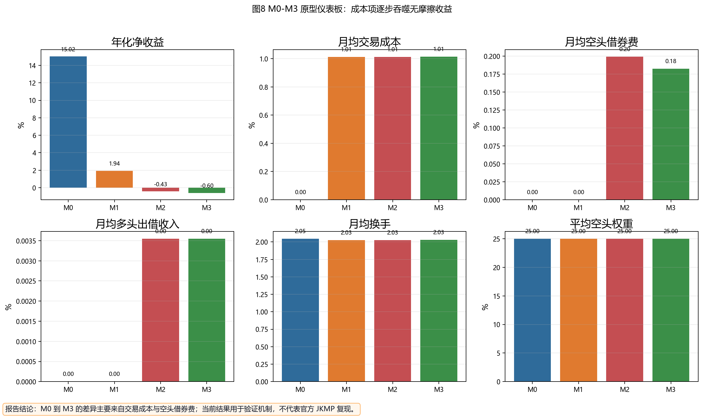

- 文件状态：**存在**
- 图表类别：M0-M3 原型结果
- 来源数据：`data/prod/prototype_summary.csv`
- 生成脚本：`scripts/make_presentation_visuals.py`
- 规范状态：机制验证原型
- 展示什么：比较 M0 到 M3 的年化净收益、交易成本、空头借券费、多头出借收入、换手和空头权重。
- 怎么读：沿模型序列阅读成本项如何逐步加入；M0 是无成本基准，M1 加交易成本，M2 事后扣借券费，M3 将借券费纳入目标函数。
- 主要解读：当前原型中成本项会显著改变净收益和模型间差异，说明借券费值得作为内生持有成本研究。
- 解释边界：这些结果是 Python 机制原型，不是官方 JKMP 全量复现，也不能直接当作最终 alpha 或投资建议。

### 4.13 `presentation/fig09_m2_m3_core_comparison.png`

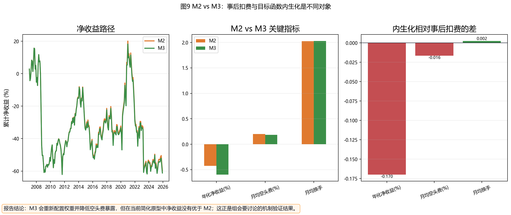

- 文件状态：**存在**
- 图表类别：M2-M3 机制比较
- 来源数据：`data/prod/prototype_monthly_metrics.csv 与 data/prod/prototype_summary.csv`
- 生成脚本：`scripts/make_presentation_visuals.py`
- 规范状态：机制验证原型
- 展示什么：比较 M2 与 M3 的累计净收益路径、核心指标和 M3-M2 差值。
- 怎么读：第一面板看时间路径，第二面板看汇总指标，第三面板看把借券费内生化后相对于事后扣费的变化方向。
- 主要解读：M2 与 M3 的差异用于识别费用进入优化目标后是否改变权重和成本，而不是单纯事后会计调整。
- 解释边界：M2 使用 M1 权重事后扣费，M3 是简化的内生化原型；两者差异不能直接解释为因果收益提升。

### 4.14 `presentation/fig10_sensitivity_panel.png`

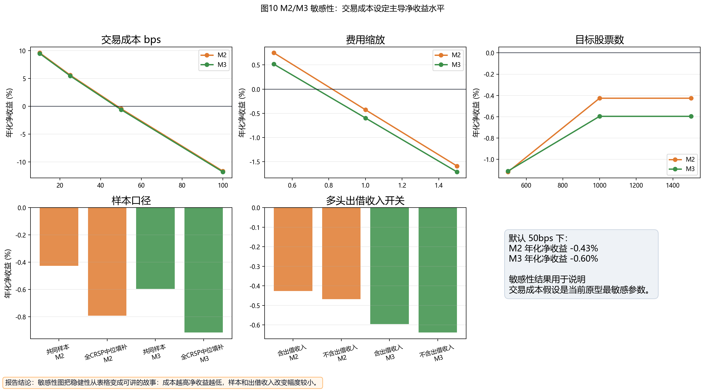

- 文件状态：**存在**
- 图表类别：M2-M3 敏感性
- 来源数据：`data/prod/prototype_sensitivity.csv`
- 生成脚本：`scripts/make_presentation_visuals.py`
- 规范状态：机制验证原型
- 展示什么：展示交易成本、费用缩放、目标股票数、样本口径和多头出借收入开关变化下的 M2/M3 结果。
- 怎么读：逐个参数观察年化净收益变化，并比较 M2 与 M3 曲线或柱形之间的相对位置。
- 主要解读：交易成本和费用口径是当前原型净收益最敏感的参数，样本和出借收入开关的影响相对需要结合具体面板解读。
- 解释边界：这是单参数敏感性，不是联合参数不确定性分析，也没有统计置信区间；结果仍受简化优化和风险代理约束。

### 4.15 `presentation/fig11_m0_m3_method_flow.png`

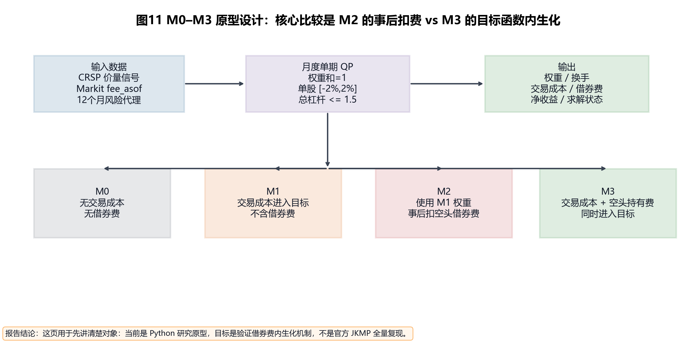

- 文件状态：**存在**
- 图表类别：方法流程
- 来源数据：`scripts/run_m0_m3_prototype.py 与 data/prod/prototype_metadata.json`
- 生成脚本：`scripts/make_presentation_visuals.py`
- 规范状态：方法说明图
- 展示什么：说明 CRSP 价量信号、Markit fee_asof、风险代理、权重约束和 M0-M3 成本处理之间的关系。
- 怎么读：按“输入 → 月度优化 → 模型分支 → 输出”阅读；重点区分 M2 的事后扣费与 M3 的目标函数内生化。
- 主要解读：该图帮助审计模型实现和解释实验设计，是机制链条的结构化说明。
- 解释边界：它不是实证结果图，也不能替代对数据、约束、求解状态和收益计算代码的审计。

### 4.16 `prototype/m0_m3_cumulative_net_returns.png`

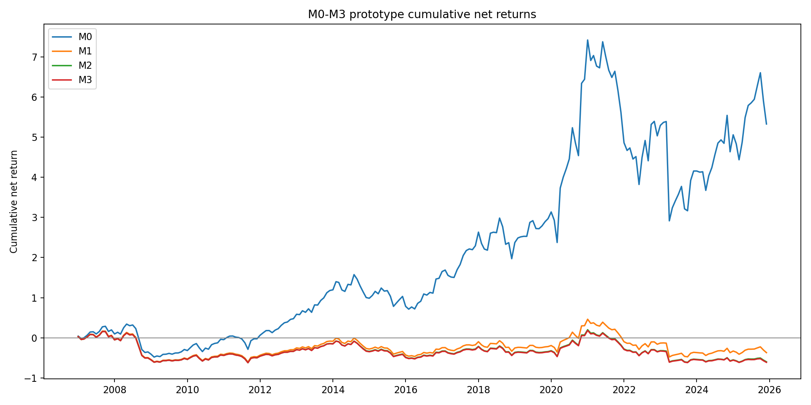

- 文件状态：**存在**
- 图表类别：M0-M3 累计结果
- 来源数据：`data/prod/prototype_monthly_metrics.csv`
- 生成脚本：`scripts/run_m0_m3_prototype.py`
- 规范状态：规范原型图表
- 展示什么：绘制 2007-01 至 2025-12 期间 M0-M3 月度净收益的累计路径。
- 怎么读：比较各模型路径的相对位置、拐点和成本加入后的长期差异；累计收益是净收益序列的连乘结果。
- 主要解读：该图直观展示成本处理如何改变原型组合的长期路径。
- 解释边界：累计路径对样本期、费用单位、交易成本和模型简化高度敏感，不是官方论文回测或稳健 alpha 证据。

### 4.17 `prototype_test3/m0_m3_cumulative_net_returns.png`

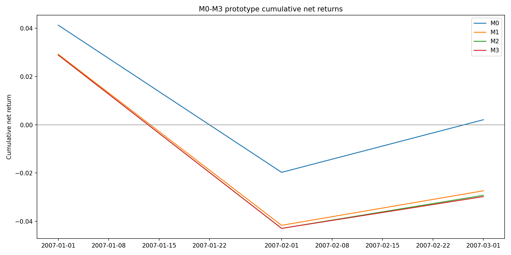

- 文件状态：**存在**
- 图表类别：M0-M3 测试结果
- 来源数据：`data/prod/test_proto3/prototype_monthly_metrics.csv`
- 生成脚本：`scripts/run_m0_m3_prototype.py`
- 规范状态：历史/测试图表
- 展示什么：展示 test_proto3 短期测试运行中的 M0-M3 累计净收益路径。
- 怎么读：仅用于检查代码、求解器和图表生成是否正常，不用于比较长期模型表现。
- 主要解读：它可以作为可复现调试痕迹，帮助确认短样本运行链路没有中断。
- 解释边界：该版本只覆盖短期测试区间，不能与规范全样本图混用，也不进入主结论。

## 五、逐文件说明与字段字典

### `13f/13ftype1.csv`

- 内容：13F Type 1 管理人主表
- 来源/怎么来的：WRDS/Thomson-Reuters 13F type1 类导出。 本地已有 CSV；与 `13f/type1.csv` 哈希相同。
- 用来干什么：提供机构管理人、报告期和管理人类型信息。
- 当前项目使用情况：当前主原型未使用；未来可用于 13F 管理人维度聚合。
- 质量与口径备注：与 `13f/type1.csv` 完全重复。
- 规范输入建议：这是 `13f/type1.csv` 的重复或样例文件，除调试外不建议单独作为研究输入。
- 文件元数据：大小 38.14 MiB；行数 512,040；列数 8；SHA-256 `c092d7a256bd9813ce96d8d0bce65015d7e1f33e296dfeb923d980ac03176ba3`。

| 字段 | 类型/角色 | 含义 | 定义来源 | 当前用途 |
|---|---|---|---|---|
| `mgrno` | 标识符 | 13F 机构管理人编号。 | WRDS/Thomson-Reuters 13F 字段惯例与字段名推断，需与 WRDS 13F 字典核验 | 用于机构持股、13F 持有人/证券/持仓和持股集中度审计；当前未进入主 M0-M3 原型。 |
| `rdate` | 日期/时点 | 13F 报告期末日期。 | WRDS/Thomson-Reuters 13F 字段惯例与字段名推断，需与 WRDS 13F 字典核验 | 用于机构持股、13F 持有人/证券/持仓和持股集中度审计；当前未进入主 M0-M3 原型。 |
| `fdate` | 日期/时点 | 13F 申报/文件日期或 WRDS 文件日期。 | WRDS/Thomson-Reuters 13F 字段惯例与字段名推断，需与 WRDS 13F 字典核验 | 用于机构持股、13F 持有人/证券/持仓和持股集中度审计；当前未进入主 M0-M3 原型。 |
| `mgrname` | 名称/文本 | 机构管理人名称。 | WRDS/Thomson-Reuters 13F 字段惯例与字段名推断，需与 WRDS 13F 字典核验 | 用于机构持股、13F 持有人/证券/持仓和持股集中度审计；当前未进入主 M0-M3 原型。 |
| `country` | 分类 | 管理人国家/地区。 | WRDS/Thomson-Reuters 13F 字段惯例与字段名推断，需与 WRDS 13F 字典核验 | 用于机构持股、13F 持有人/证券/持仓和持股集中度审计；当前未进入主 M0-M3 原型。 |
| `typecode` | 分类 | 13F 管理人或申报类型代码。 | WRDS/Thomson-Reuters 13F 字段惯例与字段名推断，需与 WRDS 13F 字典核验 | 用于机构持股、13F 持有人/证券/持仓和持股集中度审计；当前未进入主 M0-M3 原型。 |
| `permkey` | 标识符 | WRDS/Thomson 永久管理人键或映射键。 | WRDS/Thomson-Reuters 13F 字段惯例与字段名推断，需与 WRDS 13F 字典核验 | 用于机构持股、13F 持有人/证券/持仓和持股集中度审计；当前未进入主 M0-M3 原型。 |
| `prdate` | 日期/时点 | 处理日期/产品记录日期。 | WRDS/Thomson-Reuters 13F 字段惯例与字段名推断，需与 WRDS 13F 字典核验 | 用于机构持股、13F 持有人/证券/持仓和持股集中度审计；当前未进入主 M0-M3 原型。 |

### `13f/s34.csv`

- 内容：WRDS 13F s34 合并持仓表
- 来源/怎么来的：WRDS/Thomson-Reuters 13F s34 类导出。 本地已有 CSV。
- 用来干什么：把管理人、证券和持仓字段合并在一张大表中，便于直接聚合机构持股。
- 当前项目使用情况：当前主原型未使用；未来可用于 Table IX 类机构持股分母。
- 质量与口径备注：文件非常大；使用时需流式/分块读取，并处理修正件和重复申报。
- 文件元数据：大小 18.35 GiB；行数 127,142,721；列数 22；SHA-256 `88070eb7af9f264f0533d2719b0410a57531466439b356408c773cebbfc4ddc6`。

| 字段 | 类型/角色 | 含义 | 定义来源 | 当前用途 |
|---|---|---|---|---|
| `ticker` | 标识符 | 证券 ticker。 | WRDS/Thomson-Reuters 13F 字段惯例与字段名推断，需与 WRDS 13F 字典核验 | 用于机构持股、13F 持有人/证券/持仓和持股集中度审计；当前未进入主 M0-M3 原型。 |
| `fdate` | 日期/时点 | 13F 申报/文件日期或 WRDS 文件日期。 | WRDS/Thomson-Reuters 13F 字段惯例与字段名推断，需与 WRDS 13F 字典核验 | 用于机构持股、13F 持有人/证券/持仓和持股集中度审计；当前未进入主 M0-M3 原型。 |
| `mgrname` | 名称/文本 | 机构管理人名称。 | WRDS/Thomson-Reuters 13F 字段惯例与字段名推断，需与 WRDS 13F 字典核验 | 用于机构持股、13F 持有人/证券/持仓和持股集中度审计；当前未进入主 M0-M3 原型。 |
| `country` | 分类 | 管理人国家/地区。 | WRDS/Thomson-Reuters 13F 字段惯例与字段名推断，需与 WRDS 13F 字典核验 | 用于机构持股、13F 持有人/证券/持仓和持股集中度审计；当前未进入主 M0-M3 原型。 |
| `mgrno` | 标识符 | 13F 机构管理人编号。 | WRDS/Thomson-Reuters 13F 字段惯例与字段名推断，需与 WRDS 13F 字典核验 | 用于机构持股、13F 持有人/证券/持仓和持股集中度审计；当前未进入主 M0-M3 原型。 |
| `typecode` | 分类 | 13F 管理人或申报类型代码。 | WRDS/Thomson-Reuters 13F 字段惯例与字段名推断，需与 WRDS 13F 字典核验 | 用于机构持股、13F 持有人/证券/持仓和持股集中度审计；当前未进入主 M0-M3 原型。 |
| `rdate` | 日期/时点 | 13F 报告期末日期。 | WRDS/Thomson-Reuters 13F 字段惯例与字段名推断，需与 WRDS 13F 字典核验 | 用于机构持股、13F 持有人/证券/持仓和持股集中度审计；当前未进入主 M0-M3 原型。 |
| `prdate` | 日期/时点 | 处理日期/产品记录日期。 | WRDS/Thomson-Reuters 13F 字段惯例与字段名推断，需与 WRDS 13F 字典核验 | 用于机构持股、13F 持有人/证券/持仓和持股集中度审计；当前未进入主 M0-M3 原型。 |
| `cusip` | 标识符 | 13F 报告中的证券 CUSIP，通常规范化为 8 位后与 CRSP 历史 CUSIP 匹配。 | WRDS/Thomson-Reuters 13F 字段惯例 | 用于机构持仓与 CRSP 证券匹配。 |
| `shares` | 数量/规模 | 13F 报告持有股数。 | WRDS/Thomson-Reuters 13F 字段惯例与字段名推断，需与 WRDS 13F 字典核验 | 用于机构持股、13F 持有人/证券/持仓和持股集中度审计；当前未进入主 M0-M3 原型。 |
| `sole` | 数量/规模 | sole voting authority 股数。 | WRDS/Thomson-Reuters 13F 字段惯例与字段名推断，需与 WRDS 13F 字典核验 | 用于机构持股、13F 持有人/证券/持仓和持股集中度审计；当前未进入主 M0-M3 原型。 |
| `shared` | 数量/规模 | shared voting authority 股数。 | WRDS/Thomson-Reuters 13F 字段惯例与字段名推断，需与 WRDS 13F 字典核验 | 用于机构持股、13F 持有人/证券/持仓和持股集中度审计；当前未进入主 M0-M3 原型。 |
| `no` | 数量/规模 | no voting authority 股数。 | WRDS/Thomson-Reuters 13F 字段惯例与字段名推断，需与 WRDS 13F 字典核验 | 用于机构持股、13F 持有人/证券/持仓和持股集中度审计；当前未进入主 M0-M3 原型。 |
| `change` | 数量/规模 | 相对上一期的持仓变化。 | WRDS/Thomson-Reuters 13F 字段惯例与字段名推断，需与 WRDS 13F 字典核验 | 用于机构持股、13F 持有人/证券/持仓和持股集中度审计；当前未进入主 M0-M3 原型。 |
| `stkname` | 名称/文本 | 证券名称。 | WRDS/Thomson-Reuters 13F 字段惯例与字段名推断，需与 WRDS 13F 字典核验 | 用于机构持股、13F 持有人/证券/持仓和持股集中度审计；当前未进入主 M0-M3 原型。 |
| `exchcd` | 分类 | 交易所代码。 | WRDS/Thomson-Reuters 13F 字段惯例与字段名推断，需与 WRDS 13F 字典核验 | 用于机构持股、13F 持有人/证券/持仓和持股集中度审计；当前未进入主 M0-M3 原型。 |
| `stkcd` | 分类 | 股票/证券代码分类。 | WRDS/Thomson-Reuters 13F 字段惯例与字段名推断，需与 WRDS 13F 字典核验 | 用于机构持股、13F 持有人/证券/持仓和持股集中度审计；当前未进入主 M0-M3 原型。 |
| `indcode` | 分类 | 行业代码。 | WRDS/Thomson-Reuters 13F 字段惯例与字段名推断，需与 WRDS 13F 字典核验 | 用于机构持股、13F 持有人/证券/持仓和持股集中度审计；当前未进入主 M0-M3 原型。 |
| `stkcdesc` | 分类 | 股票/证券代码描述。 | WRDS/Thomson-Reuters 13F 字段惯例与字段名推断，需与 WRDS 13F 字典核验 | 用于机构持股、13F 持有人/证券/持仓和持股集中度审计；当前未进入主 M0-M3 原型。 |
| `prc` | 价格/收益 | 证券价格。 | WRDS/Thomson-Reuters 13F 字段惯例与字段名推断，需与 WRDS 13F 字典核验 | 用于机构持股、13F 持有人/证券/持仓和持股集中度审计；当前未进入主 M0-M3 原型。 |
| `shrout1` | 数量/规模 | 证券流通股数/股份数版本 1；需 WRDS 字典核验单位。 | WRDS/Thomson-Reuters 13F 字段惯例与字段名推断，需与 WRDS 13F 字典核验 | 用于机构持股、13F 持有人/证券/持仓和持股集中度审计；当前未进入主 M0-M3 原型。 |
| `shrout2` | 数量/规模 | 证券流通股数/股份数版本 2；需 WRDS 字典核验单位。 | WRDS/Thomson-Reuters 13F 字段惯例与字段名推断，需与 WRDS 13F 字典核验 | 用于机构持股、13F 持有人/证券/持仓和持股集中度审计；当前未进入主 M0-M3 原型。 |

### `13f/stock_ownership_summary_csv.csv`

- 内容：13F 机构持股汇总表副本
- 来源/怎么来的：同根目录 `stockownershipsummary.csv`。 本地已有 CSV。
- 用来干什么：同机构持股汇总。
- 当前项目使用情况：不建议作为规范输入；与根目录文件完全重复。
- 质量与口径备注：哈希重复文件。
- 规范输入建议：这是 `stockownershipsummary.csv` 的重复或样例文件，除调试外不建议单独作为研究输入。
- 文件元数据：大小 210.43 MiB；行数 1,813,910；列数 18；SHA-256 `f4de655051d1ad0ab32fd301549b941e9b228af2b1977721c5c6167797fdd005`。

| 字段 | 类型/角色 | 含义 | 定义来源 | 当前用途 |
|---|---|---|---|---|
| `rdate` | 日期/时点 | 13F 报告期末日期。 | WRDS/Thomson-Reuters 13F 字段惯例与字段名推断，需与 WRDS 13F 字典核验 | 用于机构持股、13F 持有人/证券/持仓和持股集中度审计；当前未进入主 M0-M3 原型。 |
| `cusip` | 标识符 | 13F 报告中的证券 CUSIP，通常规范化为 8 位后与 CRSP 历史 CUSIP 匹配。 | WRDS/Thomson-Reuters 13F 字段惯例 | 用于机构持仓与 CRSP 证券匹配。 |
| `stkname` | 名称/文本 | 证券名称。 | WRDS/Thomson-Reuters 13F 字段惯例与字段名推断，需与 WRDS 13F 字典核验 | 用于机构持股、13F 持有人/证券/持仓和持股集中度审计；当前未进入主 M0-M3 原型。 |
| `ticker` | 标识符 | 证券 ticker。 | WRDS/Thomson-Reuters 13F 字段惯例与字段名推断，需与 WRDS 13F 字典核验 | 用于机构持股、13F 持有人/证券/持仓和持股集中度审计；当前未进入主 M0-M3 原型。 |
| `exchcd` | 分类 | 交易所代码。 | WRDS/Thomson-Reuters 13F 字段惯例与字段名推断，需与 WRDS 13F 字典核验 | 用于机构持股、13F 持有人/证券/持仓和持股集中度审计；当前未进入主 M0-M3 原型。 |
| `stkcd` | 分类 | 股票/证券代码分类。 | WRDS/Thomson-Reuters 13F 字段惯例与字段名推断，需与 WRDS 13F 字典核验 | 用于机构持股、13F 持有人/证券/持仓和持股集中度审计；当前未进入主 M0-M3 原型。 |
| `stkcdesc` | 分类 | 股票/证券代码描述。 | WRDS/Thomson-Reuters 13F 字段惯例与字段名推断，需与 WRDS 13F 字典核验 | 用于机构持股、13F 持有人/证券/持仓和持股集中度审计；当前未进入主 M0-M3 原型。 |
| `prc` | 价格/收益 | 证券价格。 | WRDS/Thomson-Reuters 13F 字段惯例与字段名推断，需与 WRDS 13F 字典核验 | 用于机构持股、13F 持有人/证券/持仓和持股集中度审计；当前未进入主 M0-M3 原型。 |
| `shrout` | 数量/规模 | 流通股数。 | WRDS/Thomson-Reuters 13F 字段惯例与字段名推断，需与 WRDS 13F 字典核验 | 用于机构持股、13F 持有人/证券/持仓和持股集中度审计；当前未进入主 M0-M3 原型。 |
| `Top5InstOwn` | 机构持股 | 前 5 大机构持股量或比例；需 WRDS 字典核验单位。 | WRDS/Thomson-Reuters 13F 字段惯例与字段名推断，需与 WRDS 13F 字典核验 | 用于机构持股、13F 持有人/证券/持仓和持股集中度审计；当前未进入主 M0-M3 原型。 |
| `Top10InstOwn` | 机构持股 | 前 10 大机构持股量或比例；需 WRDS 字典核验单位。 | WRDS/Thomson-Reuters 13F 字段惯例与字段名推断，需与 WRDS 13F 字典核验 | 用于机构持股、13F 持有人/证券/持仓和持股集中度审计；当前未进入主 M0-M3 原型。 |
| `NumInstBlockOwners` | 机构持股 | 机构大宗持有人数量。 | WRDS/Thomson-Reuters 13F 字段惯例与字段名推断，需与 WRDS 13F 字典核验 | 用于机构持股、13F 持有人/证券/持仓和持股集中度审计；当前未进入主 M0-M3 原型。 |
| `InstBlockOwn` | 机构持股 | 机构大宗持股量或比例。 | WRDS/Thomson-Reuters 13F 字段惯例与字段名推断，需与 WRDS 13F 字典核验 | 用于机构持股、13F 持有人/证券/持仓和持股集中度审计；当前未进入主 M0-M3 原型。 |
| `NumInstOwners` | 机构持股 | 机构持有人数量。 | WRDS/Thomson-Reuters 13F 字段惯例与字段名推断，需与 WRDS 13F 字典核验 | 用于机构持股、13F 持有人/证券/持仓和持股集中度审计；当前未进入主 M0-M3 原型。 |
| `MaxInstOwn` | 机构持股 | 单一最大机构持股量或比例。 | WRDS/Thomson-Reuters 13F 字段惯例与字段名推断，需与 WRDS 13F 字典核验 | 用于机构持股、13F 持有人/证券/持仓和持股集中度审计；当前未进入主 M0-M3 原型。 |
| `InstOwn` | 机构持股 | 机构总持股量。 | WRDS/Thomson-Reuters 13F 字段惯例与字段名推断，需与 WRDS 13F 字典核验 | 用于机构持股、13F 持有人/证券/持仓和持股集中度审计；当前未进入主 M0-M3 原型。 |
| `InstOwn_HHI` | 机构持股 | 机构持股集中度 HHI。 | WRDS/Thomson-Reuters 13F 字段惯例与字段名推断，需与 WRDS 13F 字典核验 | 用于机构持股、13F 持有人/证券/持仓和持股集中度审计；当前未进入主 M0-M3 原型。 |
| `InstOwn_Perc` | 机构持股 | 机构持股比例。 | WRDS/Thomson-Reuters 13F 字段惯例与字段名推断，需与 WRDS 13F 字典核验 | 用于机构持股、13F 持有人/证券/持仓和持股集中度审计；当前未进入主 M0-M3 原型。 |

### `13f/stockownershipsummary.csv`

- 内容：13F 机构持股汇总表副本
- 来源/怎么来的：同根目录 `stockownershipsummary.csv`。 本地已有 CSV。
- 用来干什么：同机构持股汇总。
- 当前项目使用情况：不建议作为规范输入；与根目录文件完全重复。
- 质量与口径备注：哈希重复文件。
- 规范输入建议：这是 `stockownershipsummary.csv` 的重复或样例文件，除调试外不建议单独作为研究输入。
- 文件元数据：大小 210.43 MiB；行数 1,813,910；列数 18；SHA-256 `f4de655051d1ad0ab32fd301549b941e9b228af2b1977721c5c6167797fdd005`。

| 字段 | 类型/角色 | 含义 | 定义来源 | 当前用途 |
|---|---|---|---|---|
| `rdate` | 日期/时点 | 13F 报告期末日期。 | WRDS/Thomson-Reuters 13F 字段惯例与字段名推断，需与 WRDS 13F 字典核验 | 用于机构持股、13F 持有人/证券/持仓和持股集中度审计；当前未进入主 M0-M3 原型。 |
| `cusip` | 标识符 | 13F 报告中的证券 CUSIP，通常规范化为 8 位后与 CRSP 历史 CUSIP 匹配。 | WRDS/Thomson-Reuters 13F 字段惯例 | 用于机构持仓与 CRSP 证券匹配。 |
| `stkname` | 名称/文本 | 证券名称。 | WRDS/Thomson-Reuters 13F 字段惯例与字段名推断，需与 WRDS 13F 字典核验 | 用于机构持股、13F 持有人/证券/持仓和持股集中度审计；当前未进入主 M0-M3 原型。 |
| `ticker` | 标识符 | 证券 ticker。 | WRDS/Thomson-Reuters 13F 字段惯例与字段名推断，需与 WRDS 13F 字典核验 | 用于机构持股、13F 持有人/证券/持仓和持股集中度审计；当前未进入主 M0-M3 原型。 |
| `exchcd` | 分类 | 交易所代码。 | WRDS/Thomson-Reuters 13F 字段惯例与字段名推断，需与 WRDS 13F 字典核验 | 用于机构持股、13F 持有人/证券/持仓和持股集中度审计；当前未进入主 M0-M3 原型。 |
| `stkcd` | 分类 | 股票/证券代码分类。 | WRDS/Thomson-Reuters 13F 字段惯例与字段名推断，需与 WRDS 13F 字典核验 | 用于机构持股、13F 持有人/证券/持仓和持股集中度审计；当前未进入主 M0-M3 原型。 |
| `stkcdesc` | 分类 | 股票/证券代码描述。 | WRDS/Thomson-Reuters 13F 字段惯例与字段名推断，需与 WRDS 13F 字典核验 | 用于机构持股、13F 持有人/证券/持仓和持股集中度审计；当前未进入主 M0-M3 原型。 |
| `prc` | 价格/收益 | 证券价格。 | WRDS/Thomson-Reuters 13F 字段惯例与字段名推断，需与 WRDS 13F 字典核验 | 用于机构持股、13F 持有人/证券/持仓和持股集中度审计；当前未进入主 M0-M3 原型。 |
| `shrout` | 数量/规模 | 流通股数。 | WRDS/Thomson-Reuters 13F 字段惯例与字段名推断，需与 WRDS 13F 字典核验 | 用于机构持股、13F 持有人/证券/持仓和持股集中度审计；当前未进入主 M0-M3 原型。 |
| `Top5InstOwn` | 机构持股 | 前 5 大机构持股量或比例；需 WRDS 字典核验单位。 | WRDS/Thomson-Reuters 13F 字段惯例与字段名推断，需与 WRDS 13F 字典核验 | 用于机构持股、13F 持有人/证券/持仓和持股集中度审计；当前未进入主 M0-M3 原型。 |
| `Top10InstOwn` | 机构持股 | 前 10 大机构持股量或比例；需 WRDS 字典核验单位。 | WRDS/Thomson-Reuters 13F 字段惯例与字段名推断，需与 WRDS 13F 字典核验 | 用于机构持股、13F 持有人/证券/持仓和持股集中度审计；当前未进入主 M0-M3 原型。 |
| `NumInstBlockOwners` | 机构持股 | 机构大宗持有人数量。 | WRDS/Thomson-Reuters 13F 字段惯例与字段名推断，需与 WRDS 13F 字典核验 | 用于机构持股、13F 持有人/证券/持仓和持股集中度审计；当前未进入主 M0-M3 原型。 |
| `InstBlockOwn` | 机构持股 | 机构大宗持股量或比例。 | WRDS/Thomson-Reuters 13F 字段惯例与字段名推断，需与 WRDS 13F 字典核验 | 用于机构持股、13F 持有人/证券/持仓和持股集中度审计；当前未进入主 M0-M3 原型。 |
| `NumInstOwners` | 机构持股 | 机构持有人数量。 | WRDS/Thomson-Reuters 13F 字段惯例与字段名推断，需与 WRDS 13F 字典核验 | 用于机构持股、13F 持有人/证券/持仓和持股集中度审计；当前未进入主 M0-M3 原型。 |
| `MaxInstOwn` | 机构持股 | 单一最大机构持股量或比例。 | WRDS/Thomson-Reuters 13F 字段惯例与字段名推断，需与 WRDS 13F 字典核验 | 用于机构持股、13F 持有人/证券/持仓和持股集中度审计；当前未进入主 M0-M3 原型。 |
| `InstOwn` | 机构持股 | 机构总持股量。 | WRDS/Thomson-Reuters 13F 字段惯例与字段名推断，需与 WRDS 13F 字典核验 | 用于机构持股、13F 持有人/证券/持仓和持股集中度审计；当前未进入主 M0-M3 原型。 |
| `InstOwn_HHI` | 机构持股 | 机构持股集中度 HHI。 | WRDS/Thomson-Reuters 13F 字段惯例与字段名推断，需与 WRDS 13F 字典核验 | 用于机构持股、13F 持有人/证券/持仓和持股集中度审计；当前未进入主 M0-M3 原型。 |
| `InstOwn_Perc` | 机构持股 | 机构持股比例。 | WRDS/Thomson-Reuters 13F 字段惯例与字段名推断，需与 WRDS 13F 字典核验 | 用于机构持股、13F 持有人/证券/持仓和持股集中度审计；当前未进入主 M0-M3 原型。 |

### `13f/type1.csv`

- 内容：13F Type 1 管理人主表
- 来源/怎么来的：WRDS/Thomson-Reuters 13F type1 类导出。 本地已有 CSV。
- 用来干什么：提供机构管理人、报告期和管理人类型信息。
- 当前项目使用情况：当前主原型未使用；未来可用于 13F 管理人维度聚合。
- 质量与口径备注：可作为 type1 规范输入。
- 文件元数据：大小 38.14 MiB；行数 512,040；列数 8；SHA-256 `c092d7a256bd9813ce96d8d0bce65015d7e1f33e296dfeb923d980ac03176ba3`。

| 字段 | 类型/角色 | 含义 | 定义来源 | 当前用途 |
|---|---|---|---|---|
| `mgrno` | 标识符 | 13F 机构管理人编号。 | WRDS/Thomson-Reuters 13F 字段惯例与字段名推断，需与 WRDS 13F 字典核验 | 用于机构持股、13F 持有人/证券/持仓和持股集中度审计；当前未进入主 M0-M3 原型。 |
| `rdate` | 日期/时点 | 13F 报告期末日期。 | WRDS/Thomson-Reuters 13F 字段惯例与字段名推断，需与 WRDS 13F 字典核验 | 用于机构持股、13F 持有人/证券/持仓和持股集中度审计；当前未进入主 M0-M3 原型。 |
| `fdate` | 日期/时点 | 13F 申报/文件日期或 WRDS 文件日期。 | WRDS/Thomson-Reuters 13F 字段惯例与字段名推断，需与 WRDS 13F 字典核验 | 用于机构持股、13F 持有人/证券/持仓和持股集中度审计；当前未进入主 M0-M3 原型。 |
| `mgrname` | 名称/文本 | 机构管理人名称。 | WRDS/Thomson-Reuters 13F 字段惯例与字段名推断，需与 WRDS 13F 字典核验 | 用于机构持股、13F 持有人/证券/持仓和持股集中度审计；当前未进入主 M0-M3 原型。 |
| `country` | 分类 | 管理人国家/地区。 | WRDS/Thomson-Reuters 13F 字段惯例与字段名推断，需与 WRDS 13F 字典核验 | 用于机构持股、13F 持有人/证券/持仓和持股集中度审计；当前未进入主 M0-M3 原型。 |
| `typecode` | 分类 | 13F 管理人或申报类型代码。 | WRDS/Thomson-Reuters 13F 字段惯例与字段名推断，需与 WRDS 13F 字典核验 | 用于机构持股、13F 持有人/证券/持仓和持股集中度审计；当前未进入主 M0-M3 原型。 |
| `permkey` | 标识符 | WRDS/Thomson 永久管理人键或映射键。 | WRDS/Thomson-Reuters 13F 字段惯例与字段名推断，需与 WRDS 13F 字典核验 | 用于机构持股、13F 持有人/证券/持仓和持股集中度审计；当前未进入主 M0-M3 原型。 |
| `prdate` | 日期/时点 | 处理日期/产品记录日期。 | WRDS/Thomson-Reuters 13F 字段惯例与字段名推断，需与 WRDS 13F 字典核验 | 用于机构持股、13F 持有人/证券/持仓和持股集中度审计；当前未进入主 M0-M3 原型。 |

### `13f/type2.csv`

- 内容：13F Type 2 证券主表
- 来源/怎么来的：WRDS/Thomson-Reuters 13F type2 类导出。 本地已有 CSV。
- 用来干什么：提供 13F 可报告证券、CUSIP、ticker、价格、流通股数和行业/交易所信息。
- 当前项目使用情况：当前主原型未使用；未来用于 13F 持仓与证券信息匹配。
- 质量与口径备注：字段单位和 type2 具体版本需 WRDS 字典核验。
- 文件元数据：大小 133.23 MiB；行数 1,977,948；列数 12；SHA-256 `2702bd9a299864160febfd08a89c7177478fa9aa00398da9149f6fb97cab187c`。

| 字段 | 类型/角色 | 含义 | 定义来源 | 当前用途 |
|---|---|---|---|---|
| `ticker` | 标识符 | 证券 ticker。 | WRDS/Thomson-Reuters 13F 字段惯例与字段名推断，需与 WRDS 13F 字典核验 | 用于机构持股、13F 持有人/证券/持仓和持股集中度审计；当前未进入主 M0-M3 原型。 |
| `fdate` | 日期/时点 | 13F 申报/文件日期或 WRDS 文件日期。 | WRDS/Thomson-Reuters 13F 字段惯例与字段名推断，需与 WRDS 13F 字典核验 | 用于机构持股、13F 持有人/证券/持仓和持股集中度审计；当前未进入主 M0-M3 原型。 |
| `cusip` | 标识符 | 13F 报告中的证券 CUSIP，通常规范化为 8 位后与 CRSP 历史 CUSIP 匹配。 | WRDS/Thomson-Reuters 13F 字段惯例 | 用于机构持仓与 CRSP 证券匹配。 |
| `stkname` | 名称/文本 | 证券名称。 | WRDS/Thomson-Reuters 13F 字段惯例与字段名推断，需与 WRDS 13F 字典核验 | 用于机构持股、13F 持有人/证券/持仓和持股集中度审计；当前未进入主 M0-M3 原型。 |
| `ticker2` | 标识符 | 备用或历史 ticker。 | WRDS/Thomson-Reuters 13F 字段惯例与字段名推断，需与 WRDS 13F 字典核验 | 用于机构持股、13F 持有人/证券/持仓和持股集中度审计；当前未进入主 M0-M3 原型。 |
| `exchcd` | 分类 | 交易所代码。 | WRDS/Thomson-Reuters 13F 字段惯例与字段名推断，需与 WRDS 13F 字典核验 | 用于机构持股、13F 持有人/证券/持仓和持股集中度审计；当前未进入主 M0-M3 原型。 |
| `stkcd` | 分类 | 股票/证券代码分类。 | WRDS/Thomson-Reuters 13F 字段惯例与字段名推断，需与 WRDS 13F 字典核验 | 用于机构持股、13F 持有人/证券/持仓和持股集中度审计；当前未进入主 M0-M3 原型。 |
| `stkcdesc` | 分类 | 股票/证券代码描述。 | WRDS/Thomson-Reuters 13F 字段惯例与字段名推断，需与 WRDS 13F 字典核验 | 用于机构持股、13F 持有人/证券/持仓和持股集中度审计；当前未进入主 M0-M3 原型。 |
| `shrout1` | 数量/规模 | 证券流通股数/股份数版本 1；需 WRDS 字典核验单位。 | WRDS/Thomson-Reuters 13F 字段惯例与字段名推断，需与 WRDS 13F 字典核验 | 用于机构持股、13F 持有人/证券/持仓和持股集中度审计；当前未进入主 M0-M3 原型。 |
| `prc` | 价格/收益 | 证券价格。 | WRDS/Thomson-Reuters 13F 字段惯例与字段名推断，需与 WRDS 13F 字典核验 | 用于机构持股、13F 持有人/证券/持仓和持股集中度审计；当前未进入主 M0-M3 原型。 |
| `shrout2` | 数量/规模 | 证券流通股数/股份数版本 2；需 WRDS 字典核验单位。 | WRDS/Thomson-Reuters 13F 字段惯例与字段名推断，需与 WRDS 13F 字典核验 | 用于机构持股、13F 持有人/证券/持仓和持股集中度审计；当前未进入主 M0-M3 原型。 |
| `indcode` | 分类 | 行业代码。 | WRDS/Thomson-Reuters 13F 字段惯例与字段名推断，需与 WRDS 13F 字典核验 | 用于机构持股、13F 持有人/证券/持仓和持股集中度审计；当前未进入主 M0-M3 原型。 |

### `13f/type3.csv`

- 内容：13F Type 3 机构-证券持仓明细
- 来源/怎么来的：WRDS/Thomson-Reuters 13F type3 类导出。 本地已有 CSV。
- 用来干什么：提供管理人-证券-报告期持股明细和投票权拆分。
- 当前项目使用情况：当前主原型未使用；未来可聚合机构持股和计算机构分母。
- 质量与口径备注：需要处理修正件、重复记录和报告期/申报期时点。
- 文件元数据：大小 5.10 GiB；行数 127,140,268；列数 8；SHA-256 `d20cb39fc790c0cc77979128c313ee9cdb4efb82b64ee3a3647f340354893df5`。

| 字段 | 类型/角色 | 含义 | 定义来源 | 当前用途 |
|---|---|---|---|---|
| `mgrno` | 标识符 | 13F 机构管理人编号。 | WRDS/Thomson-Reuters 13F 字段惯例与字段名推断，需与 WRDS 13F 字典核验 | 用于机构持股、13F 持有人/证券/持仓和持股集中度审计；当前未进入主 M0-M3 原型。 |
| `fdate` | 日期/时点 | 13F 申报/文件日期或 WRDS 文件日期。 | WRDS/Thomson-Reuters 13F 字段惯例与字段名推断，需与 WRDS 13F 字典核验 | 用于机构持股、13F 持有人/证券/持仓和持股集中度审计；当前未进入主 M0-M3 原型。 |
| `cusip` | 标识符 | 13F 报告中的证券 CUSIP，通常规范化为 8 位后与 CRSP 历史 CUSIP 匹配。 | WRDS/Thomson-Reuters 13F 字段惯例 | 用于机构持仓与 CRSP 证券匹配。 |
| `type` | 分类 | 13F 持仓类型/记录类型代码。 | WRDS/Thomson-Reuters 13F 字段惯例与字段名推断，需与 WRDS 13F 字典核验 | 用于机构持股、13F 持有人/证券/持仓和持股集中度审计；当前未进入主 M0-M3 原型。 |
| `shares` | 数量/规模 | 13F 报告持有股数。 | WRDS/Thomson-Reuters 13F 字段惯例与字段名推断，需与 WRDS 13F 字典核验 | 用于机构持股、13F 持有人/证券/持仓和持股集中度审计；当前未进入主 M0-M3 原型。 |
| `sole` | 数量/规模 | sole voting authority 股数。 | WRDS/Thomson-Reuters 13F 字段惯例与字段名推断，需与 WRDS 13F 字典核验 | 用于机构持股、13F 持有人/证券/持仓和持股集中度审计；当前未进入主 M0-M3 原型。 |
| `shared` | 数量/规模 | shared voting authority 股数。 | WRDS/Thomson-Reuters 13F 字段惯例与字段名推断，需与 WRDS 13F 字典核验 | 用于机构持股、13F 持有人/证券/持仓和持股集中度审计；当前未进入主 M0-M3 原型。 |
| `no` | 数量/规模 | no voting authority 股数。 | WRDS/Thomson-Reuters 13F 字段惯例与字段名推断，需与 WRDS 13F 字典核验 | 用于机构持股、13F 持有人/证券/持仓和持股集中度审计；当前未进入主 M0-M3 原型。 |

### `13f/type4.csv`

- 内容：13F Type 4 持仓变化表
- 来源/怎么来的：WRDS/Thomson-Reuters 13F type4 类导出。 本地已有 CSV。
- 用来干什么：记录管理人-证券层面的持仓变化。
- 当前项目使用情况：当前主原型未使用；未来可用于持仓变化或修正件审计。
- 质量与口径备注：字段 `change` 的计算基准需 WRDS 字典核验。
- 文件元数据：大小 3.36 GiB；行数 107,264,129；列数 5；SHA-256 `b9ba9b31d42f9597047987b8477bee4bb90359c62ed187a1769f3e461e0a9fc6`。

| 字段 | 类型/角色 | 含义 | 定义来源 | 当前用途 |
|---|---|---|---|---|
| `mgrno` | 标识符 | 13F 机构管理人编号。 | WRDS/Thomson-Reuters 13F 字段惯例与字段名推断，需与 WRDS 13F 字典核验 | 用于机构持股、13F 持有人/证券/持仓和持股集中度审计；当前未进入主 M0-M3 原型。 |
| `fdate` | 日期/时点 | 13F 申报/文件日期或 WRDS 文件日期。 | WRDS/Thomson-Reuters 13F 字段惯例与字段名推断，需与 WRDS 13F 字典核验 | 用于机构持股、13F 持有人/证券/持仓和持股集中度审计；当前未进入主 M0-M3 原型。 |
| `cusip` | 标识符 | 13F 报告中的证券 CUSIP，通常规范化为 8 位后与 CRSP 历史 CUSIP 匹配。 | WRDS/Thomson-Reuters 13F 字段惯例 | 用于机构持仓与 CRSP 证券匹配。 |
| `type` | 分类 | 13F 持仓类型/记录类型代码。 | WRDS/Thomson-Reuters 13F 字段惯例与字段名推断，需与 WRDS 13F 字典核验 | 用于机构持股、13F 持有人/证券/持仓和持股集中度审计；当前未进入主 M0-M3 原型。 |
| `change` | 数量/规模 | 相对上一期的持仓变化。 | WRDS/Thomson-Reuters 13F 字段惯例与字段名推断，需与 WRDS 13F 字典核验 | 用于机构持股、13F 持有人/证券/持仓和持股集中度审计；当前未进入主 M0-M3 原型。 |

### `American Equities.csv`

- 内容：Markit/S&P Securities Finance American Equities 日频证券借贷数据
- 来源/怎么来的：Markit/S&P Global Securities Finance Analytics，American Equities 导出。 本地已有原始 CSV；现有脚本按块读取，过滤 US Equity (Others/RUSSELL 2000/S&P500)。
- 用来干什么：度量股票层面的借券费、借券供需和可借库存，是卖空成本复现的核心输入。
- 当前项目使用情况：`markit_coverage.py` 直接使用，生成 Markit 覆盖率、年度 Parquet 分区和股票-月费用摘要。
- 质量与口径备注：IndicativeFee、SAF/SAR、Utilisation 等字段的单位仍需供应商字典最终核验；脚本仅按现有项目口径记录。
- 文件元数据：大小 21.78 GiB；行数 64,161,557；列数 57；SHA-256 `9127d1833efa49490443ba753696c87997392e8306f8ded2bccd217b7f3de704`。

| 字段 | 类型/角色 | 含义 | 定义来源 | 当前用途 |
|---|---|---|---|---|
| `dxlid` | 标识符 | Markit DataExplorer/数据供应商内部证券标识。 | Markit/S&P Securities Finance 字段名、项目脚本与现有研究说明；部分缩写需供应商字典最终核验 | 当前 Markit 处理脚本直接读取；用于 US Equity 过滤、CUSIP 匹配、费用/利用率覆盖和股票-月费用摘要。 |
| `datadate` | 日期/时点 | Markit 借券市场日频观测日期。 | Markit/S&P Securities Finance 字段名与项目脚本 | 用于 US Equity 过滤、覆盖率统计和股票-月费用聚合。 |
| `isin` | 标识符 | International Securities Identification Number。 | Markit/S&P Securities Finance 字段名、项目脚本与现有研究说明；部分缩写需供应商字典最终核验 | 当前 Markit 处理脚本直接读取；用于 US Equity 过滤、CUSIP 匹配、费用/利用率覆盖和股票-月费用摘要。 |
| `sedol` | 标识符 | 伦敦证券交易所维护的证券标识。 | Markit/S&P Securities Finance 字段名、项目脚本与现有研究说明；部分缩写需供应商字典最终核验 | 当前 Markit 处理脚本直接读取；用于 US Equity 过滤、CUSIP 匹配、费用/利用率覆盖和股票-月费用摘要。 |
| `cusip` | 标识符 | Markit 导出的历史 CUSIP，用于规范化后与 CRSP CUSIP 匹配。 | Markit/S&P Securities Finance 字段名与项目脚本 | 用于 Markit-CRSP 证券匹配。 |
| `quick` | 标识符 | 日本 QUICK 证券代码；美国股票主流程通常不用。 | Markit/S&P Securities Finance 字段名、项目脚本与现有研究说明；部分缩写需供应商字典最终核验 | 保留为 Markit 原始字段；当前原型未直接使用，后续可用于借券供需、集中度或数据质量扩展。 |
| `instrumentname` | 名称/文本 | 证券或工具名称。 | Markit/S&P Securities Finance 字段名、项目脚本与现有研究说明；部分缩写需供应商字典最终核验 | 保留为 Markit 原始字段；当前原型未直接使用，后续可用于借券供需、集中度或数据质量扩展。 |
| `marketarea` | 分类 | Markit 市场区域/资产类别分组，例如 US Equity (S&P500)。 | Markit/S&P Securities Finance 字段名、项目脚本与现有研究说明；部分缩写需供应商字典最终核验 | 当前 Markit 处理脚本直接读取；用于 US Equity 过滤、CUSIP 匹配、费用/利用率覆盖和股票-月费用摘要。 |
| `bbgid` | 标识符 | Bloomberg Global ID/FIGI 类标识；需供应商字段字典核验具体口径。 | Markit/S&P Securities Finance 字段名、项目脚本与现有研究说明；部分缩写需供应商字典最终核验 | 保留为 Markit 原始字段；当前原型未直接使用，后续可用于借券供需、集中度或数据质量扩展。 |
| `bb_ticker` | 标识符 | Bloomberg ticker。 | Markit/S&P Securities Finance 字段名、项目脚本与现有研究说明；部分缩写需供应商字典最终核验 | 保留为 Markit 原始字段；当前原型未直接使用，后续可用于借券供需、集中度或数据质量扩展。 |
| `valueonloan` | 借券供需 | 在贷证券市值，通常表示借出/借入市场中已在贷部分的价值。 | Markit/S&P Securities Finance 字段名、项目脚本与现有研究说明；部分缩写需供应商字典最终核验 | 当前 Markit 处理脚本直接读取；用于 US Equity 过滤、CUSIP 匹配、费用/利用率覆盖和股票-月费用摘要。 |
| `quantityonloan` | 借券供需 | 在贷证券数量。 | Markit/S&P Securities Finance 字段名、项目脚本与现有研究说明；部分缩写需供应商字典最终核验 | 当前 Markit 处理脚本直接读取；用于 US Equity 过滤、CUSIP 匹配、费用/利用率覆盖和股票-月费用摘要。 |
| `lendervalueonloan` | 借券供需 | 出借方口径在贷市值；需供应商字典确认与 valueonloan 的差别。 | Markit/S&P Securities Finance 字段名、项目脚本与现有研究说明；部分缩写需供应商字典最终核验 | 保留为 Markit 原始字段；当前原型未直接使用，后续可用于借券供需、集中度或数据质量扩展。 |
| `lenderquantityonloan` | 借券供需 | 出借方口径在贷数量；需供应商字典确认。 | Markit/S&P Securities Finance 字段名、项目脚本与现有研究说明；部分缩写需供应商字典最终核验 | 保留为 Markit 原始字段；当前原型未直接使用，后续可用于借券供需、集中度或数据质量扩展。 |
| `utilisation` | 借券供需 | 借券利用率，一般表示在贷量相对可借供给的比例；当前数据单位需核验。 | Markit/S&P Securities Finance 字段名、项目脚本与现有研究说明；部分缩写需供应商字典最终核验 | 当前 Markit 处理脚本直接读取；用于 US Equity 过滤、CUSIP 匹配、费用/利用率覆盖和股票-月费用摘要。 |
| `averagetenure` | 借券供需 | 平均借券期限/存续天数；需供应商字典核验单位。 | Markit/S&P Securities Finance 字段名、项目脚本与现有研究说明；部分缩写需供应商字典最终核验 | 保留为 Markit 原始字段；当前原型未直接使用，后续可用于借券供需、集中度或数据质量扩展。 |
| `transactioncount` | 借券供需 | 借券交易笔数或交易活动计数；需供应商字典核验口径。 | Markit/S&P Securities Finance 字段名、项目脚本与现有研究说明；部分缩写需供应商字典最终核验 | 保留为 Markit 原始字段；当前原型未直接使用，后续可用于借券供需、集中度或数据质量扩展。 |
| `activeutilisation` | 借券供需 | 活跃供给口径的利用率；当前数据单位需核验。 | Markit/S&P Securities Finance 字段名、项目脚本与现有研究说明；部分缩写需供应商字典最终核验 | 当前 Markit 处理脚本直接读取；用于 US Equity 过滤、CUSIP 匹配、费用/利用率覆盖和股票-月费用摘要。 |
| `activeutilisationbyquantity` | 借券供需 | 按数量计算的活跃利用率。 | Markit/S&P Securities Finance 字段名、项目脚本与现有研究说明；部分缩写需供应商字典最终核验 | 保留为 Markit 原始字段；当前原型未直接使用，后续可用于借券供需、集中度或数据质量扩展。 |
| `utilisationbyquantity` | 借券供需 | 按数量计算的利用率。 | Markit/S&P Securities Finance 字段名、项目脚本与现有研究说明；部分缩写需供应商字典最终核验 | 保留为 Markit 原始字段；当前原型未直接使用，后续可用于借券供需、集中度或数据质量扩展。 |
| `lenderconcentration` | 借券供需 | 出借方集中度指标；需供应商字典核验计算方式。 | Markit/S&P Securities Finance 字段名、项目脚本与现有研究说明；部分缩写需供应商字典最终核验 | 保留为 Markit 原始字段；当前原型未直接使用，后续可用于借券供需、集中度或数据质量扩展。 |
| `lendermarketshare1` | 借券供需 | 最大出借方或一级出借方市场份额；需供应商字典核验。 | Markit/S&P Securities Finance 字段名、项目脚本与现有研究说明；部分缩写需供应商字典最终核验 | 保留为 Markit 原始字段；当前原型未直接使用，后续可用于借券供需、集中度或数据质量扩展。 |
| `lendermarketshare2` | 借券供需 | 前两名出借方或二级出借方市场份额；需供应商字典核验。 | Markit/S&P Securities Finance 字段名、项目脚本与现有研究说明；部分缩写需供应商字典最终核验 | 保留为 Markit 原始字段；当前原型未直接使用，后续可用于借券供需、集中度或数据质量扩展。 |
| `borrowerconcentration` | 借券供需 | 借入方集中度指标；需供应商字典核验计算方式。 | Markit/S&P Securities Finance 字段名、项目脚本与现有研究说明；部分缩写需供应商字典最终核验 | 保留为 Markit 原始字段；当前原型未直接使用，后续可用于借券供需、集中度或数据质量扩展。 |
| `borrowermarketshare1` | 借券供需 | 最大借入方或一级借入方市场份额；需供应商字典核验。 | Markit/S&P Securities Finance 字段名、项目脚本与现有研究说明；部分缩写需供应商字典最终核验 | 保留为 Markit 原始字段；当前原型未直接使用，后续可用于借券供需、集中度或数据质量扩展。 |
| `borrowermarketshare2` | 借券供需 | 前两名借入方或二级借入方市场份额；需供应商字典核验。 | Markit/S&P Securities Finance 字段名、项目脚本与现有研究说明；部分缩写需供应商字典最终核验 | 保留为 Markit 原始字段；当前原型未直接使用，后续可用于借券供需、集中度或数据质量扩展。 |
| `shortloanquantity` | 借券供需 | 短贷/卖空相关在贷数量；需供应商字典核验与 quantityonloan 的关系。 | Markit/S&P Securities Finance 字段名、项目脚本与现有研究说明；部分缩写需供应商字典最终核验 | 当前 Markit 处理脚本直接读取；用于 US Equity 过滤、CUSIP 匹配、费用/利用率覆盖和股票-月费用摘要。 |
| `shortloanvalue` | 借券供需 | 短贷/卖空相关在贷市值；需供应商字典核验。 | Markit/S&P Securities Finance 字段名、项目脚本与现有研究说明；部分缩写需供应商字典最终核验 | 当前 Markit 处理脚本直接读取；用于 US Equity 过滤、CUSIP 匹配、费用/利用率覆盖和股票-月费用摘要。 |
| `lenderquantityonloanstability` | 数据质量/稳定性 | 出借方在贷数量稳定性指标；需供应商字典核验。 | Markit/S&P Securities Finance 字段名、项目脚本与现有研究说明；部分缩写需供应商字典最终核验 | 保留为 Markit 原始字段；当前原型未直接使用，后续可用于借券供需、集中度或数据质量扩展。 |
| `lendervalueonloanstability` | 数据质量/稳定性 | 出借方在贷市值稳定性指标；需供应商字典核验。 | Markit/S&P Securities Finance 字段名、项目脚本与现有研究说明；部分缩写需供应商字典最终核验 | 保留为 Markit 原始字段；当前原型未直接使用，后续可用于借券供需、集中度或数据质量扩展。 |
| `lendablevalue` | 借券供需 | 可借证券市值，是衡量借券供给的重要字段。 | Markit/S&P Securities Finance 字段名、项目脚本与现有研究说明；部分缩写需供应商字典最终核验 | 当前 Markit 处理脚本直接读取；用于 US Equity 过滤、CUSIP 匹配、费用/利用率覆盖和股票-月费用摘要。 |
| `lendablequantity` | 借券供需 | 可借证券数量，是衡量借券供给的重要字段。 | Markit/S&P Securities Finance 字段名、项目脚本与现有研究说明；部分缩写需供应商字典最终核验 | 当前 Markit 处理脚本直接读取；用于 US Equity 过滤、CUSIP 匹配、费用/利用率覆盖和股票-月费用摘要。 |
| `activelendablevalue` | 借券供需 | 活跃可借证券市值；需供应商字典核验。 | Markit/S&P Securities Finance 字段名、项目脚本与现有研究说明；部分缩写需供应商字典最终核验 | 保留为 Markit 原始字段；当前原型未直接使用，后续可用于借券供需、集中度或数据质量扩展。 |
| `activelendablequantity` | 借券供需 | 活跃可借证券数量；需供应商字典核验。 | Markit/S&P Securities Finance 字段名、项目脚本与现有研究说明；部分缩写需供应商字典最终核验 | 保留为 Markit 原始字段；当前原型未直接使用，后续可用于借券供需、集中度或数据质量扩展。 |
| `activeavailablevalue` | 借券供需 | 活跃可用证券市值；需供应商字典核验。 | Markit/S&P Securities Finance 字段名、项目脚本与现有研究说明；部分缩写需供应商字典最终核验 | 保留为 Markit 原始字段；当前原型未直接使用，后续可用于借券供需、集中度或数据质量扩展。 |
| `activeavailablequantity` | 借券供需 | 活跃可用证券数量；需供应商字典核验。 | Markit/S&P Securities Finance 字段名、项目脚本与现有研究说明；部分缩写需供应商字典最终核验 | 保留为 Markit 原始字段；当前原型未直接使用，后续可用于借券供需、集中度或数据质量扩展。 |
| `inventoryconcentration` | 借券供需 | 可借库存集中度指标；需供应商字典核验计算方式。 | Markit/S&P Securities Finance 字段名、项目脚本与现有研究说明；部分缩写需供应商字典最终核验 | 保留为 Markit 原始字段；当前原型未直接使用，后续可用于借券供需、集中度或数据质量扩展。 |
| `inventorymarketshare1` | 借券供需 | 最大库存提供方市场份额；需供应商字典核验。 | Markit/S&P Securities Finance 字段名、项目脚本与现有研究说明；部分缩写需供应商字典最终核验 | 保留为 Markit 原始字段；当前原型未直接使用，后续可用于借券供需、集中度或数据质量扩展。 |
| `inventorymarketshare2` | 借券供需 | 前两名库存提供方市场份额；需供应商字典核验。 | Markit/S&P Securities Finance 字段名、项目脚本与现有研究说明；部分缩写需供应商字典最终核验 | 保留为 Markit 原始字段；当前原型未直接使用，后续可用于借券供需、集中度或数据质量扩展。 |
| `availablequantitystability` | 数据质量/稳定性 | 可用数量稳定性指标；需供应商字典核验。 | Markit/S&P Securities Finance 字段名、项目脚本与现有研究说明；部分缩写需供应商字典最终核验 | 保留为 Markit 原始字段；当前原型未直接使用，后续可用于借券供需、集中度或数据质量扩展。 |
| `availablevaluestability` | 数据质量/稳定性 | 可用市值稳定性指标；需供应商字典核验。 | Markit/S&P Securities Finance 字段名、项目脚本与现有研究说明；部分缩写需供应商字典最终核验 | 保留为 Markit 原始字段；当前原型未直接使用，后续可用于借券供需、集中度或数据质量扩展。 |
| `lendablequantitystability` | 数据质量/稳定性 | 可借数量稳定性指标；需供应商字典核验。 | Markit/S&P Securities Finance 字段名、项目脚本与现有研究说明；部分缩写需供应商字典最终核验 | 保留为 Markit 原始字段；当前原型未直接使用，后续可用于借券供需、集中度或数据质量扩展。 |
| `lendablevaluestability` | 数据质量/稳定性 | 可借市值稳定性指标；需供应商字典核验。 | Markit/S&P Securities Finance 字段名、项目脚本与现有研究说明；部分缩写需供应商字典最终核验 | 保留为 Markit 原始字段；当前原型未直接使用，后续可用于借券供需、集中度或数据质量扩展。 |
| `indicativefee` | 借券成本 | Markit 买方口径指示性年化借券费，是本文复现最核心的卖空成本字段。 | Markit/S&P Securities Finance 字段名、项目脚本与现有研究说明；部分缩写需供应商字典最终核验 | 当前 Markit 处理脚本直接读取；用于 US Equity 过滤、CUSIP 匹配、费用/利用率覆盖和股票-月费用摘要。 |
| `indicativerebate` | 借券成本 | 指示性 rebate/回扣率，和借券费相关；具体符号与单位需供应商字典核验。 | Markit/S&P Securities Finance 字段名、项目脚本与现有研究说明；部分缩写需供应商字典最终核验 | 当前 Markit 处理脚本直接读取；用于 US Equity 过滤、CUSIP 匹配、费用/利用率覆盖和股票-月费用摘要。 |
| `dcbs` | 借券成本 | Daily Cost of Borrow Score，1 到 10 的借券成本分档/评分，数值越高通常表示越难借或越贵。 | Markit/S&P Securities Finance 字段名、项目脚本与现有研究说明；部分缩写需供应商字典最终核验 | 当前 Markit 处理脚本直接读取；用于 US Equity 过滤、CUSIP 匹配、费用/利用率覆盖和股票-月费用摘要。 |
| `indicativefee1day` | 借券成本 | 1 日窗口指示性借券费变化或短期费率字段；需供应商字典核验。 | Markit/S&P Securities Finance 字段名、项目脚本与现有研究说明；部分缩写需供应商字典最终核验 | 保留为 Markit 原始字段；当前原型未直接使用，后续可用于借券供需、集中度或数据质量扩展。 |
| `indicativefee7day` | 借券成本 | 7 日窗口指示性借券费变化或短期费率字段；需供应商字典核验。 | Markit/S&P Securities Finance 字段名、项目脚本与现有研究说明；部分缩写需供应商字典最终核验 | 保留为 Markit 原始字段；当前原型未直接使用，后续可用于借券供需、集中度或数据质量扩展。 |
| `indicativerebate1day` | 借券成本 | 1 日窗口指示性 rebate 字段；需供应商字典核验。 | Markit/S&P Securities Finance 字段名、项目脚本与现有研究说明；部分缩写需供应商字典最终核验 | 保留为 Markit 原始字段；当前原型未直接使用，后续可用于借券供需、集中度或数据质量扩展。 |
| `indicativerebate7day` | 借券成本 | 7 日窗口指示性 rebate 字段；需供应商字典核验。 | Markit/S&P Securities Finance 字段名、项目脚本与现有研究说明；部分缩写需供应商字典最终核验 | 保留为 Markit 原始字段；当前原型未直接使用，后续可用于借券供需、集中度或数据质量扩展。 |
| `saf` | 借券成本 | Simple Average Fee，出借方/成交费率类辅助字段；单位和口径需供应商字典核验。 | Markit/S&P Securities Finance 字段名、项目脚本与现有研究说明；部分缩写需供应商字典最终核验 | 当前 Markit 处理脚本直接读取；用于 US Equity 过滤、CUSIP 匹配、费用/利用率覆盖和股票-月费用摘要。 |
| `sar` | 借券成本 | Simple Average Rebate 或相关 rebate 类辅助字段；缩写需供应商字典核验。 | Markit/S&P Securities Finance 字段名、项目脚本与现有研究说明；部分缩写需供应商字典最终核验 | 当前 Markit 处理脚本直接读取；用于 US Equity 过滤、CUSIP 匹配、费用/利用率覆盖和股票-月费用摘要。 |
| `dns` | 数据质量/稳定性 | Markit 供应商缩写字段；当前仅能根据名称保留，需供应商字典核验。 | Markit/S&P Securities Finance 字段名、项目脚本与现有研究说明；部分缩写需供应商字典最终核验 | 保留为 Markit 原始字段；当前原型未直接使用，后续可用于借券供需、集中度或数据质量扩展。 |
| `dips` | 数据质量/稳定性 | Markit 供应商缩写字段；当前仅能根据名称保留，需供应商字典核验。 | Markit/S&P Securities Finance 字段名、项目脚本与现有研究说明；部分缩写需供应商字典最终核验 | 保留为 Markit 原始字段；当前原型未直接使用，后续可用于借券供需、集中度或数据质量扩展。 |
| `dimv` | 数据质量/稳定性 | Markit 供应商缩写字段；当前仅能根据名称保留，需供应商字典核验。 | Markit/S&P Securities Finance 字段名、项目脚本与现有研究说明；部分缩写需供应商字典最终核验 | 保留为 Markit 原始字段；当前原型未直接使用，后续可用于借券供需、集中度或数据质量扩展。 |
| `dps` | 数据质量/稳定性 | Markit 供应商缩写字段；当前仅能根据名称保留，需供应商字典核验。 | Markit/S&P Securities Finance 字段名、项目脚本与现有研究说明；部分缩写需供应商字典最终核验 | 保留为 Markit 原始字段；当前原型未直接使用，后续可用于借券供需、集中度或数据质量扩展。 |
| `dss` | 数据质量/稳定性 | Markit 供应商缩写字段；当前仅能根据名称保留，需供应商字典核验。 | Markit/S&P Securities Finance 字段名、项目脚本与现有研究说明；部分缩写需供应商字典最终核验 | 保留为 Markit 原始字段；当前原型未直接使用，后续可用于借券供需、集中度或数据质量扩展。 |

### `compustat_supplemental_short_interest.csv.csv`

- 内容：Compustat Supplemental Short Interest 月度/半月度空头兴趣数据
- 来源/怎么来的：Compustat supplemental short interest 导出。 本地已有 CSV；字段与 CrossSection 下载脚本中的 `comp.sec_shortint` 口径一致。
- 用来干什么：为 Table IX 类空头兴趣替代路径提供空头股数输入。
- 当前项目使用情况：当前 M0-M3 原型未使用；用于原始数据审计和未来扩展。
- 质量与口径备注：需进一步核验 `shortint`/`shortintadj` 单位、频率和与 13F 分母的对齐规则。
- 文件元数据：大小 411.98 MiB；行数 5,298,058；列数 9；SHA-256 `5aabd70be5e172ca02b43a26acb0cc96fd826e571a94a5bc5086e75657899c23`。

| 字段 | 类型/角色 | 含义 | 定义来源 | 当前用途 |
|---|---|---|---|---|
| `tic` | 标识符 | Compustat ticker。 | Compustat short interest 字段惯例与 CrossSection 下载脚本 | 用于月度空头兴趣审计和 Table IX 类替代路径；当前未进入主 M0-M3 原型。 |
| `datadate` | 日期/时点 | 空头兴趣观测日期。 | Compustat short interest 字段惯例 | 用于按月组织空头兴趣并与持仓数据对齐。 |
| `gvkey` | 标识符 | Compustat Global Company Key。 | Compustat short interest 字段惯例 | 用于按公司和日期组织空头兴趣。 |
| `conm` | 名称/文本 | Compustat 公司名称。 | Compustat short interest 字段惯例与 CrossSection 下载脚本 | 用于月度空头兴趣审计和 Table IX 类替代路径；当前未进入主 M0-M3 原型。 |
| `cik` | 标识符 | SEC Central Index Key。 | Compustat short interest 字段惯例与 CrossSection 下载脚本 | 用于月度空头兴趣审计和 Table IX 类替代路径；当前未进入主 M0-M3 原型。 |
| `iid` | 标识符 | Compustat issue id。 | Compustat short interest 字段惯例与 CrossSection 下载脚本 | 用于月度空头兴趣审计和 Table IX 类替代路径；当前未进入主 M0-M3 原型。 |
| `shortint` | 空头兴趣 | 报告的空头股数；CrossSection 脚本后续按百万股缩放。 | Compustat short interest 字段惯例与 CrossSection 下载脚本 | 用于月度空头兴趣审计和 Table IX 类替代路径；当前未进入主 M0-M3 原型。 |
| `shortintadj` | 空头兴趣 | 拆股调整后的空头股数；CrossSection 脚本后续按百万股缩放。 | Compustat short interest 字段惯例与 CrossSection 下载脚本 | 用于月度空头兴趣审计和 Table IX 类替代路径；当前未进入主 M0-M3 原型。 |
| `splitadjdate` | 日期/时点 | 拆股调整日期。 | Compustat short interest 字段惯例与 CrossSection 下载脚本 | 用于月度空头兴趣审计和 Table IX 类替代路径；当前未进入主 M0-M3 原型。 |

### `keydevelopment.csv`

- 内容：Capital IQ Key Developments 公司事件数据
- 来源/怎么来的：S&P Capital IQ Key Developments 导出。 本地已有 CSV；无本地 PDF 字典，字段含义按 Capital IQ 常见命名推断。
- 用来干什么：可用于公司事件、公告或新闻事件研究扩展。
- 当前项目使用情况：当前复现流程未使用。
- 质量与口径备注：文件极大；字段定义需 S&P/Capital IQ 官方字典核验。
- 文件元数据：大小 44.01 GiB；行数 47,767,574；列数 26；SHA-256 `e8f21aec8be8652baa919be210e764cdc8acba292d7e097080a378bb4f7d5e4a`。

| 字段 | 类型/角色 | 含义 | 定义来源 | 当前用途 |
|---|---|---|---|---|
| `ticker` | 标识符 | 公司在事件记录对应期间的 ticker。 | Capital IQ Key Developments 字段名推断，待供应商字典核验 | 用于事件记录的证券级定位和辅助匹配。 |
| `ticker_startdate` | 日期/时点 | ticker 生效起始日期。 | Capital IQ Key Developments 字段名推断，需 S&P/Capital IQ 字典核验 | 用于 Capital IQ Key Developments 公司事件研究的潜在扩展；当前主复现流程未使用。 |
| `ticker_enddate` | 日期/时点 | ticker 生效结束日期。 | Capital IQ Key Developments 字段名推断，需 S&P/Capital IQ 字典核验 | 用于 Capital IQ Key Developments 公司事件研究的潜在扩展；当前主复现流程未使用。 |
| `announcedate` | 日期/时点 | 事件公告日期。 | Capital IQ Key Developments 字段名推断，需 S&P/Capital IQ 字典核验 | 用于 Capital IQ Key Developments 公司事件研究的潜在扩展；当前主复现流程未使用。 |
| `companyid` | 标识符 | Capital IQ 公司 ID。 | Capital IQ Key Developments 字段名推断，需 S&P/Capital IQ 字典核验 | 用于 Capital IQ Key Developments 公司事件研究的潜在扩展；当前主复现流程未使用。 |
| `companyname` | 名称/文本 | 公司名称。 | Capital IQ Key Developments 字段名推断，需 S&P/Capital IQ 字典核验 | 用于 Capital IQ Key Developments 公司事件研究的潜在扩展；当前主复现流程未使用。 |
| `gvkey` | 标识符 | 关联公司的 Compustat Global Company Key（若该记录有映射）。 | Capital IQ/Compustat 字段名推断，待供应商字典核验 | 用于将公司事件与 Compustat/CRSP 公司链接。 |
| `objectroletype` | 分类 | 公司在事件中的对象角色类型。 | Capital IQ Key Developments 字段名推断，需 S&P/Capital IQ 字典核验 | 用于 Capital IQ Key Developments 公司事件研究的潜在扩展；当前主复现流程未使用。 |
| `keydevid` | 标识符 | Capital IQ key development 事件 ID。 | Capital IQ Key Developments 字段名推断，需 S&P/Capital IQ 字典核验 | 用于 Capital IQ Key Developments 公司事件研究的潜在扩展；当前主复现流程未使用。 |
| `headline` | 名称/文本 | 事件标题。 | Capital IQ Key Developments 字段名推断，需 S&P/Capital IQ 字典核验 | 用于 Capital IQ Key Developments 公司事件研究的潜在扩展；当前主复现流程未使用。 |
| `keydeveventtypeid` | 分类 | Key Development 事件类型 ID。 | Capital IQ Key Developments 字段名推断，需 S&P/Capital IQ 字典核验 | 用于 Capital IQ Key Developments 公司事件研究的潜在扩展；当前主复现流程未使用。 |
| `situation` | 名称/文本 | 事件情境/状态描述。 | Capital IQ Key Developments 字段名推断，需 S&P/Capital IQ 字典核验 | 用于 Capital IQ Key Developments 公司事件研究的潜在扩展；当前主复现流程未使用。 |
| `eventtype` | 分类 | 事件类型。 | Capital IQ Key Developments 字段名推断，需 S&P/Capital IQ 字典核验 | 用于 Capital IQ Key Developments 公司事件研究的潜在扩展；当前主复现流程未使用。 |
| `keydevtoobjectroletypeid` | 分类 | 事件-对象角色类型 ID。 | Capital IQ Key Developments 字段名推断，需 S&P/Capital IQ 字典核验 | 用于 Capital IQ Key Developments 公司事件研究的潜在扩展；当前主复现流程未使用。 |
| `announcetime` | 日期/时点 | 公告时间。 | Capital IQ Key Developments 字段名推断，需 S&P/Capital IQ 字典核验 | 用于 Capital IQ Key Developments 公司事件研究的潜在扩展；当前主复现流程未使用。 |
| `announcedatetimezone` | 日期/时点 | 公告时间的时区。 | Capital IQ Key Developments 字段名推断，需 S&P/Capital IQ 字典核验 | 用于 Capital IQ Key Developments 公司事件研究的潜在扩展；当前主复现流程未使用。 |
| `announceddateutc` | 日期/时点 | UTC 公告日期时间。 | Capital IQ Key Developments 字段名推断，需 S&P/Capital IQ 字典核验 | 用于 Capital IQ Key Developments 公司事件研究的潜在扩展；当前主复现流程未使用。 |
| `enterdate` | 日期/时点 | 记录进入数据库日期。 | Capital IQ Key Developments 字段名推断，需 S&P/Capital IQ 字典核验 | 用于 Capital IQ Key Developments 公司事件研究的潜在扩展；当前主复现流程未使用。 |
| `entertime` | 日期/时点 | 记录进入数据库时间。 | Capital IQ Key Developments 字段名推断，需 S&P/Capital IQ 字典核验 | 用于 Capital IQ Key Developments 公司事件研究的潜在扩展；当前主复现流程未使用。 |
| `entereddateutc` | 日期/时点 | UTC 入库日期时间。 | Capital IQ Key Developments 字段名推断，需 S&P/Capital IQ 字典核验 | 用于 Capital IQ Key Developments 公司事件研究的潜在扩展；当前主复现流程未使用。 |
| `lastmodifieddate` | 日期/时点 | 最后修改日期。 | Capital IQ Key Developments 字段名推断，需 S&P/Capital IQ 字典核验 | 用于 Capital IQ Key Developments 公司事件研究的潜在扩展；当前主复现流程未使用。 |
| `lastmodifieddateutc` | 日期/时点 | UTC 最后修改日期时间。 | Capital IQ Key Developments 字段名推断，需 S&P/Capital IQ 字典核验 | 用于 Capital IQ Key Developments 公司事件研究的潜在扩展；当前主复现流程未使用。 |
| `mostimportantdateutc` | 日期/时点 | 供应商标记的最重要 UTC 日期。 | Capital IQ Key Developments 字段名推断，需 S&P/Capital IQ 字典核验 | 用于 Capital IQ Key Developments 公司事件研究的潜在扩展；当前主复现流程未使用。 |
| `speffectivedate` | 日期/时点 | S&P 生效日期。 | Capital IQ Key Developments 字段名推断，需 S&P/Capital IQ 字典核验 | 用于 Capital IQ Key Developments 公司事件研究的潜在扩展；当前主复现流程未使用。 |
| `sptodate` | 日期/时点 | S&P 截止日期。 | Capital IQ Key Developments 字段名推断，需 S&P/Capital IQ 字典核验 | 用于 Capital IQ Key Developments 公司事件研究的潜在扩展；当前主复现流程未使用。 |
| `sourcetypename` | 分类 | 事件信息来源类型名称。 | Capital IQ Key Developments 字段名推断，需 S&P/Capital IQ 字典核验 | 用于 Capital IQ Key Developments 公司事件研究的潜在扩展；当前主复现流程未使用。 |

### `link.csv`

- 内容：Compustat-CRSP link-like 公司证券链接表
- 来源/怎么来的：CCM/Compustat company 与 CRSP 链接类导出。 本地已有 CSV。
- 用来干什么：在 Compustat `gvkey` 与 CRSP `PERMNO/PERMCO` 之间建立时变映射。
- 当前项目使用情况：当前主原型主要走 Markit-CRSP CUSIP 匹配；DGTW、账面权益和基本面信号复刻需要该表。
- 质量与口径备注：需要按 `LINKDT`/`LINKENDDT` 做 point-in-time 链接；不能把静态映射当作全历史真值。
- 文件元数据：大小 48.83 MiB；行数 110,053；列数 47；SHA-256 `fcec8fc3cb86e587fe89e9430519c2534d1b3e5049e87d2fd9d2ce88931da552`。

| 字段 | 类型/角色 | 含义 | 定义来源 | 当前用途 |
|---|---|---|---|---|
| `gvkey` | 标识符 | Compustat Global Company Key。 | CCM/Compustat company 与 CRSP link 字段惯例 | 用于 Compustat-CRSP 时变链接；当前主原型主要依赖 CRSP-Markit CUSIP 匹配，后续 DGTW/基本面复刻需要。 |
| `conm` | 名称/文本 | 根据字段名和项目上下文推断；需供应商/WRDS 字典进一步核验。 | 字段名推断，待核验 | 链接表附带公司属性；当前多为审计背景。 |
| `tic` | 属性 | 根据字段名和项目上下文推断；需供应商/WRDS 字典进一步核验。 | 字段名推断，待核验 | 链接表附带公司属性；当前多为审计背景。 |
| `cusip` | 标识符 | Compustat/CCM 公司或证券 CUSIP。 | CCM/Compustat company 与 CRSP link 字段惯例 | 用于 Compustat-CRSP 时变链接；当前主原型主要依赖 CRSP-Markit CUSIP 匹配，后续 DGTW/基本面复刻需要。 |
| `cik` | 标识符 | 根据字段名和项目上下文推断；需供应商/WRDS 字典进一步核验。 | 字段名推断，待核验 | 链接表附带公司属性；当前多为审计背景。 |
| `sic` | 分类 | 根据字段名和项目上下文推断；需供应商/WRDS 字典进一步核验。 | 字段名推断，待核验 | 链接表附带公司属性；当前多为审计背景。 |
| `naics` | 分类 | 根据字段名和项目上下文推断；需供应商/WRDS 字典进一步核验。 | 字段名推断，待核验 | 链接表附带公司属性；当前多为审计背景。 |
| `LINKPRIM` | 链接 | CRSP-Compustat 链接主记录标记。 | CCM/Compustat company 与 CRSP link 字段惯例 | 用于 Compustat-CRSP 时变链接；当前主原型主要依赖 CRSP-Markit CUSIP 匹配，后续 DGTW/基本面复刻需要。 |
| `LIID` | 链接 | Compustat issue id。 | CCM/Compustat company 与 CRSP link 字段惯例 | 链接表附带公司属性；当前多为审计背景。 |
| `LINKTYPE` | 链接 | CRSP-Compustat 链接类型代码。 | CCM/Compustat company 与 CRSP link 字段惯例 | 用于 Compustat-CRSP 时变链接；当前主原型主要依赖 CRSP-Markit CUSIP 匹配，后续 DGTW/基本面复刻需要。 |
| `LPERMNO` | 链接 | 链接到的 CRSP PERMNO。 | CCM/Compustat company 与 CRSP link 字段惯例 | 用于 Compustat-CRSP 时变链接；当前主原型主要依赖 CRSP-Markit CUSIP 匹配，后续 DGTW/基本面复刻需要。 |
| `LPERMCO` | 链接 | 链接到的 CRSP PERMCO。 | CCM/Compustat company 与 CRSP link 字段惯例 | 用于 Compustat-CRSP 时变链接；当前主原型主要依赖 CRSP-Markit CUSIP 匹配，后续 DGTW/基本面复刻需要。 |
| `LINKDT` | 日期/时点 | 链接生效起始日期。 | CCM/Compustat company 与 CRSP link 字段惯例 | 用于 Compustat-CRSP 时变链接；当前主原型主要依赖 CRSP-Markit CUSIP 匹配，后续 DGTW/基本面复刻需要。 |
| `LINKENDDT` | 日期/时点 | 链接生效结束日期。 | CCM/Compustat company 与 CRSP link 字段惯例 | 用于 Compustat-CRSP 时变链接；当前主原型主要依赖 CRSP-Markit CUSIP 匹配，后续 DGTW/基本面复刻需要。 |
| `EIN` | 标识符 | Employer Identification Number。 | CCM/Compustat company 与 CRSP link 字段惯例 | 链接表附带公司属性；当前多为审计背景。 |
| `COSTAT` | 分类 | Compustat 公司状态。 | CCM/Compustat company 与 CRSP link 字段惯例 | 链接表附带公司属性；当前多为审计背景。 |
| `DLRSN` | 分类 | Compustat 删除原因。 | CCM/Compustat company 与 CRSP link 字段惯例 | 链接表附带公司属性；当前多为审计背景。 |
| `PRIUSA` | 分类 | 美国 primary issue 标记。 | CCM/Compustat company 与 CRSP link 字段惯例 | 链接表附带公司属性；当前多为审计背景。 |
| `PRICAN` | 分类 | 加拿大 primary issue 标记。 | CCM/Compustat company 与 CRSP link 字段惯例 | 链接表附带公司属性；当前多为审计背景。 |
| `PRIROW` | 分类 | 其他地区 primary issue 标记。 | CCM/Compustat company 与 CRSP link 字段惯例 | 链接表附带公司属性；当前多为审计背景。 |
| `IDBFLAG` | 分类 | International/Industrial database 标记。 | CCM/Compustat company 与 CRSP link 字段惯例 | 链接表附带公司属性；当前多为审计背景。 |
| `FIC` | 分类 | 注册地 ISO 国家代码。 | CCM/Compustat company 与 CRSP link 字段惯例 | 链接表附带公司属性；当前多为审计背景。 |
| `LOC` | 分类 | 总部所在地 ISO 国家代码。 | CCM/Compustat company 与 CRSP link 字段惯例 | 链接表附带公司属性；当前多为审计背景。 |
| `INCORP` | 分类 | 公司注册地。 | CCM/Compustat company 与 CRSP link 字段惯例 | 链接表附带公司属性；当前多为审计背景。 |
| `STATE` | 分类 | 州/省。 | CCM/Compustat company 与 CRSP link 字段惯例 | 链接表附带公司属性；当前多为审计背景。 |
| `COUNTY` | 分类 | 县/地区代码。 | CCM/Compustat company 与 CRSP link 字段惯例 | 链接表附带公司属性；当前多为审计背景。 |
| `CITY` | 名称/文本 | 城市。 | CCM/Compustat company 与 CRSP link 字段惯例 | 链接表附带公司属性；当前多为审计背景。 |
| `CONML` | 名称/文本 | 公司法定名称。 | CCM/Compustat company 与 CRSP link 字段惯例 | 链接表附带公司属性；当前多为审计背景。 |
| `WEBURL` | 名称/文本 | 公司网站。 | CCM/Compustat company 与 CRSP link 字段惯例 | 链接表附带公司属性；当前多为审计背景。 |
| `PHONE` | 名称/文本 | 电话。 | CCM/Compustat company 与 CRSP link 字段惯例 | 链接表附带公司属性；当前多为审计背景。 |
| `FAX` | 名称/文本 | 传真。 | CCM/Compustat company 与 CRSP link 字段惯例 | 链接表附带公司属性；当前多为审计背景。 |
| `ADD1` | 名称/文本 | 地址第 1 行。 | CCM/Compustat company 与 CRSP link 字段惯例 | 链接表附带公司属性；当前多为审计背景。 |
| `ADD2` | 名称/文本 | 地址第 2 行。 | CCM/Compustat company 与 CRSP link 字段惯例 | 链接表附带公司属性；当前多为审计背景。 |
| `ADD3` | 名称/文本 | 地址第 3 行。 | CCM/Compustat company 与 CRSP link 字段惯例 | 链接表附带公司属性；当前多为审计背景。 |
| `ADD4` | 名称/文本 | 地址第 4 行。 | CCM/Compustat company 与 CRSP link 字段惯例 | 链接表附带公司属性；当前多为审计背景。 |
| `ADDZIP` | 名称/文本 | 邮政编码。 | CCM/Compustat company 与 CRSP link 字段惯例 | 链接表附带公司属性；当前多为审计背景。 |
| `BUSDESC` | 名称/文本 | 业务描述。 | CCM/Compustat company 与 CRSP link 字段惯例 | 链接表附带公司属性；当前多为审计背景。 |
| `ipodate` | 日期/时点 | IPO 日期。 | CCM/Compustat company 与 CRSP link 字段惯例 | 链接表附带公司属性；当前多为审计背景。 |
| `dldte` | 日期/时点 | Compustat 删除日期。 | CCM/Compustat company 与 CRSP link 字段惯例 | 链接表附带公司属性；当前多为审计背景。 |
| `STKO` | 分类 | 股票所有权/上市状态代码。 | CCM/Compustat company 与 CRSP link 字段惯例 | 链接表附带公司属性；当前多为审计背景。 |
| `FYRC` | 分类 | 当前财政年结束月份。 | CCM/Compustat company 与 CRSP link 字段惯例 | 链接表附带公司属性；当前多为审计背景。 |
| `GSECTOR` | 分类 | GICS sector。 | CCM/Compustat company 与 CRSP link 字段惯例 | 链接表附带公司属性；当前多为审计背景。 |
| `GGROUP` | 分类 | GICS group。 | CCM/Compustat company 与 CRSP link 字段惯例 | 链接表附带公司属性；当前多为审计背景。 |
| `GIND` | 分类 | GICS industry。 | CCM/Compustat company 与 CRSP link 字段惯例 | 链接表附带公司属性；当前多为审计背景。 |
| `GSUBIND` | 分类 | GICS sub-industry。 | CCM/Compustat company 与 CRSP link 字段惯例 | 链接表附带公司属性；当前多为审计背景。 |
| `SPCINDCD` | 分类 | S&P 行业部门代码。 | CCM/Compustat company 与 CRSP link 字段惯例 | 链接表附带公司属性；当前多为审计背景。 |
| `SPCSECCD` | 分类 | S&P 经济部门代码。 | CCM/Compustat company 与 CRSP link 字段惯例 | 链接表附带公司属性；当前多为审计背景。 |

### `output_head.csv`

- 内容：American Equities.csv 的前若干行样例输出
- 来源/怎么来的：由 `peek_row.py` 从 Markit 原始文件导出的调试样例，不是独立原始来源。 本地辅助脚本截取 `American Equities.csv` 表头和样例行。
- 用来干什么：方便快速查看 Markit 表头与样例值。
- 当前项目使用情况：不进入研究管线；仅作为调试/查看文件。
- 质量与口径备注：字段与 `American Equities.csv` 相同，但不能作为完整数据使用。
- 规范输入建议：这是 `American Equities.csv` 的重复或样例文件，除调试外不建议单独作为研究输入。
- 文件元数据：大小 2.70 KiB；行数 9；列数 57；SHA-256 `8780b6fd11595bf8492834f5585b0cb217a2992b301d36d5db510a8626426a65`。

| 字段 | 类型/角色 | 含义 | 定义来源 | 当前用途 |
|---|---|---|---|---|
| `dxlid` | 标识符 | Markit DataExplorer/数据供应商内部证券标识。 | Markit/S&P Securities Finance 字段名、项目脚本与现有研究说明；部分缩写需供应商字典最终核验 | 当前 Markit 处理脚本直接读取；用于 US Equity 过滤、CUSIP 匹配、费用/利用率覆盖和股票-月费用摘要。 |
| `datadate` | 日期/时点 | Markit 借券市场日频观测日期。 | Markit/S&P Securities Finance 字段名与项目脚本 | 用于 US Equity 过滤、覆盖率统计和股票-月费用聚合。 |
| `isin` | 标识符 | International Securities Identification Number。 | Markit/S&P Securities Finance 字段名、项目脚本与现有研究说明；部分缩写需供应商字典最终核验 | 当前 Markit 处理脚本直接读取；用于 US Equity 过滤、CUSIP 匹配、费用/利用率覆盖和股票-月费用摘要。 |
| `sedol` | 标识符 | 伦敦证券交易所维护的证券标识。 | Markit/S&P Securities Finance 字段名、项目脚本与现有研究说明；部分缩写需供应商字典最终核验 | 当前 Markit 处理脚本直接读取；用于 US Equity 过滤、CUSIP 匹配、费用/利用率覆盖和股票-月费用摘要。 |
| `cusip` | 标识符 | Markit 导出的历史 CUSIP，用于规范化后与 CRSP CUSIP 匹配。 | Markit/S&P Securities Finance 字段名与项目脚本 | 用于 Markit-CRSP 证券匹配。 |
| `quick` | 标识符 | 日本 QUICK 证券代码；美国股票主流程通常不用。 | Markit/S&P Securities Finance 字段名、项目脚本与现有研究说明；部分缩写需供应商字典最终核验 | 保留为 Markit 原始字段；当前原型未直接使用，后续可用于借券供需、集中度或数据质量扩展。 |
| `instrumentname` | 名称/文本 | 证券或工具名称。 | Markit/S&P Securities Finance 字段名、项目脚本与现有研究说明；部分缩写需供应商字典最终核验 | 保留为 Markit 原始字段；当前原型未直接使用，后续可用于借券供需、集中度或数据质量扩展。 |
| `marketarea` | 分类 | Markit 市场区域/资产类别分组，例如 US Equity (S&P500)。 | Markit/S&P Securities Finance 字段名、项目脚本与现有研究说明；部分缩写需供应商字典最终核验 | 当前 Markit 处理脚本直接读取；用于 US Equity 过滤、CUSIP 匹配、费用/利用率覆盖和股票-月费用摘要。 |
| `bbgid` | 标识符 | Bloomberg Global ID/FIGI 类标识；需供应商字段字典核验具体口径。 | Markit/S&P Securities Finance 字段名、项目脚本与现有研究说明；部分缩写需供应商字典最终核验 | 保留为 Markit 原始字段；当前原型未直接使用，后续可用于借券供需、集中度或数据质量扩展。 |
| `bb_ticker` | 标识符 | Bloomberg ticker。 | Markit/S&P Securities Finance 字段名、项目脚本与现有研究说明；部分缩写需供应商字典最终核验 | 保留为 Markit 原始字段；当前原型未直接使用，后续可用于借券供需、集中度或数据质量扩展。 |
| `valueonloan` | 借券供需 | 在贷证券市值，通常表示借出/借入市场中已在贷部分的价值。 | Markit/S&P Securities Finance 字段名、项目脚本与现有研究说明；部分缩写需供应商字典最终核验 | 当前 Markit 处理脚本直接读取；用于 US Equity 过滤、CUSIP 匹配、费用/利用率覆盖和股票-月费用摘要。 |
| `quantityonloan` | 借券供需 | 在贷证券数量。 | Markit/S&P Securities Finance 字段名、项目脚本与现有研究说明；部分缩写需供应商字典最终核验 | 当前 Markit 处理脚本直接读取；用于 US Equity 过滤、CUSIP 匹配、费用/利用率覆盖和股票-月费用摘要。 |
| `lendervalueonloan` | 借券供需 | 出借方口径在贷市值；需供应商字典确认与 valueonloan 的差别。 | Markit/S&P Securities Finance 字段名、项目脚本与现有研究说明；部分缩写需供应商字典最终核验 | 保留为 Markit 原始字段；当前原型未直接使用，后续可用于借券供需、集中度或数据质量扩展。 |
| `lenderquantityonloan` | 借券供需 | 出借方口径在贷数量；需供应商字典确认。 | Markit/S&P Securities Finance 字段名、项目脚本与现有研究说明；部分缩写需供应商字典最终核验 | 保留为 Markit 原始字段；当前原型未直接使用，后续可用于借券供需、集中度或数据质量扩展。 |
| `utilisation` | 借券供需 | 借券利用率，一般表示在贷量相对可借供给的比例；当前数据单位需核验。 | Markit/S&P Securities Finance 字段名、项目脚本与现有研究说明；部分缩写需供应商字典最终核验 | 当前 Markit 处理脚本直接读取；用于 US Equity 过滤、CUSIP 匹配、费用/利用率覆盖和股票-月费用摘要。 |
| `averagetenure` | 借券供需 | 平均借券期限/存续天数；需供应商字典核验单位。 | Markit/S&P Securities Finance 字段名、项目脚本与现有研究说明；部分缩写需供应商字典最终核验 | 保留为 Markit 原始字段；当前原型未直接使用，后续可用于借券供需、集中度或数据质量扩展。 |
| `transactioncount` | 借券供需 | 借券交易笔数或交易活动计数；需供应商字典核验口径。 | Markit/S&P Securities Finance 字段名、项目脚本与现有研究说明；部分缩写需供应商字典最终核验 | 保留为 Markit 原始字段；当前原型未直接使用，后续可用于借券供需、集中度或数据质量扩展。 |
| `activeutilisation` | 借券供需 | 活跃供给口径的利用率；当前数据单位需核验。 | Markit/S&P Securities Finance 字段名、项目脚本与现有研究说明；部分缩写需供应商字典最终核验 | 当前 Markit 处理脚本直接读取；用于 US Equity 过滤、CUSIP 匹配、费用/利用率覆盖和股票-月费用摘要。 |
| `activeutilisationbyquantity` | 借券供需 | 按数量计算的活跃利用率。 | Markit/S&P Securities Finance 字段名、项目脚本与现有研究说明；部分缩写需供应商字典最终核验 | 保留为 Markit 原始字段；当前原型未直接使用，后续可用于借券供需、集中度或数据质量扩展。 |
| `utilisationbyquantity` | 借券供需 | 按数量计算的利用率。 | Markit/S&P Securities Finance 字段名、项目脚本与现有研究说明；部分缩写需供应商字典最终核验 | 保留为 Markit 原始字段；当前原型未直接使用，后续可用于借券供需、集中度或数据质量扩展。 |
| `lenderconcentration` | 借券供需 | 出借方集中度指标；需供应商字典核验计算方式。 | Markit/S&P Securities Finance 字段名、项目脚本与现有研究说明；部分缩写需供应商字典最终核验 | 保留为 Markit 原始字段；当前原型未直接使用，后续可用于借券供需、集中度或数据质量扩展。 |
| `lendermarketshare1` | 借券供需 | 最大出借方或一级出借方市场份额；需供应商字典核验。 | Markit/S&P Securities Finance 字段名、项目脚本与现有研究说明；部分缩写需供应商字典最终核验 | 保留为 Markit 原始字段；当前原型未直接使用，后续可用于借券供需、集中度或数据质量扩展。 |
| `lendermarketshare2` | 借券供需 | 前两名出借方或二级出借方市场份额；需供应商字典核验。 | Markit/S&P Securities Finance 字段名、项目脚本与现有研究说明；部分缩写需供应商字典最终核验 | 保留为 Markit 原始字段；当前原型未直接使用，后续可用于借券供需、集中度或数据质量扩展。 |
| `borrowerconcentration` | 借券供需 | 借入方集中度指标；需供应商字典核验计算方式。 | Markit/S&P Securities Finance 字段名、项目脚本与现有研究说明；部分缩写需供应商字典最终核验 | 保留为 Markit 原始字段；当前原型未直接使用，后续可用于借券供需、集中度或数据质量扩展。 |
| `borrowermarketshare1` | 借券供需 | 最大借入方或一级借入方市场份额；需供应商字典核验。 | Markit/S&P Securities Finance 字段名、项目脚本与现有研究说明；部分缩写需供应商字典最终核验 | 保留为 Markit 原始字段；当前原型未直接使用，后续可用于借券供需、集中度或数据质量扩展。 |
| `borrowermarketshare2` | 借券供需 | 前两名借入方或二级借入方市场份额；需供应商字典核验。 | Markit/S&P Securities Finance 字段名、项目脚本与现有研究说明；部分缩写需供应商字典最终核验 | 保留为 Markit 原始字段；当前原型未直接使用，后续可用于借券供需、集中度或数据质量扩展。 |
| `shortloanquantity` | 借券供需 | 短贷/卖空相关在贷数量；需供应商字典核验与 quantityonloan 的关系。 | Markit/S&P Securities Finance 字段名、项目脚本与现有研究说明；部分缩写需供应商字典最终核验 | 当前 Markit 处理脚本直接读取；用于 US Equity 过滤、CUSIP 匹配、费用/利用率覆盖和股票-月费用摘要。 |
| `shortloanvalue` | 借券供需 | 短贷/卖空相关在贷市值；需供应商字典核验。 | Markit/S&P Securities Finance 字段名、项目脚本与现有研究说明；部分缩写需供应商字典最终核验 | 当前 Markit 处理脚本直接读取；用于 US Equity 过滤、CUSIP 匹配、费用/利用率覆盖和股票-月费用摘要。 |
| `lenderquantityonloanstability` | 数据质量/稳定性 | 出借方在贷数量稳定性指标；需供应商字典核验。 | Markit/S&P Securities Finance 字段名、项目脚本与现有研究说明；部分缩写需供应商字典最终核验 | 保留为 Markit 原始字段；当前原型未直接使用，后续可用于借券供需、集中度或数据质量扩展。 |
| `lendervalueonloanstability` | 数据质量/稳定性 | 出借方在贷市值稳定性指标；需供应商字典核验。 | Markit/S&P Securities Finance 字段名、项目脚本与现有研究说明；部分缩写需供应商字典最终核验 | 保留为 Markit 原始字段；当前原型未直接使用，后续可用于借券供需、集中度或数据质量扩展。 |
| `lendablevalue` | 借券供需 | 可借证券市值，是衡量借券供给的重要字段。 | Markit/S&P Securities Finance 字段名、项目脚本与现有研究说明；部分缩写需供应商字典最终核验 | 当前 Markit 处理脚本直接读取；用于 US Equity 过滤、CUSIP 匹配、费用/利用率覆盖和股票-月费用摘要。 |
| `lendablequantity` | 借券供需 | 可借证券数量，是衡量借券供给的重要字段。 | Markit/S&P Securities Finance 字段名、项目脚本与现有研究说明；部分缩写需供应商字典最终核验 | 当前 Markit 处理脚本直接读取；用于 US Equity 过滤、CUSIP 匹配、费用/利用率覆盖和股票-月费用摘要。 |
| `activelendablevalue` | 借券供需 | 活跃可借证券市值；需供应商字典核验。 | Markit/S&P Securities Finance 字段名、项目脚本与现有研究说明；部分缩写需供应商字典最终核验 | 保留为 Markit 原始字段；当前原型未直接使用，后续可用于借券供需、集中度或数据质量扩展。 |
| `activelendablequantity` | 借券供需 | 活跃可借证券数量；需供应商字典核验。 | Markit/S&P Securities Finance 字段名、项目脚本与现有研究说明；部分缩写需供应商字典最终核验 | 保留为 Markit 原始字段；当前原型未直接使用，后续可用于借券供需、集中度或数据质量扩展。 |
| `activeavailablevalue` | 借券供需 | 活跃可用证券市值；需供应商字典核验。 | Markit/S&P Securities Finance 字段名、项目脚本与现有研究说明；部分缩写需供应商字典最终核验 | 保留为 Markit 原始字段；当前原型未直接使用，后续可用于借券供需、集中度或数据质量扩展。 |
| `activeavailablequantity` | 借券供需 | 活跃可用证券数量；需供应商字典核验。 | Markit/S&P Securities Finance 字段名、项目脚本与现有研究说明；部分缩写需供应商字典最终核验 | 保留为 Markit 原始字段；当前原型未直接使用，后续可用于借券供需、集中度或数据质量扩展。 |
| `inventoryconcentration` | 借券供需 | 可借库存集中度指标；需供应商字典核验计算方式。 | Markit/S&P Securities Finance 字段名、项目脚本与现有研究说明；部分缩写需供应商字典最终核验 | 保留为 Markit 原始字段；当前原型未直接使用，后续可用于借券供需、集中度或数据质量扩展。 |
| `inventorymarketshare1` | 借券供需 | 最大库存提供方市场份额；需供应商字典核验。 | Markit/S&P Securities Finance 字段名、项目脚本与现有研究说明；部分缩写需供应商字典最终核验 | 保留为 Markit 原始字段；当前原型未直接使用，后续可用于借券供需、集中度或数据质量扩展。 |
| `inventorymarketshare2` | 借券供需 | 前两名库存提供方市场份额；需供应商字典核验。 | Markit/S&P Securities Finance 字段名、项目脚本与现有研究说明；部分缩写需供应商字典最终核验 | 保留为 Markit 原始字段；当前原型未直接使用，后续可用于借券供需、集中度或数据质量扩展。 |
| `availablequantitystability` | 数据质量/稳定性 | 可用数量稳定性指标；需供应商字典核验。 | Markit/S&P Securities Finance 字段名、项目脚本与现有研究说明；部分缩写需供应商字典最终核验 | 保留为 Markit 原始字段；当前原型未直接使用，后续可用于借券供需、集中度或数据质量扩展。 |
| `availablevaluestability` | 数据质量/稳定性 | 可用市值稳定性指标；需供应商字典核验。 | Markit/S&P Securities Finance 字段名、项目脚本与现有研究说明；部分缩写需供应商字典最终核验 | 保留为 Markit 原始字段；当前原型未直接使用，后续可用于借券供需、集中度或数据质量扩展。 |
| `lendablequantitystability` | 数据质量/稳定性 | 可借数量稳定性指标；需供应商字典核验。 | Markit/S&P Securities Finance 字段名、项目脚本与现有研究说明；部分缩写需供应商字典最终核验 | 保留为 Markit 原始字段；当前原型未直接使用，后续可用于借券供需、集中度或数据质量扩展。 |
| `lendablevaluestability` | 数据质量/稳定性 | 可借市值稳定性指标；需供应商字典核验。 | Markit/S&P Securities Finance 字段名、项目脚本与现有研究说明；部分缩写需供应商字典最终核验 | 保留为 Markit 原始字段；当前原型未直接使用，后续可用于借券供需、集中度或数据质量扩展。 |
| `indicativefee` | 借券成本 | Markit 买方口径指示性年化借券费，是本文复现最核心的卖空成本字段。 | Markit/S&P Securities Finance 字段名、项目脚本与现有研究说明；部分缩写需供应商字典最终核验 | 当前 Markit 处理脚本直接读取；用于 US Equity 过滤、CUSIP 匹配、费用/利用率覆盖和股票-月费用摘要。 |
| `indicativerebate` | 借券成本 | 指示性 rebate/回扣率，和借券费相关；具体符号与单位需供应商字典核验。 | Markit/S&P Securities Finance 字段名、项目脚本与现有研究说明；部分缩写需供应商字典最终核验 | 当前 Markit 处理脚本直接读取；用于 US Equity 过滤、CUSIP 匹配、费用/利用率覆盖和股票-月费用摘要。 |
| `dcbs` | 借券成本 | Daily Cost of Borrow Score，1 到 10 的借券成本分档/评分，数值越高通常表示越难借或越贵。 | Markit/S&P Securities Finance 字段名、项目脚本与现有研究说明；部分缩写需供应商字典最终核验 | 当前 Markit 处理脚本直接读取；用于 US Equity 过滤、CUSIP 匹配、费用/利用率覆盖和股票-月费用摘要。 |
| `indicativefee1day` | 借券成本 | 1 日窗口指示性借券费变化或短期费率字段；需供应商字典核验。 | Markit/S&P Securities Finance 字段名、项目脚本与现有研究说明；部分缩写需供应商字典最终核验 | 保留为 Markit 原始字段；当前原型未直接使用，后续可用于借券供需、集中度或数据质量扩展。 |
| `indicativefee7day` | 借券成本 | 7 日窗口指示性借券费变化或短期费率字段；需供应商字典核验。 | Markit/S&P Securities Finance 字段名、项目脚本与现有研究说明；部分缩写需供应商字典最终核验 | 保留为 Markit 原始字段；当前原型未直接使用，后续可用于借券供需、集中度或数据质量扩展。 |
| `indicativerebate1day` | 借券成本 | 1 日窗口指示性 rebate 字段；需供应商字典核验。 | Markit/S&P Securities Finance 字段名、项目脚本与现有研究说明；部分缩写需供应商字典最终核验 | 保留为 Markit 原始字段；当前原型未直接使用，后续可用于借券供需、集中度或数据质量扩展。 |
| `indicativerebate7day` | 借券成本 | 7 日窗口指示性 rebate 字段；需供应商字典核验。 | Markit/S&P Securities Finance 字段名、项目脚本与现有研究说明；部分缩写需供应商字典最终核验 | 保留为 Markit 原始字段；当前原型未直接使用，后续可用于借券供需、集中度或数据质量扩展。 |
| `saf` | 借券成本 | Simple Average Fee，出借方/成交费率类辅助字段；单位和口径需供应商字典核验。 | Markit/S&P Securities Finance 字段名、项目脚本与现有研究说明；部分缩写需供应商字典最终核验 | 当前 Markit 处理脚本直接读取；用于 US Equity 过滤、CUSIP 匹配、费用/利用率覆盖和股票-月费用摘要。 |
| `sar` | 借券成本 | Simple Average Rebate 或相关 rebate 类辅助字段；缩写需供应商字典核验。 | Markit/S&P Securities Finance 字段名、项目脚本与现有研究说明；部分缩写需供应商字典最终核验 | 当前 Markit 处理脚本直接读取；用于 US Equity 过滤、CUSIP 匹配、费用/利用率覆盖和股票-月费用摘要。 |
| `dns` | 数据质量/稳定性 | Markit 供应商缩写字段；当前仅能根据名称保留，需供应商字典核验。 | Markit/S&P Securities Finance 字段名、项目脚本与现有研究说明；部分缩写需供应商字典最终核验 | 保留为 Markit 原始字段；当前原型未直接使用，后续可用于借券供需、集中度或数据质量扩展。 |
| `dips` | 数据质量/稳定性 | Markit 供应商缩写字段；当前仅能根据名称保留，需供应商字典核验。 | Markit/S&P Securities Finance 字段名、项目脚本与现有研究说明；部分缩写需供应商字典最终核验 | 保留为 Markit 原始字段；当前原型未直接使用，后续可用于借券供需、集中度或数据质量扩展。 |
| `dimv` | 数据质量/稳定性 | Markit 供应商缩写字段；当前仅能根据名称保留，需供应商字典核验。 | Markit/S&P Securities Finance 字段名、项目脚本与现有研究说明；部分缩写需供应商字典最终核验 | 保留为 Markit 原始字段；当前原型未直接使用，后续可用于借券供需、集中度或数据质量扩展。 |
| `dps` | 数据质量/稳定性 | Markit 供应商缩写字段；当前仅能根据名称保留，需供应商字典核验。 | Markit/S&P Securities Finance 字段名、项目脚本与现有研究说明；部分缩写需供应商字典最终核验 | 保留为 Markit 原始字段；当前原型未直接使用，后续可用于借券供需、集中度或数据质量扩展。 |
| `dss` | 数据质量/稳定性 | Markit 供应商缩写字段；当前仅能根据名称保留，需供应商字典核验。 | Markit/S&P Securities Finance 字段名、项目脚本与现有研究说明；部分缩写需供应商字典最终核验 | 保留为 Markit 原始字段；当前原型未直接使用，后续可用于借券供需、集中度或数据质量扩展。 |

### `stockownershipsummary.csv`

- 内容：13F 机构持股汇总表
- 来源/怎么来的：WRDS/Thomson-Reuters 13F stock ownership summary 类导出。 本地已有 CSV；与 `13f/stockownershipsummary.csv`、`13f/stock_ownership_summary_csv.csv` 哈希相同。
- 用来干什么：提供证券层面的机构持股比例、机构数量和持股集中度。
- 当前项目使用情况：当前主原型未使用；用于未来 Table IX 类机构持股分母和审计。
- 质量与口径备注：重复文件保留但应指定一个规范输入；字段单位需 WRDS 13F 字典核验。
- 文件元数据：大小 210.43 MiB；行数 1,813,910；列数 18；SHA-256 `f4de655051d1ad0ab32fd301549b941e9b228af2b1977721c5c6167797fdd005`。

| 字段 | 类型/角色 | 含义 | 定义来源 | 当前用途 |
|---|---|---|---|---|
| `rdate` | 日期/时点 | 13F 报告期末日期。 | WRDS/Thomson-Reuters 13F 字段惯例与字段名推断，需与 WRDS 13F 字典核验 | 用于机构持股、13F 持有人/证券/持仓和持股集中度审计；当前未进入主 M0-M3 原型。 |
| `cusip` | 标识符 | 13F 报告中的证券 CUSIP，通常规范化为 8 位后与 CRSP 历史 CUSIP 匹配。 | WRDS/Thomson-Reuters 13F 字段惯例 | 用于机构持仓与 CRSP 证券匹配。 |
| `stkname` | 名称/文本 | 证券名称。 | WRDS/Thomson-Reuters 13F 字段惯例与字段名推断，需与 WRDS 13F 字典核验 | 用于机构持股、13F 持有人/证券/持仓和持股集中度审计；当前未进入主 M0-M3 原型。 |
| `ticker` | 标识符 | 证券 ticker。 | WRDS/Thomson-Reuters 13F 字段惯例与字段名推断，需与 WRDS 13F 字典核验 | 用于机构持股、13F 持有人/证券/持仓和持股集中度审计；当前未进入主 M0-M3 原型。 |
| `exchcd` | 分类 | 交易所代码。 | WRDS/Thomson-Reuters 13F 字段惯例与字段名推断，需与 WRDS 13F 字典核验 | 用于机构持股、13F 持有人/证券/持仓和持股集中度审计；当前未进入主 M0-M3 原型。 |
| `stkcd` | 分类 | 股票/证券代码分类。 | WRDS/Thomson-Reuters 13F 字段惯例与字段名推断，需与 WRDS 13F 字典核验 | 用于机构持股、13F 持有人/证券/持仓和持股集中度审计；当前未进入主 M0-M3 原型。 |
| `stkcdesc` | 分类 | 股票/证券代码描述。 | WRDS/Thomson-Reuters 13F 字段惯例与字段名推断，需与 WRDS 13F 字典核验 | 用于机构持股、13F 持有人/证券/持仓和持股集中度审计；当前未进入主 M0-M3 原型。 |
| `prc` | 价格/收益 | 证券价格。 | WRDS/Thomson-Reuters 13F 字段惯例与字段名推断，需与 WRDS 13F 字典核验 | 用于机构持股、13F 持有人/证券/持仓和持股集中度审计；当前未进入主 M0-M3 原型。 |
| `shrout` | 数量/规模 | 流通股数。 | WRDS/Thomson-Reuters 13F 字段惯例与字段名推断，需与 WRDS 13F 字典核验 | 用于机构持股、13F 持有人/证券/持仓和持股集中度审计；当前未进入主 M0-M3 原型。 |
| `Top5InstOwn` | 机构持股 | 前 5 大机构持股量或比例；需 WRDS 字典核验单位。 | WRDS/Thomson-Reuters 13F 字段惯例与字段名推断，需与 WRDS 13F 字典核验 | 用于机构持股、13F 持有人/证券/持仓和持股集中度审计；当前未进入主 M0-M3 原型。 |
| `Top10InstOwn` | 机构持股 | 前 10 大机构持股量或比例；需 WRDS 字典核验单位。 | WRDS/Thomson-Reuters 13F 字段惯例与字段名推断，需与 WRDS 13F 字典核验 | 用于机构持股、13F 持有人/证券/持仓和持股集中度审计；当前未进入主 M0-M3 原型。 |
| `NumInstBlockOwners` | 机构持股 | 机构大宗持有人数量。 | WRDS/Thomson-Reuters 13F 字段惯例与字段名推断，需与 WRDS 13F 字典核验 | 用于机构持股、13F 持有人/证券/持仓和持股集中度审计；当前未进入主 M0-M3 原型。 |
| `InstBlockOwn` | 机构持股 | 机构大宗持股量或比例。 | WRDS/Thomson-Reuters 13F 字段惯例与字段名推断，需与 WRDS 13F 字典核验 | 用于机构持股、13F 持有人/证券/持仓和持股集中度审计；当前未进入主 M0-M3 原型。 |
| `NumInstOwners` | 机构持股 | 机构持有人数量。 | WRDS/Thomson-Reuters 13F 字段惯例与字段名推断，需与 WRDS 13F 字典核验 | 用于机构持股、13F 持有人/证券/持仓和持股集中度审计；当前未进入主 M0-M3 原型。 |
| `MaxInstOwn` | 机构持股 | 单一最大机构持股量或比例。 | WRDS/Thomson-Reuters 13F 字段惯例与字段名推断，需与 WRDS 13F 字典核验 | 用于机构持股、13F 持有人/证券/持仓和持股集中度审计；当前未进入主 M0-M3 原型。 |
| `InstOwn` | 机构持股 | 机构总持股量。 | WRDS/Thomson-Reuters 13F 字段惯例与字段名推断，需与 WRDS 13F 字典核验 | 用于机构持股、13F 持有人/证券/持仓和持股集中度审计；当前未进入主 M0-M3 原型。 |
| `InstOwn_HHI` | 机构持股 | 机构持股集中度 HHI。 | WRDS/Thomson-Reuters 13F 字段惯例与字段名推断，需与 WRDS 13F 字典核验 | 用于机构持股、13F 持有人/证券/持仓和持股集中度审计；当前未进入主 M0-M3 原型。 |
| `InstOwn_Perc` | 机构持股 | 机构持股比例。 | WRDS/Thomson-Reuters 13F 字段惯例与字段名推断，需与 WRDS 13F 字典核验 | 用于机构持股、13F 持有人/证券/持仓和持股集中度审计；当前未进入主 M0-M3 原型。 |

### `属性/CRSP_Stock Header Information(new).csv`

- 内容：CRSP CIZ Stock Header Information
- 来源/怎么来的：WRDS CRSP Annual Update, Stock Version 2 (CIZ), StkSecurityInfoHdr。 CSV 与本地 PDF 字典成对保存。
- 用来干什么：提供 PERMNO 证券属性、历史 CUSIP、证券类型和有效日期。
- 当前项目使用情况：`build_crsp_panel.py` 直接读取，用于 EQTY/COM/NS 普通股筛选和 CUSIP 映射。
- 质量与口径备注：CIZ 普通股映射不直接等同旧版 shrcd=10/11，需要在论文中说明。
- 字段定义来源：优先匹配 `属性/CRSP_Stock Header Information(new).pdf`。
- 文件元数据：大小 9.64 MiB；行数 40,518；列数 36；SHA-256 `d4c5880976f44067ce56df239fdafca3efc66ff420f24044f6e68abb253c5b59`。

| 字段 | 类型/角色 | 含义 | 定义来源 | 当前用途 |
|---|---|---|---|---|
| `PERMNO` | Int | PERMNO | WRDS PDF: CRSP_Stock Header Information(new).pdf | 当前 CRSP 面板构建脚本直接读取；用于普通股过滤、收益/价量信号、月度聚合和 Markit 匹配。 |
| `SecInfoStartDt` | Date | Security Information Start Date | WRDS PDF: CRSP_Stock Header Information(new).pdf | 保留为 CRSP 原始字段；当前原型未直接使用或仅作审计背景。 |
| `SecInfoEndDt` | Date | Security Information End Date | WRDS PDF: CRSP_Stock Header Information(new).pdf | 保留为 CRSP 原始字段；当前原型未直接使用或仅作审计背景。 |
| `SecurityBegDt` | Date | Begin Date of Stock Data | WRDS PDF: CRSP_Stock Header Information(new).pdf | 保留为 CRSP 原始字段；当前原型未直接使用或仅作审计背景。 |
| `SecurityEndDt` | Date | End Date of Stock Data | WRDS PDF: CRSP_Stock Header Information(new).pdf | 保留为 CRSP 原始字段；当前原型未直接使用或仅作审计背景。 |
| `SecurityHdrFlg` | Char | Security Header Flag | WRDS PDF: CRSP_Stock Header Information(new).pdf | 保留为 CRSP 原始字段；当前原型未直接使用或仅作审计背景。 |
| `HdrCUSIP` | Char | Header CUSIP -8 Characters | WRDS PDF: CRSP_Stock Header Information(new).pdf | 保留为 CRSP 原始字段；当前原型未直接使用或仅作审计背景。 |
| `HdrCUSIP9` | Char | Header CUSIP -9 Characters | WRDS PDF: CRSP_Stock Header Information(new).pdf | 当前 CRSP 面板构建脚本直接读取；用于普通股过滤、收益/价量信号、月度聚合和 Markit 匹配。 |
| `CUSIP` | Char | CUSIP | WRDS PDF: CRSP_Stock Header Information(new).pdf | 当前 CRSP 面板构建脚本直接读取；用于普通股过滤、收益/价量信号、月度聚合和 Markit 匹配。 |
| `CUSIP9` | Char | CUSIP9 | WRDS PDF: CRSP_Stock Header Information(new).pdf | 当前 CRSP 面板构建脚本直接读取；用于普通股过滤、收益/价量信号、月度聚合和 Markit 匹配。 |
| `PrimaryExch` | Char | Primary Exchange | WRDS PDF: CRSP_Stock Header Information(new).pdf | 当前 CRSP 面板构建脚本直接读取；用于普通股过滤、收益/价量信号、月度聚合和 Markit 匹配。 |
| `ConditionalType` | Char | Conditional Type | WRDS PDF: CRSP_Stock Header Information(new).pdf | 保留为 CRSP 原始字段；当前原型未直接使用或仅作审计背景。 |
| `ExchangeTier` | Char | Exchange Tier | WRDS PDF: CRSP_Stock Header Information(new).pdf | 保留为 CRSP 原始字段；当前原型未直接使用或仅作审计背景。 |
| `TradingStatusFlg` | Char | Trading Status Flag | WRDS PDF: CRSP_Stock Header Information(new).pdf | 保留为 CRSP 原始字段；当前原型未直接使用或仅作审计背景。 |
| `SecurityNm` | Char | Security Name | WRDS PDF: CRSP_Stock Header Information(new).pdf | 当前 CRSP 面板构建脚本直接读取；用于普通股过滤、收益/价量信号、月度聚合和 Markit 匹配。 |
| `ShareClass` | Char | Share Class | WRDS PDF: CRSP_Stock Header Information(new).pdf | 保留为 CRSP 原始字段；当前原型未直接使用或仅作审计背景。 |
| `USIncFlg` | Char | US Incorporation Flag | WRDS PDF: CRSP_Stock Header Information(new).pdf | 保留为 CRSP 原始字段；当前原型未直接使用或仅作审计背景。 |
| `IssuerType` | Char | Issuer Type | WRDS PDF: CRSP_Stock Header Information(new).pdf | 保留为 CRSP 原始字段；当前原型未直接使用或仅作审计背景。 |
| `SecurityType` | Char | Security Type | WRDS PDF: CRSP_Stock Header Information(new).pdf | 当前 CRSP 面板构建脚本直接读取；用于普通股过滤、收益/价量信号、月度聚合和 Markit 匹配。 |
| `SecuritySubType` | Char | Security Sub-Type | WRDS PDF: CRSP_Stock Header Information(new).pdf | 当前 CRSP 面板构建脚本直接读取；用于普通股过滤、收益/价量信号、月度聚合和 Markit 匹配。 |
| `ShareType` | Char | Share Type | WRDS PDF: CRSP_Stock Header Information(new).pdf | 当前 CRSP 面板构建脚本直接读取；用于普通股过滤、收益/价量信号、月度聚合和 Markit 匹配。 |
| `SecurityActiveFlg` | Char | Security Active Flag | WRDS PDF: CRSP_Stock Header Information(new).pdf | 保留为 CRSP 原始字段；当前原型未直接使用或仅作审计背景。 |
| `DelActionType` | Char | Delisting Corporate Action Type | WRDS PDF: CRSP_Stock Header Information(new).pdf | 用于退市收益与退市事件处理/核验；当前原型记录其可用性但未完整复刻官方退市调整。 |
| `DelStatusType` | Char | Delisting Completion Status Type | WRDS PDF: CRSP_Stock Header Information(new).pdf | 用于退市收益与退市事件处理/核验；当前原型记录其可用性但未完整复刻官方退市调整。 |
| `DelReasonType` | Char | Delisting Reason Type | WRDS PDF: CRSP_Stock Header Information(new).pdf | 用于退市收益与退市事件处理/核验；当前原型记录其可用性但未完整复刻官方退市调整。 |
| `DelPaymentType` | Char | Delisting Payment Summary Type | WRDS PDF: CRSP_Stock Header Information(new).pdf | 用于退市收益与退市事件处理/核验；当前原型记录其可用性但未完整复刻官方退市调整。 |
| `Ticker` | Char | Ticker | WRDS PDF: CRSP_Stock Header Information(new).pdf | 保留为 CRSP 原始字段；当前原型未直接使用或仅作审计背景。 |
| `TradingSymbol` | Char | Trading Symbol | WRDS PDF: CRSP_Stock Header Information(new).pdf | 保留为 CRSP 原始字段；当前原型未直接使用或仅作审计背景。 |
| `PERMCO` | Int | PERMCO | WRDS PDF: CRSP_Stock Header Information(new).pdf | 保留为 CRSP 原始字段；当前原型未直接使用或仅作审计背景。 |
| `SICCD` | Int | Sic Code | WRDS PDF: CRSP_Stock Header Information(new).pdf | 保留为 CRSP 原始字段；当前原型未直接使用或仅作审计背景。 |
| `NAICS` | Char | NAICS Code | WRDS PDF: CRSP_Stock Header Information(new).pdf | 保留为 CRSP 原始字段；当前原型未直接使用或仅作审计背景。 |
| `ICBIndustry` | Char | ICB Industry Code | WRDS PDF: CRSP_Stock Header Information(new).pdf | 保留为 CRSP 原始字段；当前原型未直接使用或仅作审计背景。 |
| `UESIndustry` | Char | uesindustry | WRDS PDF: CRSP_Stock Header Information(new).pdf | 保留为 CRSP 原始字段；当前原型未直接使用或仅作审计背景。 |
| `NASDCompno` | Int | Nasdaq Company Number | WRDS PDF: CRSP_Stock Header Information(new).pdf | 保留为 CRSP 原始字段；当前原型未直接使用或仅作审计背景。 |
| `NASDIssuno` | Int | Nasdaq Issue Number | WRDS PDF: CRSP_Stock Header Information(new).pdf | 保留为 CRSP 原始字段；当前原型未直接使用或仅作审计背景。 |
| `IssuerNm` | Char | Issuer Name | WRDS PDF: CRSP_Stock Header Information(new).pdf | 保留为 CRSP 原始字段；当前原型未直接使用或仅作审计背景。 |

### `日频/crsp0025(daily).csv`

- 内容：CRSP CIZ Daily Stock File 分片 1
- 来源/怎么来的：WRDS CRSP Annual Update, Stock Version 2 (CIZ), Daily Stock File。 CSV 与本地 PDF 字典成对保存；该文件是日频分片之一。
- 用来干什么：提供日价格、收益、成交量、市值、分配字段和市场指数收益。
- 当前项目使用情况：`build_crsp_panel.py` 直接读取并聚合为月度普通股面板。
- 质量与口径备注：DlyCap 在当前脚本中按千美元转换为美元；需要与 WRDS 字典/导出设置保持一致。
- 字段定义来源：优先匹配 `日频/crsp2525(daily).pdf`。
- 文件元数据：大小 26.44 GiB；行数 49,886,907；列数 94；SHA-256 `9fc00f674babae26553a4d78a521bb84fb4df98a181d6cc6db499bd58f175ff8`。

| 字段 | 类型/角色 | 含义 | 定义来源 | 当前用途 |
|---|---|---|---|---|
| `PERMNO` | Int | PERMNO | WRDS PDF: crsp2525(daily).pdf | 当前 CRSP 面板构建脚本直接读取；用于普通股过滤、收益/价量信号、月度聚合和 Markit 匹配。 |
| `SecInfoStartDt` | Date | Security Information Start Date | WRDS PDF: crsp2525(daily).pdf | 保留为 CRSP 原始字段；当前原型未直接使用或仅作审计背景。 |
| `SecInfoEndDt` | Date | Security Information End Date | WRDS PDF: crsp2525(daily).pdf | 保留为 CRSP 原始字段；当前原型未直接使用或仅作审计背景。 |
| `SecurityBegDt` | Date | Begin Date of Stock Data | WRDS PDF: crsp2525(daily).pdf | 保留为 CRSP 原始字段；当前原型未直接使用或仅作审计背景。 |
| `SecurityEndDt` | Date | End Date of Stock Data | WRDS PDF: crsp2525(daily).pdf | 保留为 CRSP 原始字段；当前原型未直接使用或仅作审计背景。 |
| `SecurityHdrFlg` | Char | Security Header Flag | WRDS PDF: crsp2525(daily).pdf | 保留为 CRSP 原始字段；当前原型未直接使用或仅作审计背景。 |
| `HdrCUSIP` | Char | Header CUSIP -8 Characters | WRDS PDF: crsp2525(daily).pdf | 保留为 CRSP 原始字段；当前原型未直接使用或仅作审计背景。 |
| `HdrCUSIP9` | Char | Header CUSIP -9 Characters | WRDS PDF: crsp2525(daily).pdf | 当前 CRSP 面板构建脚本直接读取；用于普通股过滤、收益/价量信号、月度聚合和 Markit 匹配。 |
| `CUSIP` | Char | CUSIP | WRDS PDF: crsp2525(daily).pdf | 当前 CRSP 面板构建脚本直接读取；用于普通股过滤、收益/价量信号、月度聚合和 Markit 匹配。 |
| `CUSIP9` | Char | CUSIP9 | WRDS PDF: crsp2525(daily).pdf | 当前 CRSP 面板构建脚本直接读取；用于普通股过滤、收益/价量信号、月度聚合和 Markit 匹配。 |
| `PrimaryExch` | Char | Primary Exchange | WRDS PDF: crsp2525(daily).pdf | 当前 CRSP 面板构建脚本直接读取；用于普通股过滤、收益/价量信号、月度聚合和 Markit 匹配。 |
| `ConditionalType` | Char | Conditional Type | WRDS PDF: crsp2525(daily).pdf | 保留为 CRSP 原始字段；当前原型未直接使用或仅作审计背景。 |
| `ExchangeTier` | Char | Exchange Tier | WRDS PDF: crsp2525(daily).pdf | 保留为 CRSP 原始字段；当前原型未直接使用或仅作审计背景。 |
| `TradingStatusFlg` | Char | Trading Status Flag | WRDS PDF: crsp2525(daily).pdf | 保留为 CRSP 原始字段；当前原型未直接使用或仅作审计背景。 |
| `SecurityNm` | Char | Security Name | WRDS PDF: crsp2525(daily).pdf | 当前 CRSP 面板构建脚本直接读取；用于普通股过滤、收益/价量信号、月度聚合和 Markit 匹配。 |
| `ShareClass` | Char | Share Class | WRDS PDF: crsp2525(daily).pdf | 保留为 CRSP 原始字段；当前原型未直接使用或仅作审计背景。 |
| `USIncFlg` | Char | US Incorporation Flag | WRDS PDF: crsp2525(daily).pdf | 保留为 CRSP 原始字段；当前原型未直接使用或仅作审计背景。 |
| `IssuerType` | Char | Issuer Type | WRDS PDF: crsp2525(daily).pdf | 保留为 CRSP 原始字段；当前原型未直接使用或仅作审计背景。 |
| `SecurityType` | Char | Security Type | WRDS PDF: crsp2525(daily).pdf | 当前 CRSP 面板构建脚本直接读取；用于普通股过滤、收益/价量信号、月度聚合和 Markit 匹配。 |
| `SecuritySubType` | Char | Security Sub-Type | WRDS PDF: crsp2525(daily).pdf | 当前 CRSP 面板构建脚本直接读取；用于普通股过滤、收益/价量信号、月度聚合和 Markit 匹配。 |
| `ShareType` | Char | Share Type | WRDS PDF: crsp2525(daily).pdf | 当前 CRSP 面板构建脚本直接读取；用于普通股过滤、收益/价量信号、月度聚合和 Markit 匹配。 |
| `SecurityActiveFlg` | Char | Security Active Flag | WRDS PDF: crsp2525(daily).pdf | 保留为 CRSP 原始字段；当前原型未直接使用或仅作审计背景。 |
| `DelActionType` | Char | Delisting Corporate Action Type | WRDS PDF: crsp2525(daily).pdf | 用于退市收益与退市事件处理/核验；当前原型记录其可用性但未完整复刻官方退市调整。 |
| `DelStatusType` | Char | Delisting Completion Status Type | WRDS PDF: crsp2525(daily).pdf | 用于退市收益与退市事件处理/核验；当前原型记录其可用性但未完整复刻官方退市调整。 |
| `DelReasonType` | Char | Delisting Reason Type | WRDS PDF: crsp2525(daily).pdf | 用于退市收益与退市事件处理/核验；当前原型记录其可用性但未完整复刻官方退市调整。 |
| `DelPaymentType` | Char | Delisting Payment Summary Type | WRDS PDF: crsp2525(daily).pdf | 用于退市收益与退市事件处理/核验；当前原型记录其可用性但未完整复刻官方退市调整。 |
| `Ticker` | Char | Ticker | WRDS PDF: crsp2525(daily).pdf | 保留为 CRSP 原始字段；当前原型未直接使用或仅作审计背景。 |
| `TradingSymbol` | Char | Trading Symbol | WRDS PDF: crsp2525(daily).pdf | 保留为 CRSP 原始字段；当前原型未直接使用或仅作审计背景。 |
| `PERMCO` | Int | PERMCO | WRDS PDF: crsp2525(daily).pdf | 保留为 CRSP 原始字段；当前原型未直接使用或仅作审计背景。 |
| `SICCD` | Int | Sic Code | WRDS PDF: crsp2525(daily).pdf | 保留为 CRSP 原始字段；当前原型未直接使用或仅作审计背景。 |
| `NAICS` | Char | NAICS Code | WRDS PDF: crsp2525(daily).pdf | 保留为 CRSP 原始字段；当前原型未直接使用或仅作审计背景。 |
| `ICBIndustry` | Char | ICB Industry Code | WRDS PDF: crsp2525(daily).pdf | 保留为 CRSP 原始字段；当前原型未直接使用或仅作审计背景。 |
| `NASDCompno` | Int | Nasdaq Company Number | WRDS PDF: crsp2525(daily).pdf | 保留为 CRSP 原始字段；当前原型未直接使用或仅作审计背景。 |
| `NASDIssuno` | Int | Nasdaq Issue Number | WRDS PDF: crsp2525(daily).pdf | 保留为 CRSP 原始字段；当前原型未直接使用或仅作审计背景。 |
| `IssuerNm` | Char | Issuer Name | WRDS PDF: crsp2525(daily).pdf | 保留为 CRSP 原始字段；当前原型未直接使用或仅作审计背景。 |
| `YYYYMMDD` | Int | YYYYMMDD - Daily Calendar Period Key | WRDS PDF: crsp2525(daily).pdf | 保留为 CRSP 原始字段；当前原型未直接使用或仅作审计背景。 |
| `DlyCalDt` | Date | Daily Calendar Date | WRDS PDF: crsp2525(daily).pdf | 当前 CRSP 面板构建脚本直接读取；用于普通股过滤、收益/价量信号、月度聚合和 Markit 匹配。 |
| `DlyDelFlg` | Char | Daily Delisting Flag | WRDS PDF: crsp2525(daily).pdf | 保留为 CRSP 原始字段；当前原型未直接使用或仅作审计背景。 |
| `DlyPrc` | Decimal | Daily Price | WRDS PDF: crsp2525(daily).pdf | 当前 CRSP 面板构建脚本直接读取；用于普通股过滤、收益/价量信号、月度聚合和 Markit 匹配。 |
| `DlyPrcFlg` | Char | Daily Price Flag | WRDS PDF: crsp2525(daily).pdf | 保留为 CRSP 原始字段；当前原型未直接使用或仅作审计背景。 |
| `DlyCap` | Decimal | Daily Capitalization | WRDS PDF: crsp2525(daily).pdf | 当前 CRSP 面板构建脚本直接读取；用于普通股过滤、收益/价量信号、月度聚合和 Markit 匹配。 |
| `DlyCapFlg` | Char | Daily Capitalization Flag | WRDS PDF: crsp2525(daily).pdf | 保留为 CRSP 原始字段；当前原型未直接使用或仅作审计背景。 |
| `DlyPrevPrc` | Decimal | Daily Previous Price | WRDS PDF: crsp2525(daily).pdf | 保留为 CRSP 原始字段；当前原型未直接使用或仅作审计背景。 |
| `DlyPrevPrcFlg` | Char | Daily Previous Price Flag | WRDS PDF: crsp2525(daily).pdf | 保留为 CRSP 原始字段；当前原型未直接使用或仅作审计背景。 |
| `DlyPrevDt` | Date | Daily Previous Price Date | WRDS PDF: crsp2525(daily).pdf | 保留为 CRSP 原始字段；当前原型未直接使用或仅作审计背景。 |
| `DlyPrevCap` | Decimal | Daily Previous Capitalization | WRDS PDF: crsp2525(daily).pdf | 保留为 CRSP 原始字段；当前原型未直接使用或仅作审计背景。 |
| `DlyPrevCapFlg` | Char | Daily Previous Capitalization Flag | WRDS PDF: crsp2525(daily).pdf | 保留为 CRSP 原始字段；当前原型未直接使用或仅作审计背景。 |
| `DlyRet` | Decimal | Daily Total Return | WRDS PDF: crsp2525(daily).pdf | 当前 CRSP 面板构建脚本直接读取；用于普通股过滤、收益/价量信号、月度聚合和 Markit 匹配。 |
| `DlyRetx` | Decimal | Daily Price Return | WRDS PDF: crsp2525(daily).pdf | 当前 CRSP 面板构建脚本直接读取；用于普通股过滤、收益/价量信号、月度聚合和 Markit 匹配。 |
| `DlyRetI` | Decimal | Daily Income Return | WRDS PDF: crsp2525(daily).pdf | 保留为 CRSP 原始字段；当前原型未直接使用或仅作审计背景。 |
| `DlyRetMissFlg` | Char | Daily Return Missing Flag | WRDS PDF: crsp2525(daily).pdf | 保留为 CRSP 原始字段；当前原型未直接使用或仅作审计背景。 |
| `DlyRetDurFlg` | Char | Daily Return Duration Flag | WRDS PDF: crsp2525(daily).pdf | 保留为 CRSP 原始字段；当前原型未直接使用或仅作审计背景。 |
| `DlyOrdDivAmt` | Decimal | Daily Ordinary Dividend Amount | WRDS PDF: crsp2525(daily).pdf | 保留为 CRSP 原始字段；当前原型未直接使用或仅作审计背景。 |
| `DlyNonOrdDivAmt` | Decimal | Daily Non-Ordinary Dividend Amount | WRDS PDF: crsp2525(daily).pdf | 保留为 CRSP 原始字段；当前原型未直接使用或仅作审计背景。 |
| `DlyFacPrc` | Decimal | Daily Factor To Adjust Price | WRDS PDF: crsp2525(daily).pdf | 保留为 CRSP 原始字段；当前原型未直接使用或仅作审计背景。 |
| `DlyDistRetFlg` | Char | Daily Return Impact Flag | WRDS PDF: crsp2525(daily).pdf | 保留为 CRSP 原始字段；当前原型未直接使用或仅作审计背景。 |
| `DlyVol` | Decimal | Daily Volume | WRDS PDF: crsp2525(daily).pdf | 当前 CRSP 面板构建脚本直接读取；用于普通股过滤、收益/价量信号、月度聚合和 Markit 匹配。 |
| `DlyClose` | Decimal | Daily Close | WRDS PDF: crsp2525(daily).pdf | 保留为 CRSP 原始字段；当前原型未直接使用或仅作审计背景。 |
| `DlyLow` | Decimal | Daily Low | WRDS PDF: crsp2525(daily).pdf | 保留为 CRSP 原始字段；当前原型未直接使用或仅作审计背景。 |
| `DlyHigh` | Decimal | Daily High | WRDS PDF: crsp2525(daily).pdf | 保留为 CRSP 原始字段；当前原型未直接使用或仅作审计背景。 |
| `DlyBid` | Decimal | Daily Bid | WRDS PDF: crsp2525(daily).pdf | 保留为 CRSP 原始字段；当前原型未直接使用或仅作审计背景。 |
| `DlyAsk` | Decimal | Daily Ask | WRDS PDF: crsp2525(daily).pdf | 保留为 CRSP 原始字段；当前原型未直接使用或仅作审计背景。 |
| `DlyOpen` | Decimal | Daily Open | WRDS PDF: crsp2525(daily).pdf | 保留为 CRSP 原始字段；当前原型未直接使用或仅作审计背景。 |
| `DlyNumTrd` | Int | Daily Number Of Trades | WRDS PDF: crsp2525(daily).pdf | 保留为 CRSP 原始字段；当前原型未直接使用或仅作审计背景。 |
| `DlyMMCnt` | Int | Daily Market Maker Count | WRDS PDF: crsp2525(daily).pdf | 保留为 CRSP 原始字段；当前原型未直接使用或仅作审计背景。 |
| `DlyPrcVol` | Decimal | Daily Price Volume | WRDS PDF: crsp2525(daily).pdf | 保留为 CRSP 原始字段；当前原型未直接使用或仅作审计背景。 |
| `ShrStartDt` | Date | Share Information Start Date | WRDS PDF: crsp2525(daily).pdf | 保留为 CRSP 原始字段；当前原型未直接使用或仅作审计背景。 |
| `ShrEndDt` | Date | Share Information End Date | WRDS PDF: crsp2525(daily).pdf | 保留为 CRSP 原始字段；当前原型未直接使用或仅作审计背景。 |
| `ShrOut` | Int | Shares Outstanding | WRDS PDF: crsp2525(daily).pdf | 保留为 CRSP 原始字段；当前原型未直接使用或仅作审计背景。 |
| `ShrSource` | Char | Share Change Source Type | WRDS PDF: crsp2525(daily).pdf | 保留为 CRSP 原始字段；当前原型未直接使用或仅作审计背景。 |
| `ShrFacType` | Char | Share Factor Type | WRDS PDF: crsp2525(daily).pdf | 保留为 CRSP 原始字段；当前原型未直接使用或仅作审计背景。 |
| `ShrAdrFlg` | Char | Share Adr Flag | WRDS PDF: crsp2525(daily).pdf | 保留为 CRSP 原始字段；当前原型未直接使用或仅作审计背景。 |
| `DisExDt` | Date | Ex-Distribution Date | WRDS PDF: crsp2525(daily).pdf | 用于分红/拆股等分配事件核验；当前主 CRSP 日频文件已包含部分分配字段。 |
| `DisSeqNbr` | Int | Distribution Sequence Number | WRDS PDF: crsp2525(daily).pdf | 用于分红/拆股等分配事件核验；当前主 CRSP 日频文件已包含部分分配字段。 |
| `DisOrdinaryFlg` | Char | Distribution Ordinary Dividend Flag | WRDS PDF: crsp2525(daily).pdf | 用于分红/拆股等分配事件核验；当前主 CRSP 日频文件已包含部分分配字段。 |
| `DisType` | Char | Distribution Type | WRDS PDF: crsp2525(daily).pdf | 用于分红/拆股等分配事件核验；当前主 CRSP 日频文件已包含部分分配字段。 |
| `DisFreqType` | Char | Distribution Frequency Type | WRDS PDF: crsp2525(daily).pdf | 用于分红/拆股等分配事件核验；当前主 CRSP 日频文件已包含部分分配字段。 |
| `DisPaymentType` | Char | Distribution Payment Method Type | WRDS PDF: crsp2525(daily).pdf | 用于分红/拆股等分配事件核验；当前主 CRSP 日频文件已包含部分分配字段。 |
| `DisDetailType` | Char | Distribution Detail Type | WRDS PDF: crsp2525(daily).pdf | 用于分红/拆股等分配事件核验；当前主 CRSP 日频文件已包含部分分配字段。 |
| `DisTaxType` | Char | Distribution Tax Status Type | WRDS PDF: crsp2525(daily).pdf | 用于分红/拆股等分配事件核验；当前主 CRSP 日频文件已包含部分分配字段。 |
| `DisOrigCurType` | Char | Distribution Original Currency Type | WRDS PDF: crsp2525(daily).pdf | 用于分红/拆股等分配事件核验；当前主 CRSP 日频文件已包含部分分配字段。 |
| `DisDivAmt` | Decimal | Dividend Amount | WRDS PDF: crsp2525(daily).pdf | 用于分红/拆股等分配事件核验；当前主 CRSP 日频文件已包含部分分配字段。 |
| `DisFacPr` | Decimal | Factor To Adjust Price | WRDS PDF: crsp2525(daily).pdf | 用于分红/拆股等分配事件核验；当前主 CRSP 日频文件已包含部分分配字段。 |
| `DisFacShr` | Decimal | Factor To Adjust Shares | WRDS PDF: crsp2525(daily).pdf | 用于分红/拆股等分配事件核验；当前主 CRSP 日频文件已包含部分分配字段。 |
| `DisDeclareDt` | Date | Declaration Date | WRDS PDF: crsp2525(daily).pdf | 用于分红/拆股等分配事件核验；当前主 CRSP 日频文件已包含部分分配字段。 |
| `DisRecordDt` | Date | Record Date | WRDS PDF: crsp2525(daily).pdf | 用于分红/拆股等分配事件核验；当前主 CRSP 日频文件已包含部分分配字段。 |
| `DisPayDt` | Date | Payment Date | WRDS PDF: crsp2525(daily).pdf | 用于分红/拆股等分配事件核验；当前主 CRSP 日频文件已包含部分分配字段。 |
| `DisPERMNO` | Int | PERMNO of the Security Received | WRDS PDF: crsp2525(daily).pdf | 用于分红/拆股等分配事件核验；当前主 CRSP 日频文件已包含部分分配字段。 |
| `DisPERMCO` | Int | PERMCO of the Issuer Providing Payment | WRDS PDF: crsp2525(daily).pdf | 用于分红/拆股等分配事件核验；当前主 CRSP 日频文件已包含部分分配字段。 |
| `vwretd` | Decimal | Value-weighted return including dividends | WRDS PDF: crsp2525(daily).pdf | 保留为 CRSP 原始字段；当前原型未直接使用或仅作审计背景。 |
| `vwretx` | Decimal | Value-weighted return excluding dividends | WRDS PDF: crsp2525(daily).pdf | 保留为 CRSP 原始字段；当前原型未直接使用或仅作审计背景。 |
| `ewretd` | Decimal | Equal-weighted return including dividends | WRDS PDF: crsp2525(daily).pdf | 保留为 CRSP 原始字段；当前原型未直接使用或仅作审计背景。 |
| `ewretx` | Decimal | Equal-weighted return excluding dividends | WRDS PDF: crsp2525(daily).pdf | 保留为 CRSP 原始字段；当前原型未直接使用或仅作审计背景。 |
| `sprtrn` | Decimal | Return on the S&P 500 Index | WRDS PDF: crsp2525(daily).pdf | 保留为 CRSP 原始字段；当前原型未直接使用或仅作审计背景。 |

### `日频/crsp2599(daily).csv`

- 内容：CRSP CIZ Daily Stock File 分片 2
- 来源/怎么来的：WRDS CRSP Annual Update, Stock Version 2 (CIZ), Daily Stock File。 CSV 与本地 PDF 字典成对保存；该文件是日频分片之一。
- 用来干什么：提供日价格、收益、成交量、市值、分配字段和市场指数收益。
- 当前项目使用情况：`build_crsp_panel.py` 直接读取并聚合为月度普通股面板。
- 质量与口径备注：与另一个日频分片字段相同，后续处理应合并两者且去重。
- 字段定义来源：优先匹配 `日频/crsp2525(daily).pdf`。
- 文件元数据：大小 29.78 GiB；行数 60,398,762；列数 94；SHA-256 `5e6148942c8fb66bb96075bac075d950faff5d5f4effae5af799ee0736c9562d`。

| 字段 | 类型/角色 | 含义 | 定义来源 | 当前用途 |
|---|---|---|---|---|
| `PERMNO` | Int | PERMNO | WRDS PDF: crsp2525(daily).pdf | 当前 CRSP 面板构建脚本直接读取；用于普通股过滤、收益/价量信号、月度聚合和 Markit 匹配。 |
| `SecInfoStartDt` | Date | Security Information Start Date | WRDS PDF: crsp2525(daily).pdf | 保留为 CRSP 原始字段；当前原型未直接使用或仅作审计背景。 |
| `SecInfoEndDt` | Date | Security Information End Date | WRDS PDF: crsp2525(daily).pdf | 保留为 CRSP 原始字段；当前原型未直接使用或仅作审计背景。 |
| `SecurityBegDt` | Date | Begin Date of Stock Data | WRDS PDF: crsp2525(daily).pdf | 保留为 CRSP 原始字段；当前原型未直接使用或仅作审计背景。 |
| `SecurityEndDt` | Date | End Date of Stock Data | WRDS PDF: crsp2525(daily).pdf | 保留为 CRSP 原始字段；当前原型未直接使用或仅作审计背景。 |
| `SecurityHdrFlg` | Char | Security Header Flag | WRDS PDF: crsp2525(daily).pdf | 保留为 CRSP 原始字段；当前原型未直接使用或仅作审计背景。 |
| `HdrCUSIP` | Char | Header CUSIP -8 Characters | WRDS PDF: crsp2525(daily).pdf | 保留为 CRSP 原始字段；当前原型未直接使用或仅作审计背景。 |
| `HdrCUSIP9` | Char | Header CUSIP -9 Characters | WRDS PDF: crsp2525(daily).pdf | 当前 CRSP 面板构建脚本直接读取；用于普通股过滤、收益/价量信号、月度聚合和 Markit 匹配。 |
| `CUSIP` | Char | CUSIP | WRDS PDF: crsp2525(daily).pdf | 当前 CRSP 面板构建脚本直接读取；用于普通股过滤、收益/价量信号、月度聚合和 Markit 匹配。 |
| `CUSIP9` | Char | CUSIP9 | WRDS PDF: crsp2525(daily).pdf | 当前 CRSP 面板构建脚本直接读取；用于普通股过滤、收益/价量信号、月度聚合和 Markit 匹配。 |
| `PrimaryExch` | Char | Primary Exchange | WRDS PDF: crsp2525(daily).pdf | 当前 CRSP 面板构建脚本直接读取；用于普通股过滤、收益/价量信号、月度聚合和 Markit 匹配。 |
| `ConditionalType` | Char | Conditional Type | WRDS PDF: crsp2525(daily).pdf | 保留为 CRSP 原始字段；当前原型未直接使用或仅作审计背景。 |
| `ExchangeTier` | Char | Exchange Tier | WRDS PDF: crsp2525(daily).pdf | 保留为 CRSP 原始字段；当前原型未直接使用或仅作审计背景。 |
| `TradingStatusFlg` | Char | Trading Status Flag | WRDS PDF: crsp2525(daily).pdf | 保留为 CRSP 原始字段；当前原型未直接使用或仅作审计背景。 |
| `SecurityNm` | Char | Security Name | WRDS PDF: crsp2525(daily).pdf | 当前 CRSP 面板构建脚本直接读取；用于普通股过滤、收益/价量信号、月度聚合和 Markit 匹配。 |
| `ShareClass` | Char | Share Class | WRDS PDF: crsp2525(daily).pdf | 保留为 CRSP 原始字段；当前原型未直接使用或仅作审计背景。 |
| `USIncFlg` | Char | US Incorporation Flag | WRDS PDF: crsp2525(daily).pdf | 保留为 CRSP 原始字段；当前原型未直接使用或仅作审计背景。 |
| `IssuerType` | Char | Issuer Type | WRDS PDF: crsp2525(daily).pdf | 保留为 CRSP 原始字段；当前原型未直接使用或仅作审计背景。 |
| `SecurityType` | Char | Security Type | WRDS PDF: crsp2525(daily).pdf | 当前 CRSP 面板构建脚本直接读取；用于普通股过滤、收益/价量信号、月度聚合和 Markit 匹配。 |
| `SecuritySubType` | Char | Security Sub-Type | WRDS PDF: crsp2525(daily).pdf | 当前 CRSP 面板构建脚本直接读取；用于普通股过滤、收益/价量信号、月度聚合和 Markit 匹配。 |
| `ShareType` | Char | Share Type | WRDS PDF: crsp2525(daily).pdf | 当前 CRSP 面板构建脚本直接读取；用于普通股过滤、收益/价量信号、月度聚合和 Markit 匹配。 |
| `SecurityActiveFlg` | Char | Security Active Flag | WRDS PDF: crsp2525(daily).pdf | 保留为 CRSP 原始字段；当前原型未直接使用或仅作审计背景。 |
| `DelActionType` | Char | Delisting Corporate Action Type | WRDS PDF: crsp2525(daily).pdf | 用于退市收益与退市事件处理/核验；当前原型记录其可用性但未完整复刻官方退市调整。 |
| `DelStatusType` | Char | Delisting Completion Status Type | WRDS PDF: crsp2525(daily).pdf | 用于退市收益与退市事件处理/核验；当前原型记录其可用性但未完整复刻官方退市调整。 |
| `DelReasonType` | Char | Delisting Reason Type | WRDS PDF: crsp2525(daily).pdf | 用于退市收益与退市事件处理/核验；当前原型记录其可用性但未完整复刻官方退市调整。 |
| `DelPaymentType` | Char | Delisting Payment Summary Type | WRDS PDF: crsp2525(daily).pdf | 用于退市收益与退市事件处理/核验；当前原型记录其可用性但未完整复刻官方退市调整。 |
| `Ticker` | Char | Ticker | WRDS PDF: crsp2525(daily).pdf | 保留为 CRSP 原始字段；当前原型未直接使用或仅作审计背景。 |
| `TradingSymbol` | Char | Trading Symbol | WRDS PDF: crsp2525(daily).pdf | 保留为 CRSP 原始字段；当前原型未直接使用或仅作审计背景。 |
| `PERMCO` | Int | PERMCO | WRDS PDF: crsp2525(daily).pdf | 保留为 CRSP 原始字段；当前原型未直接使用或仅作审计背景。 |
| `SICCD` | Int | Sic Code | WRDS PDF: crsp2525(daily).pdf | 保留为 CRSP 原始字段；当前原型未直接使用或仅作审计背景。 |
| `NAICS` | Char | NAICS Code | WRDS PDF: crsp2525(daily).pdf | 保留为 CRSP 原始字段；当前原型未直接使用或仅作审计背景。 |
| `ICBIndustry` | Char | ICB Industry Code | WRDS PDF: crsp2525(daily).pdf | 保留为 CRSP 原始字段；当前原型未直接使用或仅作审计背景。 |
| `NASDCompno` | Int | Nasdaq Company Number | WRDS PDF: crsp2525(daily).pdf | 保留为 CRSP 原始字段；当前原型未直接使用或仅作审计背景。 |
| `NASDIssuno` | Int | Nasdaq Issue Number | WRDS PDF: crsp2525(daily).pdf | 保留为 CRSP 原始字段；当前原型未直接使用或仅作审计背景。 |
| `IssuerNm` | Char | Issuer Name | WRDS PDF: crsp2525(daily).pdf | 保留为 CRSP 原始字段；当前原型未直接使用或仅作审计背景。 |
| `YYYYMMDD` | Int | YYYYMMDD - Daily Calendar Period Key | WRDS PDF: crsp2525(daily).pdf | 保留为 CRSP 原始字段；当前原型未直接使用或仅作审计背景。 |
| `DlyCalDt` | Date | Daily Calendar Date | WRDS PDF: crsp2525(daily).pdf | 当前 CRSP 面板构建脚本直接读取；用于普通股过滤、收益/价量信号、月度聚合和 Markit 匹配。 |
| `DlyDelFlg` | Char | Daily Delisting Flag | WRDS PDF: crsp2525(daily).pdf | 保留为 CRSP 原始字段；当前原型未直接使用或仅作审计背景。 |
| `DlyPrc` | Decimal | Daily Price | WRDS PDF: crsp2525(daily).pdf | 当前 CRSP 面板构建脚本直接读取；用于普通股过滤、收益/价量信号、月度聚合和 Markit 匹配。 |
| `DlyPrcFlg` | Char | Daily Price Flag | WRDS PDF: crsp2525(daily).pdf | 保留为 CRSP 原始字段；当前原型未直接使用或仅作审计背景。 |
| `DlyCap` | Decimal | Daily Capitalization | WRDS PDF: crsp2525(daily).pdf | 当前 CRSP 面板构建脚本直接读取；用于普通股过滤、收益/价量信号、月度聚合和 Markit 匹配。 |
| `DlyCapFlg` | Char | Daily Capitalization Flag | WRDS PDF: crsp2525(daily).pdf | 保留为 CRSP 原始字段；当前原型未直接使用或仅作审计背景。 |
| `DlyPrevPrc` | Decimal | Daily Previous Price | WRDS PDF: crsp2525(daily).pdf | 保留为 CRSP 原始字段；当前原型未直接使用或仅作审计背景。 |
| `DlyPrevPrcFlg` | Char | Daily Previous Price Flag | WRDS PDF: crsp2525(daily).pdf | 保留为 CRSP 原始字段；当前原型未直接使用或仅作审计背景。 |
| `DlyPrevDt` | Date | Daily Previous Price Date | WRDS PDF: crsp2525(daily).pdf | 保留为 CRSP 原始字段；当前原型未直接使用或仅作审计背景。 |
| `DlyPrevCap` | Decimal | Daily Previous Capitalization | WRDS PDF: crsp2525(daily).pdf | 保留为 CRSP 原始字段；当前原型未直接使用或仅作审计背景。 |
| `DlyPrevCapFlg` | Char | Daily Previous Capitalization Flag | WRDS PDF: crsp2525(daily).pdf | 保留为 CRSP 原始字段；当前原型未直接使用或仅作审计背景。 |
| `DlyRet` | Decimal | Daily Total Return | WRDS PDF: crsp2525(daily).pdf | 当前 CRSP 面板构建脚本直接读取；用于普通股过滤、收益/价量信号、月度聚合和 Markit 匹配。 |
| `DlyRetx` | Decimal | Daily Price Return | WRDS PDF: crsp2525(daily).pdf | 当前 CRSP 面板构建脚本直接读取；用于普通股过滤、收益/价量信号、月度聚合和 Markit 匹配。 |
| `DlyRetI` | Decimal | Daily Income Return | WRDS PDF: crsp2525(daily).pdf | 保留为 CRSP 原始字段；当前原型未直接使用或仅作审计背景。 |
| `DlyRetMissFlg` | Char | Daily Return Missing Flag | WRDS PDF: crsp2525(daily).pdf | 保留为 CRSP 原始字段；当前原型未直接使用或仅作审计背景。 |
| `DlyRetDurFlg` | Char | Daily Return Duration Flag | WRDS PDF: crsp2525(daily).pdf | 保留为 CRSP 原始字段；当前原型未直接使用或仅作审计背景。 |
| `DlyOrdDivAmt` | Decimal | Daily Ordinary Dividend Amount | WRDS PDF: crsp2525(daily).pdf | 保留为 CRSP 原始字段；当前原型未直接使用或仅作审计背景。 |
| `DlyNonOrdDivAmt` | Decimal | Daily Non-Ordinary Dividend Amount | WRDS PDF: crsp2525(daily).pdf | 保留为 CRSP 原始字段；当前原型未直接使用或仅作审计背景。 |
| `DlyFacPrc` | Decimal | Daily Factor To Adjust Price | WRDS PDF: crsp2525(daily).pdf | 保留为 CRSP 原始字段；当前原型未直接使用或仅作审计背景。 |
| `DlyDistRetFlg` | Char | Daily Return Impact Flag | WRDS PDF: crsp2525(daily).pdf | 保留为 CRSP 原始字段；当前原型未直接使用或仅作审计背景。 |
| `DlyVol` | Decimal | Daily Volume | WRDS PDF: crsp2525(daily).pdf | 当前 CRSP 面板构建脚本直接读取；用于普通股过滤、收益/价量信号、月度聚合和 Markit 匹配。 |
| `DlyClose` | Decimal | Daily Close | WRDS PDF: crsp2525(daily).pdf | 保留为 CRSP 原始字段；当前原型未直接使用或仅作审计背景。 |
| `DlyLow` | Decimal | Daily Low | WRDS PDF: crsp2525(daily).pdf | 保留为 CRSP 原始字段；当前原型未直接使用或仅作审计背景。 |
| `DlyHigh` | Decimal | Daily High | WRDS PDF: crsp2525(daily).pdf | 保留为 CRSP 原始字段；当前原型未直接使用或仅作审计背景。 |
| `DlyBid` | Decimal | Daily Bid | WRDS PDF: crsp2525(daily).pdf | 保留为 CRSP 原始字段；当前原型未直接使用或仅作审计背景。 |
| `DlyAsk` | Decimal | Daily Ask | WRDS PDF: crsp2525(daily).pdf | 保留为 CRSP 原始字段；当前原型未直接使用或仅作审计背景。 |
| `DlyOpen` | Decimal | Daily Open | WRDS PDF: crsp2525(daily).pdf | 保留为 CRSP 原始字段；当前原型未直接使用或仅作审计背景。 |
| `DlyNumTrd` | Int | Daily Number Of Trades | WRDS PDF: crsp2525(daily).pdf | 保留为 CRSP 原始字段；当前原型未直接使用或仅作审计背景。 |
| `DlyMMCnt` | Int | Daily Market Maker Count | WRDS PDF: crsp2525(daily).pdf | 保留为 CRSP 原始字段；当前原型未直接使用或仅作审计背景。 |
| `DlyPrcVol` | Decimal | Daily Price Volume | WRDS PDF: crsp2525(daily).pdf | 保留为 CRSP 原始字段；当前原型未直接使用或仅作审计背景。 |
| `ShrStartDt` | Date | Share Information Start Date | WRDS PDF: crsp2525(daily).pdf | 保留为 CRSP 原始字段；当前原型未直接使用或仅作审计背景。 |
| `ShrEndDt` | Date | Share Information End Date | WRDS PDF: crsp2525(daily).pdf | 保留为 CRSP 原始字段；当前原型未直接使用或仅作审计背景。 |
| `ShrOut` | Int | Shares Outstanding | WRDS PDF: crsp2525(daily).pdf | 保留为 CRSP 原始字段；当前原型未直接使用或仅作审计背景。 |
| `ShrSource` | Char | Share Change Source Type | WRDS PDF: crsp2525(daily).pdf | 保留为 CRSP 原始字段；当前原型未直接使用或仅作审计背景。 |
| `ShrFacType` | Char | Share Factor Type | WRDS PDF: crsp2525(daily).pdf | 保留为 CRSP 原始字段；当前原型未直接使用或仅作审计背景。 |
| `ShrAdrFlg` | Char | Share Adr Flag | WRDS PDF: crsp2525(daily).pdf | 保留为 CRSP 原始字段；当前原型未直接使用或仅作审计背景。 |
| `DisExDt` | Date | Ex-Distribution Date | WRDS PDF: crsp2525(daily).pdf | 用于分红/拆股等分配事件核验；当前主 CRSP 日频文件已包含部分分配字段。 |
| `DisSeqNbr` | Int | Distribution Sequence Number | WRDS PDF: crsp2525(daily).pdf | 用于分红/拆股等分配事件核验；当前主 CRSP 日频文件已包含部分分配字段。 |
| `DisOrdinaryFlg` | Char | Distribution Ordinary Dividend Flag | WRDS PDF: crsp2525(daily).pdf | 用于分红/拆股等分配事件核验；当前主 CRSP 日频文件已包含部分分配字段。 |
| `DisType` | Char | Distribution Type | WRDS PDF: crsp2525(daily).pdf | 用于分红/拆股等分配事件核验；当前主 CRSP 日频文件已包含部分分配字段。 |
| `DisFreqType` | Char | Distribution Frequency Type | WRDS PDF: crsp2525(daily).pdf | 用于分红/拆股等分配事件核验；当前主 CRSP 日频文件已包含部分分配字段。 |
| `DisPaymentType` | Char | Distribution Payment Method Type | WRDS PDF: crsp2525(daily).pdf | 用于分红/拆股等分配事件核验；当前主 CRSP 日频文件已包含部分分配字段。 |
| `DisDetailType` | Char | Distribution Detail Type | WRDS PDF: crsp2525(daily).pdf | 用于分红/拆股等分配事件核验；当前主 CRSP 日频文件已包含部分分配字段。 |
| `DisTaxType` | Char | Distribution Tax Status Type | WRDS PDF: crsp2525(daily).pdf | 用于分红/拆股等分配事件核验；当前主 CRSP 日频文件已包含部分分配字段。 |
| `DisOrigCurType` | Char | Distribution Original Currency Type | WRDS PDF: crsp2525(daily).pdf | 用于分红/拆股等分配事件核验；当前主 CRSP 日频文件已包含部分分配字段。 |
| `DisDivAmt` | Decimal | Dividend Amount | WRDS PDF: crsp2525(daily).pdf | 用于分红/拆股等分配事件核验；当前主 CRSP 日频文件已包含部分分配字段。 |
| `DisFacPr` | Decimal | Factor To Adjust Price | WRDS PDF: crsp2525(daily).pdf | 用于分红/拆股等分配事件核验；当前主 CRSP 日频文件已包含部分分配字段。 |
| `DisFacShr` | Decimal | Factor To Adjust Shares | WRDS PDF: crsp2525(daily).pdf | 用于分红/拆股等分配事件核验；当前主 CRSP 日频文件已包含部分分配字段。 |
| `DisDeclareDt` | Date | Declaration Date | WRDS PDF: crsp2525(daily).pdf | 用于分红/拆股等分配事件核验；当前主 CRSP 日频文件已包含部分分配字段。 |
| `DisRecordDt` | Date | Record Date | WRDS PDF: crsp2525(daily).pdf | 用于分红/拆股等分配事件核验；当前主 CRSP 日频文件已包含部分分配字段。 |
| `DisPayDt` | Date | Payment Date | WRDS PDF: crsp2525(daily).pdf | 用于分红/拆股等分配事件核验；当前主 CRSP 日频文件已包含部分分配字段。 |
| `DisPERMNO` | Int | PERMNO of the Security Received | WRDS PDF: crsp2525(daily).pdf | 用于分红/拆股等分配事件核验；当前主 CRSP 日频文件已包含部分分配字段。 |
| `DisPERMCO` | Int | PERMCO of the Issuer Providing Payment | WRDS PDF: crsp2525(daily).pdf | 用于分红/拆股等分配事件核验；当前主 CRSP 日频文件已包含部分分配字段。 |
| `vwretd` | Decimal | Value-weighted return including dividends | WRDS PDF: crsp2525(daily).pdf | 保留为 CRSP 原始字段；当前原型未直接使用或仅作审计背景。 |
| `vwretx` | Decimal | Value-weighted return excluding dividends | WRDS PDF: crsp2525(daily).pdf | 保留为 CRSP 原始字段；当前原型未直接使用或仅作审计背景。 |
| `ewretd` | Decimal | Equal-weighted return including dividends | WRDS PDF: crsp2525(daily).pdf | 保留为 CRSP 原始字段；当前原型未直接使用或仅作审计背景。 |
| `ewretx` | Decimal | Equal-weighted return excluding dividends | WRDS PDF: crsp2525(daily).pdf | 保留为 CRSP 原始字段；当前原型未直接使用或仅作审计背景。 |
| `sprtrn` | Decimal | Return on the S&P 500 Index | WRDS PDF: crsp2525(daily).pdf | 保留为 CRSP 原始字段；当前原型未直接使用或仅作审计背景。 |

### `月频/Comp_Quarterly6126.csv`

- 内容：Compustat Fundamentals Quarterly
- 来源/怎么来的：WRDS Compustat - Capital IQ North America Fundamentals Quarterly, fundq。 CSV 与本地 PDF 字典成对保存。
- 用来干什么：提供季度财务报表和公司属性字段，可用于基本面信号和控制变量。
- 当前项目使用情况：当前主原型未直接使用；不能替代论文所需的 Compustat annual/funda 与 Pension Annual。
- 质量与口径备注：表名所在目录叫“月频”，但文件本身是 Compustat quarterly；不要误写成 CRSP 月频。
- 字段定义来源：优先匹配 `月频/Comp_Quarterly6126.pdf`。
- 文件元数据：大小 4.25 GiB；行数 2,110,695；列数 679；SHA-256 `894a434adc17311ec00e7bbbd6ae576a5a18a48bc9ee6af0a9f70fd23763cf43`。

| 字段 | 类型/角色 | 含义 | 定义来源 | 当前用途 |
|---|---|---|---|---|
| `costat` | 分类 | Compustat 公司状态。 | CCM/Compustat company 与 CRSP link 字段惯例 | 保留为 Compustat 季度原始字段；未来可用于信号或财务控制变量。 |
| `curcdq` | Char | ISO Currency Code (curcdq) | WRDS PDF: Comp_Quarterly6126.pdf | 保留为 Compustat 季度原始字段；未来可用于信号或财务控制变量。 |
| `datafmt` | 分类 | Compustat 数据格式。 | CCM/Compustat company 与 CRSP link 字段惯例 | 用于识别 Compustat 公司、季度时点和基本筛选；当前未进入主 M0-M3 原型。 |
| `indfmt` | 分类 | Compustat 行业格式。 | CCM/Compustat company 与 CRSP link 字段惯例 | 用于识别 Compustat 公司、季度时点和基本筛选；当前未进入主 M0-M3 原型。 |
| `consol` | 分类 | Compustat 合并口径。 | CCM/Compustat company 与 CRSP link 字段惯例 | 用于识别 Compustat 公司、季度时点和基本筛选；当前未进入主 M0-M3 原型。 |
| `gvkey` | Char | Global Company Key | WRDS PDF: Comp_Quarterly6126.pdf | 用于识别 Compustat 公司、季度时点和基本筛选；当前未进入主 M0-M3 原型。 |
| `datadate` | 日期/时点 | Compustat 财务数据对应的季度数据日期。 | Compustat 字段名与本地 fundq PDF 语境 | 用于季度财务数据的 point-in-time 对齐。 |
| `conm` | Char | Company Name | WRDS PDF: Comp_Quarterly6126.pdf | 用于识别 Compustat 公司、季度时点和基本筛选；当前未进入主 M0-M3 原型。 |
| `tic` | Char | Ticker Symbol | WRDS PDF: Comp_Quarterly6126.pdf | 用于识别 Compustat 公司、季度时点和基本筛选；当前未进入主 M0-M3 原型。 |
| `cusip` | Char | CUSIP | WRDS PDF: Comp_Quarterly6126.pdf | 用于识别 Compustat 公司、季度时点和基本筛选；当前未进入主 M0-M3 原型。 |
| `cik` | Char | CIK Number | WRDS PDF: Comp_Quarterly6126.pdf | 用于识别 Compustat 公司、季度时点和基本筛选；当前未进入主 M0-M3 原型。 |
| `exchg` | Int | Stock Exchange Code | WRDS PDF: Comp_Quarterly6126.pdf | 用于识别 Compustat 公司、季度时点和基本筛选；当前未进入主 M0-M3 原型。 |
| `fyr` | Int | Fiscal Year-end Month | WRDS PDF: Comp_Quarterly6126.pdf | 保留为 Compustat 季度原始字段；未来可用于信号或财务控制变量。 |
| `fic` | Char | Current ISO Country Code - Incorporation | WRDS PDF: Comp_Quarterly6126.pdf | 用于识别 Compustat 公司、季度时点和基本筛选；当前未进入主 M0-M3 原型。 |
| `add1` | Char | Address Line 1 | WRDS PDF: Comp_Quarterly6126.pdf | 保留为 Compustat 季度原始字段；未来可用于信号或财务控制变量。 |
| `add2` | Char | Address Line 2 | WRDS PDF: Comp_Quarterly6126.pdf | 保留为 Compustat 季度原始字段；未来可用于信号或财务控制变量。 |
| `add3` | Char | Address Line 3 | WRDS PDF: Comp_Quarterly6126.pdf | 保留为 Compustat 季度原始字段；未来可用于信号或财务控制变量。 |
| `add4` | Char | Address Line 4 | WRDS PDF: Comp_Quarterly6126.pdf | 保留为 Compustat 季度原始字段；未来可用于信号或财务控制变量。 |
| `addzip` | Char | Postal Code | WRDS PDF: Comp_Quarterly6126.pdf | 保留为 Compustat 季度原始字段；未来可用于信号或财务控制变量。 |
| `busdesc` | Char | S&P Business Description | WRDS PDF: Comp_Quarterly6126.pdf | 保留为 Compustat 季度原始字段；未来可用于信号或财务控制变量。 |
| `city` | Char | City | WRDS PDF: Comp_Quarterly6126.pdf | 保留为 Compustat 季度原始字段；未来可用于信号或财务控制变量。 |
| `conml` | Char | Company Legal Name | WRDS PDF: Comp_Quarterly6126.pdf | 保留为 Compustat 季度原始字段；未来可用于信号或财务控制变量。 |
| `county` | Char | County Code | WRDS PDF: Comp_Quarterly6126.pdf | 保留为 Compustat 季度原始字段；未来可用于信号或财务控制变量。 |
| `dldte` | Date | Research Company Deletion Date | WRDS PDF: Comp_Quarterly6126.pdf | 保留为 Compustat 季度原始字段；未来可用于信号或财务控制变量。 |
| `dlrsn` | Char | Research Co Reason for Deletion | WRDS PDF: Comp_Quarterly6126.pdf | 保留为 Compustat 季度原始字段；未来可用于信号或财务控制变量。 |
| `ein` | Char | Employer Identification Number | WRDS PDF: Comp_Quarterly6126.pdf | 保留为 Compustat 季度原始字段；未来可用于信号或财务控制变量。 |
| `fax` | Char | Fax Number | WRDS PDF: Comp_Quarterly6126.pdf | 保留为 Compustat 季度原始字段；未来可用于信号或财务控制变量。 |
| `fyrc` | Int | Current Fiscal Year End Month | WRDS PDF: Comp_Quarterly6126.pdf | 保留为 Compustat 季度原始字段；未来可用于信号或财务控制变量。 |
| `ggroup` | Char | GIC Groups | WRDS PDF: Comp_Quarterly6126.pdf | 保留为 Compustat 季度原始字段；未来可用于信号或财务控制变量。 |
| `gind` | Char | GIC Industries | WRDS PDF: Comp_Quarterly6126.pdf | 保留为 Compustat 季度原始字段；未来可用于信号或财务控制变量。 |
| `gsector` | Char | GIC Sectors | WRDS PDF: Comp_Quarterly6126.pdf | 保留为 Compustat 季度原始字段；未来可用于信号或财务控制变量。 |
| `gsubind` | Char | GIC Sub-Industries | WRDS PDF: Comp_Quarterly6126.pdf | 保留为 Compustat 季度原始字段；未来可用于信号或财务控制变量。 |
| `idbflag` | Char | International, Domestic, Both Indicator | WRDS PDF: Comp_Quarterly6126.pdf | 保留为 Compustat 季度原始字段；未来可用于信号或财务控制变量。 |
| `incorp` | Char | Current State/Province of Incorporation Code | WRDS PDF: Comp_Quarterly6126.pdf | 保留为 Compustat 季度原始字段；未来可用于信号或财务控制变量。 |
| `ipodate` | Date | Company Initial Public Offering Date | WRDS PDF: Comp_Quarterly6126.pdf | 保留为 Compustat 季度原始字段；未来可用于信号或财务控制变量。 |
| `loc` | Char | Current ISO Country Code - Headquarters | WRDS PDF: Comp_Quarterly6126.pdf | 保留为 Compustat 季度原始字段；未来可用于信号或财务控制变量。 |
| `naics` | Char | North American Industry Classification Code | WRDS PDF: Comp_Quarterly6126.pdf | 保留为 Compustat 季度原始字段；未来可用于信号或财务控制变量。 |
| `phone` | Char | Phone Number | WRDS PDF: Comp_Quarterly6126.pdf | 保留为 Compustat 季度原始字段；未来可用于信号或财务控制变量。 |
| `prican` | Char | Current Primary Issue Tag - Canada | WRDS PDF: Comp_Quarterly6126.pdf | 保留为 Compustat 季度原始字段；未来可用于信号或财务控制变量。 |
| `prirow` | Char | Primary Issue Tag - Rest of World | WRDS PDF: Comp_Quarterly6126.pdf | 保留为 Compustat 季度原始字段；未来可用于信号或财务控制变量。 |
| `priusa` | Char | Current Primary Issue Tag - US | WRDS PDF: Comp_Quarterly6126.pdf | 保留为 Compustat 季度原始字段；未来可用于信号或财务控制变量。 |
| `sic` | Char | Standard Industry Classification Code | WRDS PDF: Comp_Quarterly6126.pdf | 保留为 Compustat 季度原始字段；未来可用于信号或财务控制变量。 |
| `spcindcd` | Int | S&P Industry Sector Code | WRDS PDF: Comp_Quarterly6126.pdf | 保留为 Compustat 季度原始字段；未来可用于信号或财务控制变量。 |
| `spcseccd` | Int | S&P Economic Sector Code | WRDS PDF: Comp_Quarterly6126.pdf | 保留为 Compustat 季度原始字段；未来可用于信号或财务控制变量。 |
| `spcsrc` | Char | S&P Quality Ranking - Current | WRDS PDF: Comp_Quarterly6126.pdf | 保留为 Compustat 季度原始字段；未来可用于信号或财务控制变量。 |
| `state` | Char | State/Province | WRDS PDF: Comp_Quarterly6126.pdf | 保留为 Compustat 季度原始字段；未来可用于信号或财务控制变量。 |
| `stko` | Int | Stock Ownership Code | WRDS PDF: Comp_Quarterly6126.pdf | 保留为 Compustat 季度原始字段；未来可用于信号或财务控制变量。 |
| `weburl` | Char | Web URL | WRDS PDF: Comp_Quarterly6126.pdf | 保留为 Compustat 季度原始字段；未来可用于信号或财务控制变量。 |
| `acctchgq` | Char | Adoption of Accounting Changes | WRDS PDF: Comp_Quarterly6126.pdf | 保留为 Compustat 季度原始字段；未来可用于信号或财务控制变量。 |
| `acctstdq` | Char | Accounting Standard | WRDS PDF: Comp_Quarterly6126.pdf | 保留为 Compustat 季度原始字段；未来可用于信号或财务控制变量。 |
| `adrrq` | Decimal | ADR Ratio | WRDS PDF: Comp_Quarterly6126.pdf | 保留为 Compustat 季度原始字段；未来可用于信号或财务控制变量。 |
| `ajexq` | Decimal | Adjustment Factor (Company) - Cumulative by Ex-Date | WRDS PDF: Comp_Quarterly6126.pdf | 保留为 Compustat 季度原始字段；未来可用于信号或财务控制变量。 |
| `ajpq` | Decimal | Adjustment Factor (Company) - Cumulative byPay- Date | WRDS PDF: Comp_Quarterly6126.pdf | 保留为 Compustat 季度原始字段；未来可用于信号或财务控制变量。 |
| `apdedateq` | Date | Actual Period End date | WRDS PDF: Comp_Quarterly6126.pdf | 保留为 Compustat 季度原始字段；未来可用于信号或财务控制变量。 |
| `bsprq` | Char | Balance Sheet Presentation | WRDS PDF: Comp_Quarterly6126.pdf | 保留为 Compustat 季度原始字段；未来可用于信号或财务控制变量。 |
| `compstq` | Char | Comparability Status | WRDS PDF: Comp_Quarterly6126.pdf | 保留为 Compustat 季度原始字段；未来可用于信号或财务控制变量。 |
| `curncdq` | Char | Native Currency Code | WRDS PDF: Comp_Quarterly6126.pdf | 保留为 Compustat 季度原始字段；未来可用于信号或财务控制变量。 |
| `currtrq` | Decimal | Currency Translation Rate | WRDS PDF: Comp_Quarterly6126.pdf | 保留为 Compustat 季度原始字段；未来可用于信号或财务控制变量。 |
| `curuscnq` | Decimal | US Canadian Translation Rate - Interim | WRDS PDF: Comp_Quarterly6126.pdf | 保留为 Compustat 季度原始字段；未来可用于信号或财务控制变量。 |
| `datacqtr` | Char | Calendar Data Year and Quarter | WRDS PDF: Comp_Quarterly6126.pdf | 保留为 Compustat 季度原始字段；未来可用于信号或财务控制变量。 |
| `datafqtr` | Char | Fiscal Data Year and Quarter | WRDS PDF: Comp_Quarterly6126.pdf | 保留为 Compustat 季度原始字段；未来可用于信号或财务控制变量。 |
| `fdateq` | Date | Final Date | WRDS PDF: Comp_Quarterly6126.pdf | 保留为 Compustat 季度原始字段；未来可用于信号或财务控制变量。 |
| `finalq` | Char | Final Indicator Flag | WRDS PDF: Comp_Quarterly6126.pdf | 保留为 Compustat 季度原始字段；未来可用于信号或财务控制变量。 |
| `fqtr` | Int | Fiscal Quarter | WRDS PDF: Comp_Quarterly6126.pdf | 保留为 Compustat 季度原始字段；未来可用于信号或财务控制变量。 |
| `fyearq` | Int | Fiscal Year | WRDS PDF: Comp_Quarterly6126.pdf | 保留为 Compustat 季度原始字段；未来可用于信号或财务控制变量。 |
| `ogmq` | Char | OIL & GAS METHOD | WRDS PDF: Comp_Quarterly6126.pdf | 保留为 Compustat 季度原始字段；未来可用于信号或财务控制变量。 |
| `pdateq` | Date | Preliminary Date | WRDS PDF: Comp_Quarterly6126.pdf | 保留为 Compustat 季度原始字段；未来可用于信号或财务控制变量。 |
| `rdq` | Date | Report Date of Quarterly Earnings | WRDS PDF: Comp_Quarterly6126.pdf | 保留为 Compustat 季度原始字段；未来可用于信号或财务控制变量。 |
| `rp` | Char | Reporting Periodicity | WRDS PDF: Comp_Quarterly6126.pdf | 保留为 Compustat 季度原始字段；未来可用于信号或财务控制变量。 |
| `scfq` | Int | Cash Flow Model | WRDS PDF: Comp_Quarterly6126.pdf | 保留为 Compustat 季度原始字段；未来可用于信号或财务控制变量。 |
| `srcq` | Int | Source Code | WRDS PDF: Comp_Quarterly6126.pdf | 保留为 Compustat 季度原始字段；未来可用于信号或财务控制变量。 |
| `staltq` | Char | Status Alert | WRDS PDF: Comp_Quarterly6126.pdf | 保留为 Compustat 季度原始字段；未来可用于信号或财务控制变量。 |
| `updq` | Int | Update Code | WRDS PDF: Comp_Quarterly6126.pdf | 保留为 Compustat 季度原始字段；未来可用于信号或财务控制变量。 |
| `acchgq` | Decimal | Accounting Changes - Cumulative Effect | WRDS PDF: Comp_Quarterly6126.pdf | 保留为 Compustat 季度原始字段；未来可用于信号或财务控制变量。 |
| `acomincq` | Decimal | Accumulated Other Comprehensive Income (Loss) | WRDS PDF: Comp_Quarterly6126.pdf | 保留为 Compustat 季度原始字段；未来可用于信号或财务控制变量。 |
| `acoq` | Decimal | Current Assets - Other - Total | WRDS PDF: Comp_Quarterly6126.pdf | 保留为 Compustat 季度原始字段；未来可用于信号或财务控制变量。 |
| `actq` | Decimal | Current Assets - Total | WRDS PDF: Comp_Quarterly6126.pdf | 可用于未来账面权益、规模、盈利和基本面信号构造；当前不是官方年度 funda 的替代品。 |
| `altoq` | Decimal | Other Long-term Assets | WRDS PDF: Comp_Quarterly6126.pdf | 保留为 Compustat 季度原始字段；未来可用于信号或财务控制变量。 |
| `ancq` | Decimal | Non-Current Assets - Total | WRDS PDF: Comp_Quarterly6126.pdf | 保留为 Compustat 季度原始字段；未来可用于信号或财务控制变量。 |
| `anoq` | Decimal | Assets Netting & Other Adjustments | WRDS PDF: Comp_Quarterly6126.pdf | 保留为 Compustat 季度原始字段；未来可用于信号或财务控制变量。 |
| `aociderglq` | Decimal | Accum Other Comp Inc - Derivatives Unrealized Gain/Loss | WRDS PDF: Comp_Quarterly6126.pdf | 保留为 Compustat 季度原始字段；未来可用于信号或财务控制变量。 |
| `aociotherq` | Decimal | Accum Other Comp Inc - Other Adjustments | WRDS PDF: Comp_Quarterly6126.pdf | 保留为 Compustat 季度原始字段；未来可用于信号或财务控制变量。 |
| `aocipenq` | Decimal | Accum Other Comp Inc - Min Pension Liab Adj | WRDS PDF: Comp_Quarterly6126.pdf | 保留为 Compustat 季度原始字段；未来可用于信号或财务控制变量。 |
| `aocisecglq` | Decimal | Accum Other Comp Inc - Unreal G/L Ret Int in Sec Assets | WRDS PDF: Comp_Quarterly6126.pdf | 保留为 Compustat 季度原始字段；未来可用于信号或财务控制变量。 |
| `aol2q` | Decimal | Assets Level2 (Observable) | WRDS PDF: Comp_Quarterly6126.pdf | 保留为 Compustat 季度原始字段；未来可用于信号或财务控制变量。 |
| `aoq` | Decimal | Assets - Other - Total | WRDS PDF: Comp_Quarterly6126.pdf | 保留为 Compustat 季度原始字段；未来可用于信号或财务控制变量。 |
| `apq` | Decimal | Account Payable/Creditors - Trade | WRDS PDF: Comp_Quarterly6126.pdf | 保留为 Compustat 季度原始字段；未来可用于信号或财务控制变量。 |
| `aqaq` | Decimal | Acquisition/Merger After-Tax | WRDS PDF: Comp_Quarterly6126.pdf | 保留为 Compustat 季度原始字段；未来可用于信号或财务控制变量。 |
| `aqdq` | Decimal | Acquisition/Merger Diluted EPS Effect | WRDS PDF: Comp_Quarterly6126.pdf | 保留为 Compustat 季度原始字段；未来可用于信号或财务控制变量。 |
| `aqepsq` | Decimal | Acquisition/Merger Basic EPS Effect | WRDS PDF: Comp_Quarterly6126.pdf | 保留为 Compustat 季度原始字段；未来可用于信号或财务控制变量。 |
| `aqpl1q` | Decimal | Assets Level1 (Quoted Prices) | WRDS PDF: Comp_Quarterly6126.pdf | 保留为 Compustat 季度原始字段；未来可用于信号或财务控制变量。 |
| `aqpq` | Decimal | Acquisition/Merger Pretax | WRDS PDF: Comp_Quarterly6126.pdf | 保留为 Compustat 季度原始字段；未来可用于信号或财务控制变量。 |
| `arcedq` | Decimal | As Reported Core - Diluted EPS Effect | WRDS PDF: Comp_Quarterly6126.pdf | 保留为 Compustat 季度原始字段；未来可用于信号或财务控制变量。 |
| `arceepsq` | Decimal | As Reported Core - Basic EPS Effect | WRDS PDF: Comp_Quarterly6126.pdf | 保留为 Compustat 季度原始字段；未来可用于信号或财务控制变量。 |
| `arceq` | Decimal | As Reported Core - After-tax | WRDS PDF: Comp_Quarterly6126.pdf | 保留为 Compustat 季度原始字段；未来可用于信号或财务控制变量。 |
| `atq` | Decimal | Assets - Total | WRDS PDF: Comp_Quarterly6126.pdf | 可用于未来账面权益、规模、盈利和基本面信号构造；当前不是官方年度 funda 的替代品。 |
| `aul3q` | Decimal | Assets Level3 (Unobservable) | WRDS PDF: Comp_Quarterly6126.pdf | 保留为 Compustat 季度原始字段；未来可用于信号或财务控制变量。 |
| `billexceq` | Decimal | Billings in Excess of Cost & Earnings | WRDS PDF: Comp_Quarterly6126.pdf | 保留为 Compustat 季度原始字段；未来可用于信号或财务控制变量。 |
| `capr1q` | Decimal | Risk-Adjusted Capital Ratio - Tier 1 | WRDS PDF: Comp_Quarterly6126.pdf | 保留为 Compustat 季度原始字段；未来可用于信号或财务控制变量。 |
| `capr2q` | Decimal | Risk-Adjusted Capital Ratio - Tier 2 | WRDS PDF: Comp_Quarterly6126.pdf | 保留为 Compustat 季度原始字段；未来可用于信号或财务控制变量。 |
| `capr3q` | Decimal | Risk-Adjusted Capital Ratio - Combined | WRDS PDF: Comp_Quarterly6126.pdf | 保留为 Compustat 季度原始字段；未来可用于信号或财务控制变量。 |
| `capsftq` | Decimal | Capitalized Software | WRDS PDF: Comp_Quarterly6126.pdf | 保留为 Compustat 季度原始字段；未来可用于信号或财务控制变量。 |
| `capsq` | Decimal | Capital Surplus/Share Premium Reserve | WRDS PDF: Comp_Quarterly6126.pdf | 保留为 Compustat 季度原始字段；未来可用于信号或财务控制变量。 |
| `ceiexbillq` | Decimal | Cost & Earnings in Excess of Billings | WRDS PDF: Comp_Quarterly6126.pdf | 保留为 Compustat 季度原始字段；未来可用于信号或财务控制变量。 |
| `ceqq` | Decimal | Common/Ordinary Equity - Total | WRDS PDF: Comp_Quarterly6126.pdf | 可用于未来账面权益、规模、盈利和基本面信号构造；当前不是官方年度 funda 的替代品。 |
| `cheq` | Decimal | Cash and Short-Term Investments | WRDS PDF: Comp_Quarterly6126.pdf | 保留为 Compustat 季度原始字段；未来可用于信号或财务控制变量。 |
| `chq` | Decimal | Cash | WRDS PDF: Comp_Quarterly6126.pdf | 保留为 Compustat 季度原始字段；未来可用于信号或财务控制变量。 |
| `cibegniq` | Decimal | Comp Inc - Beginning Net Income | WRDS PDF: Comp_Quarterly6126.pdf | 保留为 Compustat 季度原始字段；未来可用于信号或财务控制变量。 |
| `cicurrq` | Decimal | Comp Inc - Currency Trans Adj | WRDS PDF: Comp_Quarterly6126.pdf | 保留为 Compustat 季度原始字段；未来可用于信号或财务控制变量。 |
| `ciderglq` | Decimal | Comp Inc - Derivative Gains/Losses | WRDS PDF: Comp_Quarterly6126.pdf | 保留为 Compustat 季度原始字段；未来可用于信号或财务控制变量。 |
| `cimiiq` | Decimal | Comprehensive Income - Noncontrolling Interest | WRDS PDF: Comp_Quarterly6126.pdf | 保留为 Compustat 季度原始字段；未来可用于信号或财务控制变量。 |
| `ciotherq` | Decimal | Comp Inc - Other Adj | WRDS PDF: Comp_Quarterly6126.pdf | 保留为 Compustat 季度原始字段；未来可用于信号或财务控制变量。 |
| `cipenq` | Decimal | Comp Inc - Minimum Pension Adj | WRDS PDF: Comp_Quarterly6126.pdf | 保留为 Compustat 季度原始字段；未来可用于信号或财务控制变量。 |
| `ciq` | Decimal | Comprehensive Income - Total | WRDS PDF: Comp_Quarterly6126.pdf | 保留为 Compustat 季度原始字段；未来可用于信号或财务控制变量。 |
| `cisecglq` | Decimal | Comp Inc - Securities Gains/Losses | WRDS PDF: Comp_Quarterly6126.pdf | 保留为 Compustat 季度原始字段；未来可用于信号或财务控制变量。 |
| `citotalq` | Decimal | Comprehensive Income - Parent | WRDS PDF: Comp_Quarterly6126.pdf | 保留为 Compustat 季度原始字段；未来可用于信号或财务控制变量。 |
| `cogsq` | Decimal | Cost of Goods Sold | WRDS PDF: Comp_Quarterly6126.pdf | 保留为 Compustat 季度原始字段；未来可用于信号或财务控制变量。 |
| `csh12q` | Decimal | Common Shares Used to Calculate Earnings Per Share - 12 Months Moving | WRDS PDF: Comp_Quarterly6126.pdf | 保留为 Compustat 季度原始字段；未来可用于信号或财务控制变量。 |
| `cshfd12` | Decimal | Common Shares Used to Calc Earnings Per Share - Fully Diluted - 12 Months Moving | WRDS PDF: Comp_Quarterly6126.pdf | 保留为 Compustat 季度原始字段；未来可用于信号或财务控制变量。 |
| `cshfdq` | Decimal | Com Shares for Diluted EPS | WRDS PDF: Comp_Quarterly6126.pdf | 保留为 Compustat 季度原始字段；未来可用于信号或财务控制变量。 |
| `cshiq` | Decimal | Common Shares Issued | WRDS PDF: Comp_Quarterly6126.pdf | 保留为 Compustat 季度原始字段；未来可用于信号或财务控制变量。 |
| `cshopq` | Decimal | Total Shares Repurchased - Quarter | WRDS PDF: Comp_Quarterly6126.pdf | 保留为 Compustat 季度原始字段；未来可用于信号或财务控制变量。 |
| `cshoq` | Decimal | Common Shares Outstanding | WRDS PDF: Comp_Quarterly6126.pdf | 可用于未来账面权益、规模、盈利和基本面信号构造；当前不是官方年度 funda 的替代品。 |
| `cshprq` | Decimal | Common Shares Used to Calculate Earnings Per Share - Basic | WRDS PDF: Comp_Quarterly6126.pdf | 保留为 Compustat 季度原始字段；未来可用于信号或财务控制变量。 |
| `cstkcvq` | Decimal | Carrying Value | WRDS PDF: Comp_Quarterly6126.pdf | 保留为 Compustat 季度原始字段；未来可用于信号或财务控制变量。 |
| `cstkeq` | Decimal | Common Stock Equivalents - Dollar Savings | WRDS PDF: Comp_Quarterly6126.pdf | 保留为 Compustat 季度原始字段；未来可用于信号或财务控制变量。 |
| `cstkq` | Decimal | Common/Ordinary Stock (Capital) | WRDS PDF: Comp_Quarterly6126.pdf | 保留为 Compustat 季度原始字段；未来可用于信号或财务控制变量。 |
| `dcomq` | Decimal | Deferred Compensation | WRDS PDF: Comp_Quarterly6126.pdf | 保留为 Compustat 季度原始字段；未来可用于信号或财务控制变量。 |
| `dd1q` | Decimal | Long-Term Debt Due in One Year | WRDS PDF: Comp_Quarterly6126.pdf | 保留为 Compustat 季度原始字段；未来可用于信号或财务控制变量。 |
| `deracq` | Decimal | Derivative Assets - Current | WRDS PDF: Comp_Quarterly6126.pdf | 保留为 Compustat 季度原始字段；未来可用于信号或财务控制变量。 |
| `deraltq` | Decimal | Derivative Assets Long-Term | WRDS PDF: Comp_Quarterly6126.pdf | 保留为 Compustat 季度原始字段；未来可用于信号或财务控制变量。 |
| `derhedglq` | Decimal | Gains/Losses on Derivatives and Hedging | WRDS PDF: Comp_Quarterly6126.pdf | 保留为 Compustat 季度原始字段；未来可用于信号或财务控制变量。 |
| `derlcq` | Decimal | Derivative Liabilities- Current | WRDS PDF: Comp_Quarterly6126.pdf | 保留为 Compustat 季度原始字段；未来可用于信号或财务控制变量。 |
| `derlltq` | Decimal | Derivative Liabilities Long-Term | WRDS PDF: Comp_Quarterly6126.pdf | 保留为 Compustat 季度原始字段；未来可用于信号或财务控制变量。 |
| `diladq` | Decimal | Dilution Adjustment | WRDS PDF: Comp_Quarterly6126.pdf | 保留为 Compustat 季度原始字段；未来可用于信号或财务控制变量。 |
| `dilavq` | Decimal | Dilution Available - Excluding Extraordinary Items | WRDS PDF: Comp_Quarterly6126.pdf | 保留为 Compustat 季度原始字段；未来可用于信号或财务控制变量。 |
| `dlcq` | Decimal | Debt in Current Liabilities | WRDS PDF: Comp_Quarterly6126.pdf | 保留为 Compustat 季度原始字段；未来可用于信号或财务控制变量。 |
| `dlttq` | Decimal | Long-Term Debt - Total | WRDS PDF: Comp_Quarterly6126.pdf | 保留为 Compustat 季度原始字段；未来可用于信号或财务控制变量。 |
| `doq` | Decimal | Discontinued Operations | WRDS PDF: Comp_Quarterly6126.pdf | 保留为 Compustat 季度原始字段；未来可用于信号或财务控制变量。 |
| `dpacreq` | Decimal | Accumulated Depreciation of RE Property | WRDS PDF: Comp_Quarterly6126.pdf | 保留为 Compustat 季度原始字段；未来可用于信号或财务控制变量。 |
| `dpactq` | Decimal | Depreciation, Depletion and Amortization (Accumulated) | WRDS PDF: Comp_Quarterly6126.pdf | 保留为 Compustat 季度原始字段；未来可用于信号或财务控制变量。 |
| `dpq` | Decimal | Depreciation and Amortization - Total | WRDS PDF: Comp_Quarterly6126.pdf | 保留为 Compustat 季度原始字段；未来可用于信号或财务控制变量。 |
| `dpretq` | Decimal | Depr/Amort of Property | WRDS PDF: Comp_Quarterly6126.pdf | 保留为 Compustat 季度原始字段；未来可用于信号或财务控制变量。 |
| `drcq` | Decimal | Deferred Revenue - Current | WRDS PDF: Comp_Quarterly6126.pdf | 保留为 Compustat 季度原始字段；未来可用于信号或财务控制变量。 |
| `drltq` | Decimal | Deferred Revenue - Long-term | WRDS PDF: Comp_Quarterly6126.pdf | 保留为 Compustat 季度原始字段；未来可用于信号或财务控制变量。 |
| `dteaq` | Decimal | Extinguishment of Debt After-tax | WRDS PDF: Comp_Quarterly6126.pdf | 保留为 Compustat 季度原始字段；未来可用于信号或财务控制变量。 |
| `dtedq` | Decimal | Extinguishment of Debt Diluted EPS Effect | WRDS PDF: Comp_Quarterly6126.pdf | 保留为 Compustat 季度原始字段；未来可用于信号或财务控制变量。 |
| `dteepsq` | Decimal | Extinguishment of Debt Basic EPS Effect | WRDS PDF: Comp_Quarterly6126.pdf | 保留为 Compustat 季度原始字段；未来可用于信号或财务控制变量。 |
| `dtepq` | Decimal | Extinguishment of Debt Pretax | WRDS PDF: Comp_Quarterly6126.pdf | 保留为 Compustat 季度原始字段；未来可用于信号或财务控制变量。 |
| `dvintfq` | Decimal | Dividends & Interest Receivable (Cash Flow) | WRDS PDF: Comp_Quarterly6126.pdf | 保留为 Compustat 季度原始字段；未来可用于信号或财务控制变量。 |
| `dvpq` | Decimal | Dividends - Preferred/Preference | WRDS PDF: Comp_Quarterly6126.pdf | 保留为 Compustat 季度原始字段；未来可用于信号或财务控制变量。 |
| `epsf12` | Decimal | Earnings Per Share (Diluted) - Excluding Extraordinary Items - 12 Months Moving | WRDS PDF: Comp_Quarterly6126.pdf | 保留为 Compustat 季度原始字段；未来可用于信号或财务控制变量。 |
| `epsfi12` | Decimal | Earnings Per Share (Diluted) - Including | WRDS PDF: Comp_Quarterly6126.pdf | 保留为 Compustat 季度原始字段；未来可用于信号或财务控制变量。 |
| `epsfiq` | Decimal | Earnings Per Share (Diluted) - Including Extraordinary Items | WRDS PDF: Comp_Quarterly6126.pdf | 保留为 Compustat 季度原始字段；未来可用于信号或财务控制变量。 |
| `epsfxq` | Decimal | Earnings Per Share (Diluted) - Excluding Extraordinary items | WRDS PDF: Comp_Quarterly6126.pdf | 保留为 Compustat 季度原始字段；未来可用于信号或财务控制变量。 |
| `epspi12` | Decimal | Earnings Per Share (Basic) - Including Extraordinary Items - 12 Months Moving | WRDS PDF: Comp_Quarterly6126.pdf | 保留为 Compustat 季度原始字段；未来可用于信号或财务控制变量。 |
| `epspiq` | Decimal | Earnings Per Share (Basic) - Including Extraordinary Items | WRDS PDF: Comp_Quarterly6126.pdf | 保留为 Compustat 季度原始字段；未来可用于信号或财务控制变量。 |
| `epspxq` | Decimal | Earnings Per Share (Basic) - Excluding Extraordinary Items | WRDS PDF: Comp_Quarterly6126.pdf | 保留为 Compustat 季度原始字段；未来可用于信号或财务控制变量。 |
| `epsx12` | Decimal | Earnings Per Share (Basic) - Excluding Extraordinary Items - 12 Months Moving | WRDS PDF: Comp_Quarterly6126.pdf | 保留为 Compustat 季度原始字段；未来可用于信号或财务控制变量。 |
| `esopctq` | Decimal | Common ESOP Obligation - Total | WRDS PDF: Comp_Quarterly6126.pdf | 保留为 Compustat 季度原始字段；未来可用于信号或财务控制变量。 |
| `esopnrq` | Decimal | Preferred ESOP Obligation - Non-Redeemable | WRDS PDF: Comp_Quarterly6126.pdf | 保留为 Compustat 季度原始字段；未来可用于信号或财务控制变量。 |
| `esoprq` | Decimal | Preferred ESOP Obligation - Redeemable | WRDS PDF: Comp_Quarterly6126.pdf | 保留为 Compustat 季度原始字段；未来可用于信号或财务控制变量。 |
| `esoptq` | Decimal | Preferred ESOP Obligation - Total | WRDS PDF: Comp_Quarterly6126.pdf | 保留为 Compustat 季度原始字段；未来可用于信号或财务控制变量。 |
| `esubq` | Decimal | Equity in Earnings (I/S) - Unconsolidated Subsidiaries | WRDS PDF: Comp_Quarterly6126.pdf | 保留为 Compustat 季度原始字段；未来可用于信号或财务控制变量。 |
| `fcaq` | Decimal | Foreign Exchange Income (Loss) | WRDS PDF: Comp_Quarterly6126.pdf | 保留为 Compustat 季度原始字段；未来可用于信号或财务控制变量。 |
| `ffoq` | Decimal | Funds From Operations (REIT) | WRDS PDF: Comp_Quarterly6126.pdf | 保留为 Compustat 季度原始字段；未来可用于信号或财务控制变量。 |
| `finacoq` | Decimal | Finance Division Other Current Assets, Total | WRDS PDF: Comp_Quarterly6126.pdf | 保留为 Compustat 季度原始字段；未来可用于信号或财务控制变量。 |
| `finaoq` | Decimal | Finance Division Other Long-Term Assets, Total | WRDS PDF: Comp_Quarterly6126.pdf | 保留为 Compustat 季度原始字段；未来可用于信号或财务控制变量。 |
| `finchq` | Decimal | Finance Division - Cash | WRDS PDF: Comp_Quarterly6126.pdf | 保留为 Compustat 季度原始字段；未来可用于信号或财务控制变量。 |
| `findlcq` | Decimal | Finance Division Long-Term Debt Current | WRDS PDF: Comp_Quarterly6126.pdf | 保留为 Compustat 季度原始字段；未来可用于信号或财务控制变量。 |
| `findltq` | Decimal | Finance Division Debt Long-Term | WRDS PDF: Comp_Quarterly6126.pdf | 保留为 Compustat 季度原始字段；未来可用于信号或财务控制变量。 |
| `finivstq` | Decimal | Finance Division Short-Term Investments | WRDS PDF: Comp_Quarterly6126.pdf | 保留为 Compustat 季度原始字段；未来可用于信号或财务控制变量。 |
| `finlcoq` | Decimal | Finance Division Other Current Liabilities, Total | WRDS PDF: Comp_Quarterly6126.pdf | 保留为 Compustat 季度原始字段；未来可用于信号或财务控制变量。 |
| `finltoq` | Decimal | Finance Division Other Long Term Liabilities, Total | WRDS PDF: Comp_Quarterly6126.pdf | 保留为 Compustat 季度原始字段；未来可用于信号或财务控制变量。 |
| `finnpq` | Decimal | Finance Division Notes Payable | WRDS PDF: Comp_Quarterly6126.pdf | 保留为 Compustat 季度原始字段；未来可用于信号或财务控制变量。 |
| `finreccq` | Decimal | Finance Division Current Receivables | WRDS PDF: Comp_Quarterly6126.pdf | 保留为 Compustat 季度原始字段；未来可用于信号或财务控制变量。 |
| `finrecltq` | Decimal | Finance Division Long-Term Receivables | WRDS PDF: Comp_Quarterly6126.pdf | 保留为 Compustat 季度原始字段；未来可用于信号或财务控制变量。 |
| `finrevq` | Decimal | Finance Division Revenue | WRDS PDF: Comp_Quarterly6126.pdf | 保留为 Compustat 季度原始字段；未来可用于信号或财务控制变量。 |
| `finxintq` | Decimal | Finance Division Interest Expense | WRDS PDF: Comp_Quarterly6126.pdf | 保留为 Compustat 季度原始字段；未来可用于信号或财务控制变量。 |
| `finxoprq` | Decimal | Finance Division Operating Expense | WRDS PDF: Comp_Quarterly6126.pdf | 保留为 Compustat 季度原始字段；未来可用于信号或财务控制变量。 |
| `gdwlamq` | Decimal | Amortization of Goodwill | WRDS PDF: Comp_Quarterly6126.pdf | 保留为 Compustat 季度原始字段；未来可用于信号或财务控制变量。 |
| `gdwlia12` | Decimal | Impairments of Goodwill AfterTax - 12mm | WRDS PDF: Comp_Quarterly6126.pdf | 保留为 Compustat 季度原始字段；未来可用于信号或财务控制变量。 |
| `gdwliaq` | Decimal | Impairment of Goodwill After-tax | WRDS PDF: Comp_Quarterly6126.pdf | 保留为 Compustat 季度原始字段；未来可用于信号或财务控制变量。 |
| `gdwlid12` | Decimal | Impairments Diluted EPS - 12mm | WRDS PDF: Comp_Quarterly6126.pdf | 保留为 Compustat 季度原始字段；未来可用于信号或财务控制变量。 |
| `gdwlidq` | Decimal | Impairment of Goodwill Diluted EPS Effect | WRDS PDF: Comp_Quarterly6126.pdf | 保留为 Compustat 季度原始字段；未来可用于信号或财务控制变量。 |
| `gdwlieps12` | Decimal | Impairment of Goodwill Basic EPS Effect 12MM | WRDS PDF: Comp_Quarterly6126.pdf | 保留为 Compustat 季度原始字段；未来可用于信号或财务控制变量。 |
| `gdwliepsq` | Decimal | Impairment of Goodwill Basic EPS Effect | WRDS PDF: Comp_Quarterly6126.pdf | 保留为 Compustat 季度原始字段；未来可用于信号或财务控制变量。 |
| `gdwlipq` | Decimal | Impairment of Goodwill Pretax | WRDS PDF: Comp_Quarterly6126.pdf | 保留为 Compustat 季度原始字段；未来可用于信号或财务控制变量。 |
| `gdwlq` | Decimal | Goodwill (net) | WRDS PDF: Comp_Quarterly6126.pdf | 保留为 Compustat 季度原始字段；未来可用于信号或财务控制变量。 |
| `glaq` | Decimal | Gain/Loss After-Tax | WRDS PDF: Comp_Quarterly6126.pdf | 保留为 Compustat 季度原始字段；未来可用于信号或财务控制变量。 |
| `glcea12` | Decimal | Gain/Loss on Sale (Core Earnings Adjusted) After-tax 12MM | WRDS PDF: Comp_Quarterly6126.pdf | 保留为 Compustat 季度原始字段；未来可用于信号或财务控制变量。 |
| `glceaq` | Decimal | Gain/Loss on Sale (Core Earnings Adjusted) After-tax | WRDS PDF: Comp_Quarterly6126.pdf | 保留为 Compustat 季度原始字段；未来可用于信号或财务控制变量。 |
| `glced12` | Decimal | Gain/Loss on Sale (Core Earnings Adjusted) Diluted EPS Effect 12MM | WRDS PDF: Comp_Quarterly6126.pdf | 保留为 Compustat 季度原始字段；未来可用于信号或财务控制变量。 |
| `glcedq` | Decimal | Gain/Loss on Sale (Core Earnings Adjusted) Diluted EPS | WRDS PDF: Comp_Quarterly6126.pdf | 保留为 Compustat 季度原始字段；未来可用于信号或财务控制变量。 |
| `glceeps12` | Decimal | Gain/Loss on Sale (Core Earnings Adjusted) Basic EPS Effect 12MM | WRDS PDF: Comp_Quarterly6126.pdf | 保留为 Compustat 季度原始字段；未来可用于信号或财务控制变量。 |
| `glceepsq` | Decimal | Gain/Loss on Sale (Core Earnings Adjusted) Basic EPS Effect | WRDS PDF: Comp_Quarterly6126.pdf | 保留为 Compustat 季度原始字段；未来可用于信号或财务控制变量。 |
| `glcepq` | Decimal | Gain/Loss on Sale (Core Earnings Adjusted) Pretax | WRDS PDF: Comp_Quarterly6126.pdf | 保留为 Compustat 季度原始字段；未来可用于信号或财务控制变量。 |
| `gldq` | Decimal | Gain/Loss Diluted EPS Effect | WRDS PDF: Comp_Quarterly6126.pdf | 保留为 Compustat 季度原始字段；未来可用于信号或财务控制变量。 |
| `glepsq` | Decimal | Gain/Loss Basic EPS Effect | WRDS PDF: Comp_Quarterly6126.pdf | 保留为 Compustat 季度原始字段；未来可用于信号或财务控制变量。 |
| `glivq` | Decimal | Gains/Losses on investments | WRDS PDF: Comp_Quarterly6126.pdf | 保留为 Compustat 季度原始字段；未来可用于信号或财务控制变量。 |
| `glpq` | Decimal | Gain/Loss Pretax | WRDS PDF: Comp_Quarterly6126.pdf | 保留为 Compustat 季度原始字段；未来可用于信号或财务控制变量。 |
| `hedgeglq` | Decimal | Gain/Loss on Ineffective Hedges | WRDS PDF: Comp_Quarterly6126.pdf | 保留为 Compustat 季度原始字段；未来可用于信号或财务控制变量。 |
| `ibadj12` | Decimal | Income Before Extra Items - Adj for Common Stock Equivalents - 12MM | WRDS PDF: Comp_Quarterly6126.pdf | 保留为 Compustat 季度原始字段；未来可用于信号或财务控制变量。 |
| `ibadjq` | Decimal | Income Before Extraordinary Items - Adjusted for Common Stock Equivalents | WRDS PDF: Comp_Quarterly6126.pdf | 保留为 Compustat 季度原始字段；未来可用于信号或财务控制变量。 |
| `ibcomq` | Decimal | Income Before Extraordinary Items - Available for Common | WRDS PDF: Comp_Quarterly6126.pdf | 保留为 Compustat 季度原始字段；未来可用于信号或财务控制变量。 |
| `ibmiiq` | Decimal | Income before Extraordinary Items and Noncontrolling Interests | WRDS PDF: Comp_Quarterly6126.pdf | 保留为 Compustat 季度原始字段；未来可用于信号或财务控制变量。 |
| `ibq` | Decimal | Income Before Extraordinary Items | WRDS PDF: Comp_Quarterly6126.pdf | 保留为 Compustat 季度原始字段；未来可用于信号或财务控制变量。 |
| `icaptq` | Decimal | Invested Capital - Total - Quarterly | WRDS PDF: Comp_Quarterly6126.pdf | 保留为 Compustat 季度原始字段；未来可用于信号或财务控制变量。 |
| `intaccq` | Decimal | Interest Accrued | WRDS PDF: Comp_Quarterly6126.pdf | 保留为 Compustat 季度原始字段；未来可用于信号或财务控制变量。 |
| `intanoq` | Decimal | Other Intangibles | WRDS PDF: Comp_Quarterly6126.pdf | 保留为 Compustat 季度原始字段；未来可用于信号或财务控制变量。 |
| `intanq` | Decimal | Intangible Assets - Total | WRDS PDF: Comp_Quarterly6126.pdf | 保留为 Compustat 季度原始字段；未来可用于信号或财务控制变量。 |
| `invfgq` | Decimal | Inventory - Finished Goods | WRDS PDF: Comp_Quarterly6126.pdf | 保留为 Compustat 季度原始字段；未来可用于信号或财务控制变量。 |
| `invoq` | Decimal | Inventory - Other | WRDS PDF: Comp_Quarterly6126.pdf | 保留为 Compustat 季度原始字段；未来可用于信号或财务控制变量。 |
| `invrmq` | Decimal | Inventory - Raw Materials | WRDS PDF: Comp_Quarterly6126.pdf | 保留为 Compustat 季度原始字段；未来可用于信号或财务控制变量。 |
| `invtq` | Decimal | Inventories - Total | WRDS PDF: Comp_Quarterly6126.pdf | 保留为 Compustat 季度原始字段；未来可用于信号或财务控制变量。 |
| `invwipq` | Decimal | Inventory - Work in Process | WRDS PDF: Comp_Quarterly6126.pdf | 保留为 Compustat 季度原始字段；未来可用于信号或财务控制变量。 |
| `ivaeqq` | Decimal | Investment and Advances - Equity | WRDS PDF: Comp_Quarterly6126.pdf | 保留为 Compustat 季度原始字段；未来可用于信号或财务控制变量。 |
| `ivaoq` | Decimal | Investment and Advances - Other | WRDS PDF: Comp_Quarterly6126.pdf | 保留为 Compustat 季度原始字段；未来可用于信号或财务控制变量。 |
| `ivltq` | Decimal | Total Long-term Investments | WRDS PDF: Comp_Quarterly6126.pdf | 保留为 Compustat 季度原始字段；未来可用于信号或财务控制变量。 |
| `ivstq` | Decimal | Short-Term Investments- Total | WRDS PDF: Comp_Quarterly6126.pdf | 保留为 Compustat 季度原始字段；未来可用于信号或财务控制变量。 |
| `lcoq` | Decimal | Current Liabilities - Other - Total | WRDS PDF: Comp_Quarterly6126.pdf | 保留为 Compustat 季度原始字段；未来可用于信号或财务控制变量。 |
| `lctq` | Decimal | Current Liabilities - Total | WRDS PDF: Comp_Quarterly6126.pdf | 保留为 Compustat 季度原始字段；未来可用于信号或财务控制变量。 |
| `lltq` | Decimal | Long-Term Liabilities (Total) | WRDS PDF: Comp_Quarterly6126.pdf | 保留为 Compustat 季度原始字段；未来可用于信号或财务控制变量。 |
| `lnoq` | Decimal | Liabilities Netting & Other Adjustments | WRDS PDF: Comp_Quarterly6126.pdf | 保留为 Compustat 季度原始字段；未来可用于信号或财务控制变量。 |
| `lol2q` | Decimal | Liabilities Level2 (Observable) | WRDS PDF: Comp_Quarterly6126.pdf | 保留为 Compustat 季度原始字段；未来可用于信号或财务控制变量。 |
| `loq` | Decimal | Liabilities - Other | WRDS PDF: Comp_Quarterly6126.pdf | 保留为 Compustat 季度原始字段；未来可用于信号或财务控制变量。 |
| `loxdrq` | Decimal | Liabilities - Other - Excluding Deferred Revenue | WRDS PDF: Comp_Quarterly6126.pdf | 保留为 Compustat 季度原始字段；未来可用于信号或财务控制变量。 |
| `lqpl1q` | Decimal | Liabilities Level1 (Quoted Prices) | WRDS PDF: Comp_Quarterly6126.pdf | 保留为 Compustat 季度原始字段；未来可用于信号或财务控制变量。 |
| `lseq` | Decimal | Liabilities and Stockholders Equity - Total | WRDS PDF: Comp_Quarterly6126.pdf | 保留为 Compustat 季度原始字段；未来可用于信号或财务控制变量。 |
| `ltmibq` | Decimal | Liabilities - Total and Noncontrolling Interest | WRDS PDF: Comp_Quarterly6126.pdf | 保留为 Compustat 季度原始字段；未来可用于信号或财务控制变量。 |
| `ltq` | Decimal | Liabilities - Total | WRDS PDF: Comp_Quarterly6126.pdf | 可用于未来账面权益、规模、盈利和基本面信号构造；当前不是官方年度 funda 的替代品。 |
| `lul3q` | Decimal | Liabilities Level3 (Unobservable) | WRDS PDF: Comp_Quarterly6126.pdf | 保留为 Compustat 季度原始字段；未来可用于信号或财务控制变量。 |
| `mibnq` | Decimal | Noncontrolling Interests - Nonredeemable - Balance Sheet | WRDS PDF: Comp_Quarterly6126.pdf | 保留为 Compustat 季度原始字段；未来可用于信号或财务控制变量。 |
| `mibq` | Decimal | Noncontrolling Interest - Redeemable - Balance Sheet | WRDS PDF: Comp_Quarterly6126.pdf | 保留为 Compustat 季度原始字段；未来可用于信号或财务控制变量。 |
| `mibtq` | Decimal | Noncontrolling Interests - Total - Balance Sheet | WRDS PDF: Comp_Quarterly6126.pdf | 保留为 Compustat 季度原始字段；未来可用于信号或财务控制变量。 |
| `miiq` | Decimal | Noncontrolling Interest - Income Account | WRDS PDF: Comp_Quarterly6126.pdf | 保留为 Compustat 季度原始字段；未来可用于信号或财务控制变量。 |
| `msaq` | Decimal | Accum Other Comp Inc - Marketable Security Adjustments | WRDS PDF: Comp_Quarterly6126.pdf | 保留为 Compustat 季度原始字段；未来可用于信号或财务控制变量。 |
| `ncoq` | Decimal | Net Charge-Offs | WRDS PDF: Comp_Quarterly6126.pdf | 保留为 Compustat 季度原始字段；未来可用于信号或财务控制变量。 |
| `niitq` | Decimal | Net Interest Income (Tax Equivalent) | WRDS PDF: Comp_Quarterly6126.pdf | 保留为 Compustat 季度原始字段；未来可用于信号或财务控制变量。 |
| `nimq` | Decimal | Net Interest Margin | WRDS PDF: Comp_Quarterly6126.pdf | 保留为 Compustat 季度原始字段；未来可用于信号或财务控制变量。 |
| `niq` | Decimal | Net Income (Loss) | WRDS PDF: Comp_Quarterly6126.pdf | 可用于未来账面权益、规模、盈利和基本面信号构造；当前不是官方年度 funda 的替代品。 |
| `nopiq` | Decimal | Non-Operating Income (Expense) - Total | WRDS PDF: Comp_Quarterly6126.pdf | 保留为 Compustat 季度原始字段；未来可用于信号或财务控制变量。 |
| `npatq` | Decimal | Nonperforming Assets - Total | WRDS PDF: Comp_Quarterly6126.pdf | 保留为 Compustat 季度原始字段；未来可用于信号或财务控制变量。 |
| `npq` | Decimal | Notes Payable | WRDS PDF: Comp_Quarterly6126.pdf | 保留为 Compustat 季度原始字段；未来可用于信号或财务控制变量。 |
| `nrtxtdq` | Decimal | Nonrecurring Income Taxes Diluted EPS Effect | WRDS PDF: Comp_Quarterly6126.pdf | 保留为 Compustat 季度原始字段；未来可用于信号或财务控制变量。 |
| `nrtxtepsq` | Decimal | Nonrecurring Income Taxes Basic EPS Effect | WRDS PDF: Comp_Quarterly6126.pdf | 保留为 Compustat 季度原始字段；未来可用于信号或财务控制变量。 |
| `nrtxtq` | Decimal | Nonrecurring Income Taxes - After-tax | WRDS PDF: Comp_Quarterly6126.pdf | 保留为 Compustat 季度原始字段；未来可用于信号或财务控制变量。 |
| `obkq` | Decimal | Order backlog | WRDS PDF: Comp_Quarterly6126.pdf | 保留为 Compustat 季度原始字段；未来可用于信号或财务控制变量。 |
| `oepf12` | Decimal | Earnings Per Share - Diluted - from Operations - 12MM | WRDS PDF: Comp_Quarterly6126.pdf | 保留为 Compustat 季度原始字段；未来可用于信号或财务控制变量。 |
| `oeps12` | Decimal | Earnings Per Share from Operations - 12 Months Moving | WRDS PDF: Comp_Quarterly6126.pdf | 保留为 Compustat 季度原始字段；未来可用于信号或财务控制变量。 |
| `oepsxq` | Decimal | Earnings Per Share - Diluted - from Operations | WRDS PDF: Comp_Quarterly6126.pdf | 保留为 Compustat 季度原始字段；未来可用于信号或财务控制变量。 |
| `oiadpq` | Decimal | Operating Income After Depreciation - Quarterly | WRDS PDF: Comp_Quarterly6126.pdf | 保留为 Compustat 季度原始字段；未来可用于信号或财务控制变量。 |
| `oibdpq` | Decimal | Operating Income Before Depreciation - Quarterly | WRDS PDF: Comp_Quarterly6126.pdf | 保留为 Compustat 季度原始字段；未来可用于信号或财务控制变量。 |
| `opepsq` | Decimal | Earnings Per Share from Operations | WRDS PDF: Comp_Quarterly6126.pdf | 保留为 Compustat 季度原始字段；未来可用于信号或财务控制变量。 |
| `optdrq` | Decimal | Dividend Rate - Assumption (%) | WRDS PDF: Comp_Quarterly6126.pdf | 保留为 Compustat 季度原始字段；未来可用于信号或财务控制变量。 |
| `optfvgrq` | Decimal | Options - Fair Value of Options Granted | WRDS PDF: Comp_Quarterly6126.pdf | 保留为 Compustat 季度原始字段；未来可用于信号或财务控制变量。 |
| `optlifeq` | Decimal | Life of Options - Assumption (# yrs) | WRDS PDF: Comp_Quarterly6126.pdf | 保留为 Compustat 季度原始字段；未来可用于信号或财务控制变量。 |
| `optrfrq` | Decimal | Risk Free Rate - Assumption (%) | WRDS PDF: Comp_Quarterly6126.pdf | 保留为 Compustat 季度原始字段；未来可用于信号或财务控制变量。 |
| `optvolq` | Decimal | Volatility - Assumption (%) | WRDS PDF: Comp_Quarterly6126.pdf | 保留为 Compustat 季度原始字段；未来可用于信号或财务控制变量。 |
| `piq` | Decimal | Pretax Income | WRDS PDF: Comp_Quarterly6126.pdf | 保留为 Compustat 季度原始字段；未来可用于信号或财务控制变量。 |
| `pllq` | Decimal | Provision for Loan/Asset Losses | WRDS PDF: Comp_Quarterly6126.pdf | 保留为 Compustat 季度原始字段；未来可用于信号或财务控制变量。 |
| `pnc12` | Decimal | Pension Core Adjustment - 12mm | WRDS PDF: Comp_Quarterly6126.pdf | 保留为 Compustat 季度原始字段；未来可用于信号或财务控制变量。 |
| `pncd12` | Decimal | Core Pension Adjustment Diluted EPS Effect 12MM | WRDS PDF: Comp_Quarterly6126.pdf | 保留为 Compustat 季度原始字段；未来可用于信号或财务控制变量。 |
| `pncdq` | Decimal | Core Pension Adjustment Diluted EPS Effect | WRDS PDF: Comp_Quarterly6126.pdf | 保留为 Compustat 季度原始字段；未来可用于信号或财务控制变量。 |
| `pnceps12` | Decimal | Core Pension Adjustment Basic EPS Effect 12MM | WRDS PDF: Comp_Quarterly6126.pdf | 保留为 Compustat 季度原始字段；未来可用于信号或财务控制变量。 |
| `pncepsq` | Decimal | Core Pension Adjustment Basic EPS Effect | WRDS PDF: Comp_Quarterly6126.pdf | 保留为 Compustat 季度原始字段；未来可用于信号或财务控制变量。 |
| `pnciapq` | Decimal | Core Pension Interest Adjustment After-tax Preliminary | WRDS PDF: Comp_Quarterly6126.pdf | 保留为 Compustat 季度原始字段；未来可用于信号或财务控制变量。 |
| `pnciaq` | Decimal | Core Pension Interest Adjustment After-tax | WRDS PDF: Comp_Quarterly6126.pdf | 保留为 Compustat 季度原始字段；未来可用于信号或财务控制变量。 |
| `pncidpq` | Decimal | Core Pension Interest Adjustment Diluted EPS Effect Preliminary | WRDS PDF: Comp_Quarterly6126.pdf | 保留为 Compustat 季度原始字段；未来可用于信号或财务控制变量。 |
| `pncidq` | Decimal | Core Pension Interest Adjustment Diluted EPS Effect | WRDS PDF: Comp_Quarterly6126.pdf | 保留为 Compustat 季度原始字段；未来可用于信号或财务控制变量。 |
| `pnciepspq` | Decimal | Core Pension Interest Adjustment Basic EPS | WRDS PDF: Comp_Quarterly6126.pdf | 保留为 Compustat 季度原始字段；未来可用于信号或财务控制变量。 |
| `pnciepsq` | Decimal | Core Pension Interest Adjustment Basic EPS Effect | WRDS PDF: Comp_Quarterly6126.pdf | 保留为 Compustat 季度原始字段；未来可用于信号或财务控制变量。 |
| `pncippq` | Decimal | Core Pension Interest Adjustment Pretax Preliminary | WRDS PDF: Comp_Quarterly6126.pdf | 保留为 Compustat 季度原始字段；未来可用于信号或财务控制变量。 |
| `pncipq` | Decimal | Core Pension Interest Adjustment Pretax | WRDS PDF: Comp_Quarterly6126.pdf | 保留为 Compustat 季度原始字段；未来可用于信号或财务控制变量。 |
| `pncpd12` | Decimal | Core Pension Adjustment 12MM Diluted EPS Effect Preliminary | WRDS PDF: Comp_Quarterly6126.pdf | 保留为 Compustat 季度原始字段；未来可用于信号或财务控制变量。 |
| `pncpdq` | Decimal | Core Pension Adjustment Diluted EPS Effect Preliminary | WRDS PDF: Comp_Quarterly6126.pdf | 保留为 Compustat 季度原始字段；未来可用于信号或财务控制变量。 |
| `pncpeps12` | Decimal | Core Pension Adjustment 12MM Basic EPS Effect Preliminary | WRDS PDF: Comp_Quarterly6126.pdf | 保留为 Compustat 季度原始字段；未来可用于信号或财务控制变量。 |
| `pncpepsq` | Decimal | Core Pension Adjustment Basic EPS Effect Preliminary | WRDS PDF: Comp_Quarterly6126.pdf | 保留为 Compustat 季度原始字段；未来可用于信号或财务控制变量。 |
| `pncpq` | Decimal | Core Pension Adjustment Preliminary | WRDS PDF: Comp_Quarterly6126.pdf | 保留为 Compustat 季度原始字段；未来可用于信号或财务控制变量。 |
| `pncq` | Decimal | Core Pension Adjustment | WRDS PDF: Comp_Quarterly6126.pdf | 保留为 Compustat 季度原始字段；未来可用于信号或财务控制变量。 |
| `pncwiapq` | Decimal | Core Pension w/o Interest Adjustment After- tax Preliminary | WRDS PDF: Comp_Quarterly6126.pdf | 保留为 Compustat 季度原始字段；未来可用于信号或财务控制变量。 |
| `pncwiaq` | Decimal | Core Pension w/o Interest Adjustment After-tax | WRDS PDF: Comp_Quarterly6126.pdf | 保留为 Compustat 季度原始字段；未来可用于信号或财务控制变量。 |
| `pncwidpq` | Decimal | Core Pension w/o Interest Adjustment Diluted EPS Effect Preliminary | WRDS PDF: Comp_Quarterly6126.pdf | 保留为 Compustat 季度原始字段；未来可用于信号或财务控制变量。 |
| `pncwidq` | Decimal | Core Pension w/o Interest Adjustment Diluted EPS Effect | WRDS PDF: Comp_Quarterly6126.pdf | 保留为 Compustat 季度原始字段；未来可用于信号或财务控制变量。 |
| `pncwiepq` | Decimal | Core Pension w/o Interest Adjustment Basic EPS Effect Preliminary | WRDS PDF: Comp_Quarterly6126.pdf | 保留为 Compustat 季度原始字段；未来可用于信号或财务控制变量。 |
| `pncwiepsq` | Decimal | Core Pension w/o Interest Adjustment Basic EPS Effect | WRDS PDF: Comp_Quarterly6126.pdf | 保留为 Compustat 季度原始字段；未来可用于信号或财务控制变量。 |
| `pncwippq` | Decimal | Core Pension w/o Interest Adjustment Pretax Preliminary | WRDS PDF: Comp_Quarterly6126.pdf | 保留为 Compustat 季度原始字段；未来可用于信号或财务控制变量。 |
| `pncwipq` | Decimal | Core Pension w/o Interest Adjustment Pretax | WRDS PDF: Comp_Quarterly6126.pdf | 保留为 Compustat 季度原始字段；未来可用于信号或财务控制变量。 |
| `pnrshoq` | Decimal | Nonred Pfd Shares Outs (000) - Quarterly | WRDS PDF: Comp_Quarterly6126.pdf | 保留为 Compustat 季度原始字段；未来可用于信号或财务控制变量。 |
| `ppegtq` | Decimal | Property, Plant and Equipment - Total (Gross) - Quarterly | WRDS PDF: Comp_Quarterly6126.pdf | 保留为 Compustat 季度原始字段；未来可用于信号或财务控制变量。 |
| `ppentq` | Decimal | Property Plant and Equipment - Total (Net) | WRDS PDF: Comp_Quarterly6126.pdf | 保留为 Compustat 季度原始字段；未来可用于信号或财务控制变量。 |
| `prcaq` | Decimal | Core Post Retirement Adjustment | WRDS PDF: Comp_Quarterly6126.pdf | 保留为 Compustat 季度原始字段；未来可用于信号或财务控制变量。 |
| `prcd12` | Decimal | Core Post Retirement Adjustment Diluted EPS Effect 12MM | WRDS PDF: Comp_Quarterly6126.pdf | 保留为 Compustat 季度原始字段；未来可用于信号或财务控制变量。 |
| `prcdq` | Decimal | Core Post Retirement Adjustment Diluted EPS Effect | WRDS PDF: Comp_Quarterly6126.pdf | 保留为 Compustat 季度原始字段；未来可用于信号或财务控制变量。 |
| `prce12` | Decimal | Core Post Retirement Adjustment 12MM | WRDS PDF: Comp_Quarterly6126.pdf | 保留为 Compustat 季度原始字段；未来可用于信号或财务控制变量。 |
| `prceps12` | Decimal | Core Post Retirement Adjustment Basic EPS | WRDS PDF: Comp_Quarterly6126.pdf | 保留为 Compustat 季度原始字段；未来可用于信号或财务控制变量。 |
| `prcepsq` | Decimal | Core Post Retirement Adjustment Basic EPS Effect | WRDS PDF: Comp_Quarterly6126.pdf | 保留为 Compustat 季度原始字段；未来可用于信号或财务控制变量。 |
| `prcpd12` | Decimal | Core Post Retirement Adjustment 12MM Diluted EPS Effect Preliminary | WRDS PDF: Comp_Quarterly6126.pdf | 保留为 Compustat 季度原始字段；未来可用于信号或财务控制变量。 |
| `prcpdq` | Decimal | Core Post Retirement Adjustment Diluted EPS Effect Preliminary | WRDS PDF: Comp_Quarterly6126.pdf | 保留为 Compustat 季度原始字段；未来可用于信号或财务控制变量。 |
| `prcpeps12` | Decimal | Core Post Retirement Adjustment 12MM Basic EPS Effect Preliminary | WRDS PDF: Comp_Quarterly6126.pdf | 保留为 Compustat 季度原始字段；未来可用于信号或财务控制变量。 |
| `prcpepsq` | Decimal | Core Post Retirement Adjustment Basic EPS Effect Preliminary | WRDS PDF: Comp_Quarterly6126.pdf | 保留为 Compustat 季度原始字段；未来可用于信号或财务控制变量。 |
| `prcpq` | Decimal | Core Post Retirement Adjustment Preliminary | WRDS PDF: Comp_Quarterly6126.pdf | 保留为 Compustat 季度原始字段；未来可用于信号或财务控制变量。 |
| `prcraq` | Decimal | Repurchase Price - Average per share Quarter | WRDS PDF: Comp_Quarterly6126.pdf | 保留为 Compustat 季度原始字段；未来可用于信号或财务控制变量。 |
| `prshoq` | Decimal | Redeem Pfd Shares Outs (000) | WRDS PDF: Comp_Quarterly6126.pdf | 保留为 Compustat 季度原始字段；未来可用于信号或财务控制变量。 |
| `pstknq` | Decimal | Preferred/Preference Stock - Nonredeemable | WRDS PDF: Comp_Quarterly6126.pdf | 保留为 Compustat 季度原始字段；未来可用于信号或财务控制变量。 |
| `pstkq` | Decimal | Preferred/Preference Stock (Capital) - Total | WRDS PDF: Comp_Quarterly6126.pdf | 可用于未来账面权益、规模、盈利和基本面信号构造；当前不是官方年度 funda 的替代品。 |
| `pstkrq` | Decimal | Preferred/Preference Stock - Redeemable | WRDS PDF: Comp_Quarterly6126.pdf | 可用于未来账面权益、规模、盈利和基本面信号构造；当前不是官方年度 funda 的替代品。 |
| `rcaq` | Decimal | Restructuring Cost After-tax | WRDS PDF: Comp_Quarterly6126.pdf | 保留为 Compustat 季度原始字段；未来可用于信号或财务控制变量。 |
| `rcdq` | Decimal | Restructuring Cost Diluted EPS Effect | WRDS PDF: Comp_Quarterly6126.pdf | 保留为 Compustat 季度原始字段；未来可用于信号或财务控制变量。 |
| `rcepsq` | Decimal | Restructuring Cost Basic EPS Effect | WRDS PDF: Comp_Quarterly6126.pdf | 保留为 Compustat 季度原始字段；未来可用于信号或财务控制变量。 |
| `rcpq` | Decimal | Restructuring Cost Pretax | WRDS PDF: Comp_Quarterly6126.pdf | 保留为 Compustat 季度原始字段；未来可用于信号或财务控制变量。 |
| `rdipaq` | Decimal | In Process R&D Expense After-tax | WRDS PDF: Comp_Quarterly6126.pdf | 保留为 Compustat 季度原始字段；未来可用于信号或财务控制变量。 |
| `rdipdq` | Decimal | In Process R&D Expense Diluted EPS Effect | WRDS PDF: Comp_Quarterly6126.pdf | 保留为 Compustat 季度原始字段；未来可用于信号或财务控制变量。 |
| `rdipepsq` | Decimal | In Process R&D Expense Basic EPS Effect | WRDS PDF: Comp_Quarterly6126.pdf | 保留为 Compustat 季度原始字段；未来可用于信号或财务控制变量。 |
| `rdipq` | Decimal | In Process R&D | WRDS PDF: Comp_Quarterly6126.pdf | 保留为 Compustat 季度原始字段；未来可用于信号或财务控制变量。 |
| `recdq` | Decimal | Receivables - Estimated Doubtful | WRDS PDF: Comp_Quarterly6126.pdf | 保留为 Compustat 季度原始字段；未来可用于信号或财务控制变量。 |
| `rectaq` | Decimal | Accum Other Comp Inc - Cumulative Translation Adjustments | WRDS PDF: Comp_Quarterly6126.pdf | 保留为 Compustat 季度原始字段；未来可用于信号或财务控制变量。 |
| `rectoq` | Decimal | Receivables - Current Other incl Tax Refunds | WRDS PDF: Comp_Quarterly6126.pdf | 保留为 Compustat 季度原始字段；未来可用于信号或财务控制变量。 |
| `rectq` | Decimal | Receivables - Total | WRDS PDF: Comp_Quarterly6126.pdf | 保留为 Compustat 季度原始字段；未来可用于信号或财务控制变量。 |
| `rectrq` | Decimal | Receivables - Trade | WRDS PDF: Comp_Quarterly6126.pdf | 保留为 Compustat 季度原始字段；未来可用于信号或财务控制变量。 |
| `recubq` | Decimal | Unbilled Receivables - Quarterly | WRDS PDF: Comp_Quarterly6126.pdf | 保留为 Compustat 季度原始字段；未来可用于信号或财务控制变量。 |
| `req` | Decimal | Retained Earnings | WRDS PDF: Comp_Quarterly6126.pdf | 保留为 Compustat 季度原始字段；未来可用于信号或财务控制变量。 |
| `retq` | Decimal | Total RE Property | WRDS PDF: Comp_Quarterly6126.pdf | 保留为 Compustat 季度原始字段；未来可用于信号或财务控制变量。 |
| `reunaq` | Decimal | Unadjusted Retained Earnings | WRDS PDF: Comp_Quarterly6126.pdf | 保留为 Compustat 季度原始字段；未来可用于信号或财务控制变量。 |
| `revtq` | Decimal | Revenue - Total | WRDS PDF: Comp_Quarterly6126.pdf | 可用于未来账面权益、规模、盈利和基本面信号构造；当前不是官方年度 funda 的替代品。 |
| `rllq` | Decimal | Reserve for Loan/Asset Losses | WRDS PDF: Comp_Quarterly6126.pdf | 保留为 Compustat 季度原始字段；未来可用于信号或财务控制变量。 |
| `rra12` | Decimal | Reversal - Restructruring/Acquisition Aftertax 12MM | WRDS PDF: Comp_Quarterly6126.pdf | 保留为 Compustat 季度原始字段；未来可用于信号或财务控制变量。 |
| `rraq` | Decimal | Reversal - Restructruring/Acquisition Aftertax | WRDS PDF: Comp_Quarterly6126.pdf | 保留为 Compustat 季度原始字段；未来可用于信号或财务控制变量。 |
| `rrd12` | Decimal | Reversal - Restructuring/Acq Diluted EPS Effect 12MM | WRDS PDF: Comp_Quarterly6126.pdf | 保留为 Compustat 季度原始字段；未来可用于信号或财务控制变量。 |
| `rrdq` | Decimal | Reversal - Restructuring/Acq Diluted EPS Effect | WRDS PDF: Comp_Quarterly6126.pdf | 保留为 Compustat 季度原始字段；未来可用于信号或财务控制变量。 |
| `rreps12` | Decimal | Reversal - Restructuring/Acq Basic EPS Effect 12MM | WRDS PDF: Comp_Quarterly6126.pdf | 保留为 Compustat 季度原始字段；未来可用于信号或财务控制变量。 |
| `rrepsq` | Decimal | Reversal - Restructuring/Acq Basic EPS Effect | WRDS PDF: Comp_Quarterly6126.pdf | 保留为 Compustat 季度原始字段；未来可用于信号或财务控制变量。 |
| `rrpq` | Decimal | Reversal - Restructruring/Acquisition Pretax | WRDS PDF: Comp_Quarterly6126.pdf | 保留为 Compustat 季度原始字段；未来可用于信号或财务控制变量。 |
| `rstcheltq` | Decimal | Long-Term Restricted Cash & Investments | WRDS PDF: Comp_Quarterly6126.pdf | 保留为 Compustat 季度原始字段；未来可用于信号或财务控制变量。 |
| `rstcheq` | Decimal | Restricted Cash & Investments - Current | WRDS PDF: Comp_Quarterly6126.pdf | 保留为 Compustat 季度原始字段；未来可用于信号或财务控制变量。 |
| `saleq` | Decimal | Sales/Turnover (Net) | WRDS PDF: Comp_Quarterly6126.pdf | 可用于未来账面权益、规模、盈利和基本面信号构造；当前不是官方年度 funda 的替代品。 |
| `seqoq` | Decimal | Other Stockholders- Equity Adjustments | WRDS PDF: Comp_Quarterly6126.pdf | 保留为 Compustat 季度原始字段；未来可用于信号或财务控制变量。 |
| `seqq` | Decimal | Stockholders Equity > Parent > Index Fundamental > Quarterly | WRDS PDF: Comp_Quarterly6126.pdf | 可用于未来账面权益、规模、盈利和基本面信号构造；当前不是官方年度 funda 的替代品。 |
| `seta12` | Decimal | Settlement (Litigation/Insurance) AfterTax - 12mm | WRDS PDF: Comp_Quarterly6126.pdf | 保留为 Compustat 季度原始字段；未来可用于信号或财务控制变量。 |
| `setaq` | Decimal | Settlement (Litigation/Insurance) After-tax | WRDS PDF: Comp_Quarterly6126.pdf | 保留为 Compustat 季度原始字段；未来可用于信号或财务控制变量。 |
| `setd12` | Decimal | Settlement (Litigation/Insurance) Diluted EPS Effect 12MM | WRDS PDF: Comp_Quarterly6126.pdf | 保留为 Compustat 季度原始字段；未来可用于信号或财务控制变量。 |
| `setdq` | Decimal | Settlement (Litigation/Insurance) Diluted EPS Effect | WRDS PDF: Comp_Quarterly6126.pdf | 保留为 Compustat 季度原始字段；未来可用于信号或财务控制变量。 |
| `seteps12` | Decimal | Settlement (Litigation/Insurance) Basic EPS Effect 12MM | WRDS PDF: Comp_Quarterly6126.pdf | 保留为 Compustat 季度原始字段；未来可用于信号或财务控制变量。 |
| `setepsq` | Decimal | Settlement (Litigation/Insurance) Basic EPS Effect | WRDS PDF: Comp_Quarterly6126.pdf | 保留为 Compustat 季度原始字段；未来可用于信号或财务控制变量。 |
| `setpq` | Decimal | Settlement (Litigation/Insurance) Pretax | WRDS PDF: Comp_Quarterly6126.pdf | 保留为 Compustat 季度原始字段；未来可用于信号或财务控制变量。 |
| `spce12` | Decimal | S&P Core Earnings 12MM | WRDS PDF: Comp_Quarterly6126.pdf | 保留为 Compustat 季度原始字段；未来可用于信号或财务控制变量。 |
| `spced12` | Decimal | S&P Core Earnings EPS Diluted 12MM | WRDS PDF: Comp_Quarterly6126.pdf | 保留为 Compustat 季度原始字段；未来可用于信号或财务控制变量。 |
| `spcedpq` | Decimal | S&P Core Earnings EPS Diluted - Preliminary | WRDS PDF: Comp_Quarterly6126.pdf | 保留为 Compustat 季度原始字段；未来可用于信号或财务控制变量。 |
| `spcedq` | Decimal | S&P Core Earnings EPS Diluted | WRDS PDF: Comp_Quarterly6126.pdf | 保留为 Compustat 季度原始字段；未来可用于信号或财务控制变量。 |
| `spceeps12` | Decimal | S&P Core Earnings EPS Basic 12MM | WRDS PDF: Comp_Quarterly6126.pdf | 保留为 Compustat 季度原始字段；未来可用于信号或财务控制变量。 |
| `spceepsp12` | Decimal | S&P Core 12MM EPS - Basic - Preliminary | WRDS PDF: Comp_Quarterly6126.pdf | 保留为 Compustat 季度原始字段；未来可用于信号或财务控制变量。 |
| `spceepspq` | Decimal | S&P Core Earnings EPS Basic - Preliminary | WRDS PDF: Comp_Quarterly6126.pdf | 保留为 Compustat 季度原始字段；未来可用于信号或财务控制变量。 |
| `spceepsq` | Decimal | S&P Core Earnings EPS Basic | WRDS PDF: Comp_Quarterly6126.pdf | 保留为 Compustat 季度原始字段；未来可用于信号或财务控制变量。 |
| `spcep12` | Decimal | S&P Core Earnings 12MM - Preliminary | WRDS PDF: Comp_Quarterly6126.pdf | 保留为 Compustat 季度原始字段；未来可用于信号或财务控制变量。 |
| `spcepd12` | Decimal | S&P Core Earnings 12MM EPS Diluted - Preliminary | WRDS PDF: Comp_Quarterly6126.pdf | 保留为 Compustat 季度原始字段；未来可用于信号或财务控制变量。 |
| `spcepq` | Decimal | S&P Core Earnings - Preliminary | WRDS PDF: Comp_Quarterly6126.pdf | 保留为 Compustat 季度原始字段；未来可用于信号或财务控制变量。 |
| `spceq` | Decimal | S&P Core Earnings | WRDS PDF: Comp_Quarterly6126.pdf | 保留为 Compustat 季度原始字段；未来可用于信号或财务控制变量。 |
| `spidq` | Decimal | Other Special Items Diluted EPS Effect | WRDS PDF: Comp_Quarterly6126.pdf | 保留为 Compustat 季度原始字段；未来可用于信号或财务控制变量。 |
| `spiepsq` | Decimal | Other Special Items Basic EPS Effect | WRDS PDF: Comp_Quarterly6126.pdf | 保留为 Compustat 季度原始字段；未来可用于信号或财务控制变量。 |
| `spioaq` | Decimal | Other Special Items After-tax | WRDS PDF: Comp_Quarterly6126.pdf | 保留为 Compustat 季度原始字段；未来可用于信号或财务控制变量。 |
| `spiopq` | Decimal | Other Special Items Pretax | WRDS PDF: Comp_Quarterly6126.pdf | 保留为 Compustat 季度原始字段；未来可用于信号或财务控制变量。 |
| `spiq` | Decimal | Special Items | WRDS PDF: Comp_Quarterly6126.pdf | 保留为 Compustat 季度原始字段；未来可用于信号或财务控制变量。 |
| `sretq` | Decimal | Gain/Loss on Sale of Property | WRDS PDF: Comp_Quarterly6126.pdf | 保留为 Compustat 季度原始字段；未来可用于信号或财务控制变量。 |
| `stkcoq` | Decimal | Stock Compensation Expense | WRDS PDF: Comp_Quarterly6126.pdf | 保留为 Compustat 季度原始字段；未来可用于信号或财务控制变量。 |
| `stkcpaq` | Decimal | After-tax stock compensation | WRDS PDF: Comp_Quarterly6126.pdf | 保留为 Compustat 季度原始字段；未来可用于信号或财务控制变量。 |
| `teqq` | Decimal | Stockholders Equity - Total | WRDS PDF: Comp_Quarterly6126.pdf | 保留为 Compustat 季度原始字段；未来可用于信号或财务控制变量。 |
| `tfvaq` | Decimal | Total Fair Value Assets | WRDS PDF: Comp_Quarterly6126.pdf | 保留为 Compustat 季度原始字段；未来可用于信号或财务控制变量。 |
| `tfvceq` | Decimal | Total Fair Value Changes including Earnings | WRDS PDF: Comp_Quarterly6126.pdf | 保留为 Compustat 季度原始字段；未来可用于信号或财务控制变量。 |
| `tfvlq` | Decimal | Total Fair Value Liabilities | WRDS PDF: Comp_Quarterly6126.pdf | 保留为 Compustat 季度原始字段；未来可用于信号或财务控制变量。 |
| `tieq` | Decimal | Interest Expense - Total (Financial Services) | WRDS PDF: Comp_Quarterly6126.pdf | 保留为 Compustat 季度原始字段；未来可用于信号或财务控制变量。 |
| `tiiq` | Decimal | Interest Income - Total (Financial Services) | WRDS PDF: Comp_Quarterly6126.pdf | 保留为 Compustat 季度原始字段；未来可用于信号或财务控制变量。 |
| `tstknq` | Decimal | Treasury Stock - Number of Common Shares | WRDS PDF: Comp_Quarterly6126.pdf | 保留为 Compustat 季度原始字段；未来可用于信号或财务控制变量。 |
| `tstkq` | Decimal | Treasury Stock - Total (All Capital) | WRDS PDF: Comp_Quarterly6126.pdf | 保留为 Compustat 季度原始字段；未来可用于信号或财务控制变量。 |
| `txdbaq` | Decimal | Deferred Tax Asset - Long Term | WRDS PDF: Comp_Quarterly6126.pdf | 保留为 Compustat 季度原始字段；未来可用于信号或财务控制变量。 |
| `txdbcaq` | Decimal | Current Deferred Tax Asset | WRDS PDF: Comp_Quarterly6126.pdf | 保留为 Compustat 季度原始字段；未来可用于信号或财务控制变量。 |
| `txdbclq` | Decimal | Current Deferred Tax Liability | WRDS PDF: Comp_Quarterly6126.pdf | 保留为 Compustat 季度原始字段；未来可用于信号或财务控制变量。 |
| `txdbq` | Decimal | Deferred Taxes - Balance Sheet | WRDS PDF: Comp_Quarterly6126.pdf | 保留为 Compustat 季度原始字段；未来可用于信号或财务控制变量。 |
| `txdiq` | Decimal | Income Taxes - Deferred | WRDS PDF: Comp_Quarterly6126.pdf | 保留为 Compustat 季度原始字段；未来可用于信号或财务控制变量。 |
| `txditcq` | Decimal | Deferred Taxes and Investment Tax Credit | WRDS PDF: Comp_Quarterly6126.pdf | 可用于未来账面权益、规模、盈利和基本面信号构造；当前不是官方年度 funda 的替代品。 |
| `txpq` | Decimal | Income Taxes Payable | WRDS PDF: Comp_Quarterly6126.pdf | 保留为 Compustat 季度原始字段；未来可用于信号或财务控制变量。 |
| `txtq` | Decimal | Income Taxes - Total | WRDS PDF: Comp_Quarterly6126.pdf | 保留为 Compustat 季度原始字段；未来可用于信号或财务控制变量。 |
| `txwq` | Decimal | Excise Taxes | WRDS PDF: Comp_Quarterly6126.pdf | 保留为 Compustat 季度原始字段；未来可用于信号或财务控制变量。 |
| `uacoq` | Decimal | Current Assets - Other - Utility | WRDS PDF: Comp_Quarterly6126.pdf | 保留为 Compustat 季度原始字段；未来可用于信号或财务控制变量。 |
| `uaoq` | Decimal | Other Assets - Utility | WRDS PDF: Comp_Quarterly6126.pdf | 保留为 Compustat 季度原始字段；未来可用于信号或财务控制变量。 |
| `uaptq` | Decimal | Accounts Payable - Utility | WRDS PDF: Comp_Quarterly6126.pdf | 保留为 Compustat 季度原始字段；未来可用于信号或财务控制变量。 |
| `ucapsq` | Decimal | Paid In Capital - Other - Utility | WRDS PDF: Comp_Quarterly6126.pdf | 保留为 Compustat 季度原始字段；未来可用于信号或财务控制变量。 |
| `ucconsq` | Decimal | Contributions In Aid Of Construction | WRDS PDF: Comp_Quarterly6126.pdf | 保留为 Compustat 季度原始字段；未来可用于信号或财务控制变量。 |
| `uceqq` | Decimal | Common Equity - Total - Utility | WRDS PDF: Comp_Quarterly6126.pdf | 保留为 Compustat 季度原始字段；未来可用于信号或财务控制变量。 |
| `uddq` | Decimal | Debt (Debentures) - Utility | WRDS PDF: Comp_Quarterly6126.pdf | 保留为 Compustat 季度原始字段；未来可用于信号或财务控制变量。 |
| `udmbq` | Decimal | Debt (Mortgage Bonds) | WRDS PDF: Comp_Quarterly6126.pdf | 保留为 Compustat 季度原始字段；未来可用于信号或财务控制变量。 |
| `udoltq` | Decimal | Debt (Other Long-Term) | WRDS PDF: Comp_Quarterly6126.pdf | 保留为 Compustat 季度原始字段；未来可用于信号或财务控制变量。 |
| `udpcoq` | Decimal | Debt (Pollution Control Obligations) | WRDS PDF: Comp_Quarterly6126.pdf | 保留为 Compustat 季度原始字段；未来可用于信号或财务控制变量。 |
| `udvpq` | Decimal | Preferred Dividend Requirements | WRDS PDF: Comp_Quarterly6126.pdf | 保留为 Compustat 季度原始字段；未来可用于信号或财务控制变量。 |
| `ugiq` | Decimal | Gross Income (Income Before Interest Charges) | WRDS PDF: Comp_Quarterly6126.pdf | 保留为 Compustat 季度原始字段；未来可用于信号或财务控制变量。 |
| `uinvq` | Decimal | Inventories | WRDS PDF: Comp_Quarterly6126.pdf | 保留为 Compustat 季度原始字段；未来可用于信号或财务控制变量。 |
| `ulcoq` | Decimal | Current Liabilities - Other | WRDS PDF: Comp_Quarterly6126.pdf | 保留为 Compustat 季度原始字段；未来可用于信号或财务控制变量。 |
| `uniamiq` | Decimal | Net Income before Extraordinary Items After Noncontrolling Interest | WRDS PDF: Comp_Quarterly6126.pdf | 保留为 Compustat 季度原始字段；未来可用于信号或财务控制变量。 |
| `unopincq` | Decimal | Nonoperating Income (Net) - Other | WRDS PDF: Comp_Quarterly6126.pdf | 保留为 Compustat 季度原始字段；未来可用于信号或财务控制变量。 |
| `uopiq` | Decimal | Operating Income - Total - Utility | WRDS PDF: Comp_Quarterly6126.pdf | 保留为 Compustat 季度原始字段；未来可用于信号或财务控制变量。 |
| `updvpq` | Decimal | Preference Dividend Requirements - Utility | WRDS PDF: Comp_Quarterly6126.pdf | 保留为 Compustat 季度原始字段；未来可用于信号或财务控制变量。 |
| `upmcstkq` | Decimal | Premium On Common Stock - Utility | WRDS PDF: Comp_Quarterly6126.pdf | 保留为 Compustat 季度原始字段；未来可用于信号或财务控制变量。 |
| `upmpfq` | Decimal | Premium On Preferred Stock - Utility | WRDS PDF: Comp_Quarterly6126.pdf | 保留为 Compustat 季度原始字段；未来可用于信号或财务控制变量。 |
| `upmpfsq` | Decimal | Premium On Preference Stock - Utility | WRDS PDF: Comp_Quarterly6126.pdf | 保留为 Compustat 季度原始字段；未来可用于信号或财务控制变量。 |
| `upmsubpq` | Decimal | Premium On Subsidiary Preferred Stock - Utility | WRDS PDF: Comp_Quarterly6126.pdf | 保留为 Compustat 季度原始字段；未来可用于信号或财务控制变量。 |
| `upstkcq` | Decimal | Preference Stock At Carrying Value - Utility | WRDS PDF: Comp_Quarterly6126.pdf | 保留为 Compustat 季度原始字段；未来可用于信号或财务控制变量。 |
| `upstkq` | Decimal | Preferred Stock At Carrying Value - Utility | WRDS PDF: Comp_Quarterly6126.pdf | 保留为 Compustat 季度原始字段；未来可用于信号或财务控制变量。 |
| `urectq` | Decimal | Receivables (Net) - Utility | WRDS PDF: Comp_Quarterly6126.pdf | 保留为 Compustat 季度原始字段；未来可用于信号或财务控制变量。 |
| `uspiq` | Decimal | Special Items - Utility | WRDS PDF: Comp_Quarterly6126.pdf | 保留为 Compustat 季度原始字段；未来可用于信号或财务控制变量。 |
| `usubdvpq` | Decimal | Subsidiary Preferred Dividends - Utility | WRDS PDF: Comp_Quarterly6126.pdf | 保留为 Compustat 季度原始字段；未来可用于信号或财务控制变量。 |
| `usubpcvq` | Decimal | Subsidiary Preferred Stock At Carrying Value - Utility | WRDS PDF: Comp_Quarterly6126.pdf | 保留为 Compustat 季度原始字段；未来可用于信号或财务控制变量。 |
| `utemq` | Decimal | Maintenance Expense - Total | WRDS PDF: Comp_Quarterly6126.pdf | 保留为 Compustat 季度原始字段；未来可用于信号或财务控制变量。 |
| `wcapq` | Decimal | Working Capital (Balance Sheet) | WRDS PDF: Comp_Quarterly6126.pdf | 保留为 Compustat 季度原始字段；未来可用于信号或财务控制变量。 |
| `wdaq` | Decimal | Writedowns After-tax | WRDS PDF: Comp_Quarterly6126.pdf | 保留为 Compustat 季度原始字段；未来可用于信号或财务控制变量。 |
| `wddq` | Decimal | Writedowns Diluted EPS Effect | WRDS PDF: Comp_Quarterly6126.pdf | 保留为 Compustat 季度原始字段；未来可用于信号或财务控制变量。 |
| `wdepsq` | Decimal | Writedowns Basic EPS Effect | WRDS PDF: Comp_Quarterly6126.pdf | 保留为 Compustat 季度原始字段；未来可用于信号或财务控制变量。 |
| `wdpq` | Decimal | Writedowns Pretax | WRDS PDF: Comp_Quarterly6126.pdf | 保留为 Compustat 季度原始字段；未来可用于信号或财务控制变量。 |
| `xaccq` | Decimal | Accrued Expenses | WRDS PDF: Comp_Quarterly6126.pdf | 保留为 Compustat 季度原始字段；未来可用于信号或财务控制变量。 |
| `xidoq` | Decimal | Extraordinary Items and Discontinued Operations | WRDS PDF: Comp_Quarterly6126.pdf | 保留为 Compustat 季度原始字段；未来可用于信号或财务控制变量。 |
| `xintq` | Decimal | Interest and Related Expense- Total | WRDS PDF: Comp_Quarterly6126.pdf | 保留为 Compustat 季度原始字段；未来可用于信号或财务控制变量。 |
| `xiq` | Decimal | Extraordinary Items | WRDS PDF: Comp_Quarterly6126.pdf | 保留为 Compustat 季度原始字段；未来可用于信号或财务控制变量。 |
| `xoprq` | Decimal | Operating Expense- Total | WRDS PDF: Comp_Quarterly6126.pdf | 保留为 Compustat 季度原始字段；未来可用于信号或财务控制变量。 |
| `xopt12` | Decimal | Implied Option Expense - 12mm | WRDS PDF: Comp_Quarterly6126.pdf | 保留为 Compustat 季度原始字段；未来可用于信号或财务控制变量。 |
| `xoptd12` | Decimal | Implied Option EPS Diluted 12MM | WRDS PDF: Comp_Quarterly6126.pdf | 保留为 Compustat 季度原始字段；未来可用于信号或财务控制变量。 |
| `xoptd12p` | Decimal | Implied Option 12MM EPS Diluted Preliminary | WRDS PDF: Comp_Quarterly6126.pdf | 保留为 Compustat 季度原始字段；未来可用于信号或财务控制变量。 |
| `xoptdq` | Decimal | Implied Option EPS Diluted | WRDS PDF: Comp_Quarterly6126.pdf | 保留为 Compustat 季度原始字段；未来可用于信号或财务控制变量。 |
| `xoptdqp` | Decimal | Implied Option EPS Diluted Preliminary | WRDS PDF: Comp_Quarterly6126.pdf | 保留为 Compustat 季度原始字段；未来可用于信号或财务控制变量。 |
| `xopteps12` | Decimal | Implied Option EPS Basic 12MM | WRDS PDF: Comp_Quarterly6126.pdf | 保留为 Compustat 季度原始字段；未来可用于信号或财务控制变量。 |
| `xoptepsp12` | Decimal | Implied Option 12MM EPS Basic Preliminary | WRDS PDF: Comp_Quarterly6126.pdf | 保留为 Compustat 季度原始字段；未来可用于信号或财务控制变量。 |
| `xoptepsq` | Decimal | Implied Option EPS Basic | WRDS PDF: Comp_Quarterly6126.pdf | 保留为 Compustat 季度原始字段；未来可用于信号或财务控制变量。 |
| `xoptepsqp` | Decimal | Implied Option EPS Basic Preliminary | WRDS PDF: Comp_Quarterly6126.pdf | 保留为 Compustat 季度原始字段；未来可用于信号或财务控制变量。 |
| `xoptq` | Decimal | Implied Option Expense | WRDS PDF: Comp_Quarterly6126.pdf | 保留为 Compustat 季度原始字段；未来可用于信号或财务控制变量。 |
| `xoptqp` | Decimal | Implied Option Expense Preliminary | WRDS PDF: Comp_Quarterly6126.pdf | 保留为 Compustat 季度原始字段；未来可用于信号或财务控制变量。 |
| `xrdq` | Decimal | Research and Development Expense | WRDS PDF: Comp_Quarterly6126.pdf | 保留为 Compustat 季度原始字段；未来可用于信号或财务控制变量。 |
| `xsgaq` | Decimal | Selling, General and Administrative Expenses | WRDS PDF: Comp_Quarterly6126.pdf | 保留为 Compustat 季度原始字段；未来可用于信号或财务控制变量。 |
| `acchgy` | Decimal | Accounting Changes - Cumulative Effect | WRDS PDF: Comp_Quarterly6126.pdf | 保留为 Compustat 季度原始字段；未来可用于信号或财务控制变量。 |
| `afudccy` | Decimal | Allowance for Funds Used During Construction (Cash Flow) | WRDS PDF: Comp_Quarterly6126.pdf | 保留为 Compustat 季度原始字段；未来可用于信号或财务控制变量。 |
| `afudciy` | Decimal | Allowance for Funds Used During Construction (Investing) (Cash Flow) | WRDS PDF: Comp_Quarterly6126.pdf | 保留为 Compustat 季度原始字段；未来可用于信号或财务控制变量。 |
| `amcy` | Decimal | Amortization (Cash Flow) | WRDS PDF: Comp_Quarterly6126.pdf | 保留为 Compustat 季度原始字段；未来可用于信号或财务控制变量。 |
| `aolochy` | Decimal | Assets and Liabilities - Other (Net Change) | WRDS PDF: Comp_Quarterly6126.pdf | 保留为 Compustat 季度原始字段；未来可用于信号或财务控制变量。 |
| `apalchy` | Decimal | Accounts Payable and Accrued Liabilities - Increase (Decrease) | WRDS PDF: Comp_Quarterly6126.pdf | 保留为 Compustat 季度原始字段；未来可用于信号或财务控制变量。 |
| `aqay` | Decimal | Acquisition/Merger After-Tax | WRDS PDF: Comp_Quarterly6126.pdf | 保留为 Compustat 季度原始字段；未来可用于信号或财务控制变量。 |
| `aqcy` | Decimal | Acquisitions | WRDS PDF: Comp_Quarterly6126.pdf | 保留为 Compustat 季度原始字段；未来可用于信号或财务控制变量。 |
| `aqdy` | Decimal | Acquisition/Merger Diluted EPS Effect | WRDS PDF: Comp_Quarterly6126.pdf | 保留为 Compustat 季度原始字段；未来可用于信号或财务控制变量。 |
| `aqepsy` | Decimal | Acquisition/Merger Basic EPS Effect | WRDS PDF: Comp_Quarterly6126.pdf | 保留为 Compustat 季度原始字段；未来可用于信号或财务控制变量。 |
| `aqpy` | Decimal | Acquisition/Merger Pretax | WRDS PDF: Comp_Quarterly6126.pdf | 保留为 Compustat 季度原始字段；未来可用于信号或财务控制变量。 |
| `arcedy` | Decimal | As Reported Core - Diluted EPS Effect | WRDS PDF: Comp_Quarterly6126.pdf | 保留为 Compustat 季度原始字段；未来可用于信号或财务控制变量。 |
| `arceepsy` | Decimal | As Reported Core - Basic EPS Effect | WRDS PDF: Comp_Quarterly6126.pdf | 保留为 Compustat 季度原始字段；未来可用于信号或财务控制变量。 |
| `arcey` | Decimal | As Reported Core - After-tax | WRDS PDF: Comp_Quarterly6126.pdf | 保留为 Compustat 季度原始字段；未来可用于信号或财务控制变量。 |
| `capxy` | Decimal | Capital Expenditures | WRDS PDF: Comp_Quarterly6126.pdf | 保留为 Compustat 季度原始字段；未来可用于信号或财务控制变量。 |
| `cdvcy` | Decimal | Cash Dividends on Common Stock (Cash Flow) | WRDS PDF: Comp_Quarterly6126.pdf | 保留为 Compustat 季度原始字段；未来可用于信号或财务控制变量。 |
| `chechy` | Decimal | Cash and Cash Equivalents - Increase (Decrease) | WRDS PDF: Comp_Quarterly6126.pdf | 保留为 Compustat 季度原始字段；未来可用于信号或财务控制变量。 |
| `cibegniy` | Decimal | Comp Inc - Beginning Net Income | WRDS PDF: Comp_Quarterly6126.pdf | 保留为 Compustat 季度原始字段；未来可用于信号或财务控制变量。 |
| `cicurry` | Decimal | Comp Inc - Currency Trans Adj | WRDS PDF: Comp_Quarterly6126.pdf | 保留为 Compustat 季度原始字段；未来可用于信号或财务控制变量。 |
| `cidergly` | Decimal | Comp Inc - Derivative Gains/Losses | WRDS PDF: Comp_Quarterly6126.pdf | 保留为 Compustat 季度原始字段；未来可用于信号或财务控制变量。 |
| `cimiiy` | Decimal | Comprehensive Income - Noncontrolling Interest | WRDS PDF: Comp_Quarterly6126.pdf | 保留为 Compustat 季度原始字段；未来可用于信号或财务控制变量。 |
| `ciothery` | Decimal | Comp Inc - Other Adj | WRDS PDF: Comp_Quarterly6126.pdf | 保留为 Compustat 季度原始字段；未来可用于信号或财务控制变量。 |
| `cipeny` | Decimal | Comp Inc - Minimum Pension Adj | WRDS PDF: Comp_Quarterly6126.pdf | 保留为 Compustat 季度原始字段；未来可用于信号或财务控制变量。 |
| `cisecgly` | Decimal | Comp Inc - Securities Gains/Losses | WRDS PDF: Comp_Quarterly6126.pdf | 保留为 Compustat 季度原始字段；未来可用于信号或财务控制变量。 |
| `citotaly` | Decimal | Comprehensive Income - Parent | WRDS PDF: Comp_Quarterly6126.pdf | 保留为 Compustat 季度原始字段；未来可用于信号或财务控制变量。 |
| `ciy` | Decimal | Comprehensive Income - Total | WRDS PDF: Comp_Quarterly6126.pdf | 保留为 Compustat 季度原始字段；未来可用于信号或财务控制变量。 |
| `cogsy` | Decimal | Cost of Goods Sold | WRDS PDF: Comp_Quarterly6126.pdf | 保留为 Compustat 季度原始字段；未来可用于信号或财务控制变量。 |
| `cshfdy` | Decimal | Com Shares for Diluted EPS | WRDS PDF: Comp_Quarterly6126.pdf | 保留为 Compustat 季度原始字段；未来可用于信号或财务控制变量。 |
| `cshpry` | Decimal | Common Shares Used to Calculate Earnings Per Share - Basic | WRDS PDF: Comp_Quarterly6126.pdf | 保留为 Compustat 季度原始字段；未来可用于信号或财务控制变量。 |
| `cstkey` | Decimal | Common Stock Equivalents - Dollar Savings | WRDS PDF: Comp_Quarterly6126.pdf | 保留为 Compustat 季度原始字段；未来可用于信号或财务控制变量。 |
| `depcy` | Decimal | Depreciation and Depletion (Cash Flow) | WRDS PDF: Comp_Quarterly6126.pdf | 保留为 Compustat 季度原始字段；未来可用于信号或财务控制变量。 |
| `derhedgly` | Decimal | Gains/Losses on Derivatives and Hedging | WRDS PDF: Comp_Quarterly6126.pdf | 保留为 Compustat 季度原始字段；未来可用于信号或财务控制变量。 |
| `dilady` | Decimal | Dilution Adjustment | WRDS PDF: Comp_Quarterly6126.pdf | 保留为 Compustat 季度原始字段；未来可用于信号或财务控制变量。 |
| `dilavy` | Decimal | Dilution Available - Excluding Extraordinary Items | WRDS PDF: Comp_Quarterly6126.pdf | 保留为 Compustat 季度原始字段；未来可用于信号或财务控制变量。 |
| `dlcchy` | Decimal | Changes in Current Debt | WRDS PDF: Comp_Quarterly6126.pdf | 保留为 Compustat 季度原始字段；未来可用于信号或财务控制变量。 |
| `dltisy` | Decimal | Long-Term Debt - Issuance | WRDS PDF: Comp_Quarterly6126.pdf | 保留为 Compustat 季度原始字段；未来可用于信号或财务控制变量。 |
| `dltry` | Decimal | Long-Term Debt - Reduction | WRDS PDF: Comp_Quarterly6126.pdf | 保留为 Compustat 季度原始字段；未来可用于信号或财务控制变量。 |
| `doy` | Decimal | Discontinued Operations | WRDS PDF: Comp_Quarterly6126.pdf | 保留为 Compustat 季度原始字段；未来可用于信号或财务控制变量。 |
| `dpcy` | Decimal | Depreciation and Amortization - Statement of Cash Flows | WRDS PDF: Comp_Quarterly6126.pdf | 保留为 Compustat 季度原始字段；未来可用于信号或财务控制变量。 |
| `dprety` | Decimal | Depr/Amort of Property | WRDS PDF: Comp_Quarterly6126.pdf | 保留为 Compustat 季度原始字段；未来可用于信号或财务控制变量。 |
| `dpy` | Decimal | Depreciation and Amortization - Total | WRDS PDF: Comp_Quarterly6126.pdf | 保留为 Compustat 季度原始字段；未来可用于信号或财务控制变量。 |
| `dteay` | Decimal | Extinguishment of Debt After-tax | WRDS PDF: Comp_Quarterly6126.pdf | 保留为 Compustat 季度原始字段；未来可用于信号或财务控制变量。 |
| `dtedy` | Decimal | Extinguishment of Debt Diluted EPS Effect | WRDS PDF: Comp_Quarterly6126.pdf | 保留为 Compustat 季度原始字段；未来可用于信号或财务控制变量。 |
| `dteepsy` | Decimal | Extinguishment of Debt Basic EPS Effect | WRDS PDF: Comp_Quarterly6126.pdf | 保留为 Compustat 季度原始字段；未来可用于信号或财务控制变量。 |
| `dtepy` | Decimal | Extinguishment of Debt Pretax | WRDS PDF: Comp_Quarterly6126.pdf | 保留为 Compustat 季度原始字段；未来可用于信号或财务控制变量。 |
| `dvpy` | Decimal | Dividends - Preferred/Preference | WRDS PDF: Comp_Quarterly6126.pdf | 保留为 Compustat 季度原始字段；未来可用于信号或财务控制变量。 |
| `dvy` | Decimal | Cash Dividends | WRDS PDF: Comp_Quarterly6126.pdf | 保留为 Compustat 季度原始字段；未来可用于信号或财务控制变量。 |
| `epsfiy` | Decimal | Earnings Per Share (Diluted) - Including Extraordinary Items | WRDS PDF: Comp_Quarterly6126.pdf | 保留为 Compustat 季度原始字段；未来可用于信号或财务控制变量。 |
| `epsfxy` | Decimal | Earnings Per Share (Diluted) - Excluding Extraordinary items | WRDS PDF: Comp_Quarterly6126.pdf | 保留为 Compustat 季度原始字段；未来可用于信号或财务控制变量。 |
| `epspiy` | Decimal | Earnings Per Share (Basic) - Including Extraordinary Items | WRDS PDF: Comp_Quarterly6126.pdf | 保留为 Compustat 季度原始字段；未来可用于信号或财务控制变量。 |
| `epspxy` | Decimal | Earnings Per Share (Basic) - Excluding Extraordinary Items | WRDS PDF: Comp_Quarterly6126.pdf | 保留为 Compustat 季度原始字段；未来可用于信号或财务控制变量。 |
| `esubcy` | Decimal | Equity in Net Loss/Earnings (C/F) | WRDS PDF: Comp_Quarterly6126.pdf | 保留为 Compustat 季度原始字段；未来可用于信号或财务控制变量。 |
| `esuby` | Decimal | Equity in Earnings (I/S)- Unconsolidated Subsidiaries | WRDS PDF: Comp_Quarterly6126.pdf | 保留为 Compustat 季度原始字段；未来可用于信号或财务控制变量。 |
| `exrey` | Decimal | Exchange Rate Effect | WRDS PDF: Comp_Quarterly6126.pdf | 保留为 Compustat 季度原始字段；未来可用于信号或财务控制变量。 |
| `fcay` | Decimal | Foreign Exchange Income (Loss) | WRDS PDF: Comp_Quarterly6126.pdf | 保留为 Compustat 季度原始字段；未来可用于信号或财务控制变量。 |
| `ffoy` | Decimal | Funds From Operations (REIT) | WRDS PDF: Comp_Quarterly6126.pdf | 保留为 Compustat 季度原始字段；未来可用于信号或财务控制变量。 |
| `fiaoy` | Decimal | Financing Activities - Other | WRDS PDF: Comp_Quarterly6126.pdf | 保留为 Compustat 季度原始字段；未来可用于信号或财务控制变量。 |
| `fincfy` | Decimal | Financing Activities - Net Cash Flow | WRDS PDF: Comp_Quarterly6126.pdf | 保留为 Compustat 季度原始字段；未来可用于信号或财务控制变量。 |
| `finrevy` | Decimal | Finance Division Revenue | WRDS PDF: Comp_Quarterly6126.pdf | 保留为 Compustat 季度原始字段；未来可用于信号或财务控制变量。 |
| `finxinty` | Decimal | Finance Division Interest Expense | WRDS PDF: Comp_Quarterly6126.pdf | 保留为 Compustat 季度原始字段；未来可用于信号或财务控制变量。 |
| `finxopry` | Decimal | Finance Division Operating Expense | WRDS PDF: Comp_Quarterly6126.pdf | 保留为 Compustat 季度原始字段；未来可用于信号或财务控制变量。 |
| `fopoxy` | Decimal | Funds from Operations - Other excluding Option Tax Benefit | WRDS PDF: Comp_Quarterly6126.pdf | 保留为 Compustat 季度原始字段；未来可用于信号或财务控制变量。 |
| `fopoy` | Decimal | Funds from Operations - Other | WRDS PDF: Comp_Quarterly6126.pdf | 保留为 Compustat 季度原始字段；未来可用于信号或财务控制变量。 |
| `fopty` | Decimal | Funds From Operations - Total | WRDS PDF: Comp_Quarterly6126.pdf | 保留为 Compustat 季度原始字段；未来可用于信号或财务控制变量。 |
| `fsrcoy` | Decimal | Sources of Funds - Other | WRDS PDF: Comp_Quarterly6126.pdf | 保留为 Compustat 季度原始字段；未来可用于信号或财务控制变量。 |
| `fsrcty` | Decimal | Sources of Funds - Total | WRDS PDF: Comp_Quarterly6126.pdf | 保留为 Compustat 季度原始字段；未来可用于信号或财务控制变量。 |
| `fuseoy` | Decimal | Uses of Funds - Other | WRDS PDF: Comp_Quarterly6126.pdf | 保留为 Compustat 季度原始字段；未来可用于信号或财务控制变量。 |
| `fusety` | Decimal | Uses of Funds - Total | WRDS PDF: Comp_Quarterly6126.pdf | 保留为 Compustat 季度原始字段；未来可用于信号或财务控制变量。 |
| `gdwlamy` | Decimal | Amortization of Goodwill | WRDS PDF: Comp_Quarterly6126.pdf | 保留为 Compustat 季度原始字段；未来可用于信号或财务控制变量。 |
| `gdwliay` | Decimal | Impairment of Goodwill After-tax | WRDS PDF: Comp_Quarterly6126.pdf | 保留为 Compustat 季度原始字段；未来可用于信号或财务控制变量。 |
| `gdwlidy` | Decimal | Impairment of Goodwill Diluted EPS Effect | WRDS PDF: Comp_Quarterly6126.pdf | 保留为 Compustat 季度原始字段；未来可用于信号或财务控制变量。 |
| `gdwliepsy` | Decimal | Impairment of Goodwill Basic EPS Effect | WRDS PDF: Comp_Quarterly6126.pdf | 保留为 Compustat 季度原始字段；未来可用于信号或财务控制变量。 |
| `gdwlipy` | Decimal | Impairment of Goodwill Pretax | WRDS PDF: Comp_Quarterly6126.pdf | 保留为 Compustat 季度原始字段；未来可用于信号或财务控制变量。 |
| `glay` | Decimal | Gain/Loss After-Tax | WRDS PDF: Comp_Quarterly6126.pdf | 保留为 Compustat 季度原始字段；未来可用于信号或财务控制变量。 |
| `glceay` | Decimal | Gain/Loss on Sale (Core Earnings Adjusted) After-tax | WRDS PDF: Comp_Quarterly6126.pdf | 保留为 Compustat 季度原始字段；未来可用于信号或财务控制变量。 |
| `glcedy` | Decimal | Gain/Loss on Sale (Core Earnings Adjusted) Diluted EPS | WRDS PDF: Comp_Quarterly6126.pdf | 保留为 Compustat 季度原始字段；未来可用于信号或财务控制变量。 |
| `glceepsy` | Decimal | Gain/Loss on Sale (Core Earnings Adjusted) Basic EPS Effect | WRDS PDF: Comp_Quarterly6126.pdf | 保留为 Compustat 季度原始字段；未来可用于信号或财务控制变量。 |
| `glcepy` | Decimal | Gain/Loss on Sale (Core Earnings Adjusted) Pretax | WRDS PDF: Comp_Quarterly6126.pdf | 保留为 Compustat 季度原始字段；未来可用于信号或财务控制变量。 |
| `gldy` | Decimal | Gain/Loss Diluted EPS Effect | WRDS PDF: Comp_Quarterly6126.pdf | 保留为 Compustat 季度原始字段；未来可用于信号或财务控制变量。 |
| `glepsy` | Decimal | Gain/Loss Basic EPS Effect | WRDS PDF: Comp_Quarterly6126.pdf | 保留为 Compustat 季度原始字段；未来可用于信号或财务控制变量。 |
| `glivy` | Decimal | Gains/Losses on investments | WRDS PDF: Comp_Quarterly6126.pdf | 保留为 Compustat 季度原始字段；未来可用于信号或财务控制变量。 |
| `glpy` | Decimal | Gain/Loss Pretax | WRDS PDF: Comp_Quarterly6126.pdf | 保留为 Compustat 季度原始字段；未来可用于信号或财务控制变量。 |
| `hedgegly` | Decimal | Gain/Loss on Ineffective Hedges | WRDS PDF: Comp_Quarterly6126.pdf | 保留为 Compustat 季度原始字段；未来可用于信号或财务控制变量。 |
| `ibadjy` | Decimal | Income Before Extraordinary Items - Adjusted for Common Stock Equivalents | WRDS PDF: Comp_Quarterly6126.pdf | 保留为 Compustat 季度原始字段；未来可用于信号或财务控制变量。 |
| `ibcomy` | Decimal | Income Before Extraordinary Items - Available for Common | WRDS PDF: Comp_Quarterly6126.pdf | 保留为 Compustat 季度原始字段；未来可用于信号或财务控制变量。 |
| `ibcy` | Decimal | Income Before Extraordinary Items - Statement of Cash Flows | WRDS PDF: Comp_Quarterly6126.pdf | 保留为 Compustat 季度原始字段；未来可用于信号或财务控制变量。 |
| `ibmiiy` | Decimal | Income before Extraordinary Items and Noncontrolling Interests | WRDS PDF: Comp_Quarterly6126.pdf | 保留为 Compustat 季度原始字段；未来可用于信号或财务控制变量。 |
| `iby` | Decimal | Income Before Extraordinary Items | WRDS PDF: Comp_Quarterly6126.pdf | 保留为 Compustat 季度原始字段；未来可用于信号或财务控制变量。 |
| `intpny` | Decimal | Interest Paid - Net | WRDS PDF: Comp_Quarterly6126.pdf | 保留为 Compustat 季度原始字段；未来可用于信号或财务控制变量。 |
| `invchy` | Decimal | Inventory - Decrease (Increase) | WRDS PDF: Comp_Quarterly6126.pdf | 保留为 Compustat 季度原始字段；未来可用于信号或财务控制变量。 |
| `itccy` | Decimal | Investment Tax Credit - Net (Cash Flow) | WRDS PDF: Comp_Quarterly6126.pdf | 保留为 Compustat 季度原始字段；未来可用于信号或财务控制变量。 |
| `ivacoy` | Decimal | Investing Activities - Other | WRDS PDF: Comp_Quarterly6126.pdf | 保留为 Compustat 季度原始字段；未来可用于信号或财务控制变量。 |
| `ivchy` | Decimal | Increase in Investments | WRDS PDF: Comp_Quarterly6126.pdf | 保留为 Compustat 季度原始字段；未来可用于信号或财务控制变量。 |
| `ivncfy` | Decimal | Investing Activities - Net Cash Flow | WRDS PDF: Comp_Quarterly6126.pdf | 保留为 Compustat 季度原始字段；未来可用于信号或财务控制变量。 |
| `ivstchy` | Decimal | Short-Term Investments - Change | WRDS PDF: Comp_Quarterly6126.pdf | 保留为 Compustat 季度原始字段；未来可用于信号或财务控制变量。 |
| `miiy` | Decimal | Noncontrolling Interest - Income Account | WRDS PDF: Comp_Quarterly6126.pdf | 保留为 Compustat 季度原始字段；未来可用于信号或财务控制变量。 |
| `ncoy` | Decimal | Net Charge-Offs | WRDS PDF: Comp_Quarterly6126.pdf | 保留为 Compustat 季度原始字段；未来可用于信号或财务控制变量。 |
| `niity` | Decimal | Net Interest Income (Tax Equivalent) | WRDS PDF: Comp_Quarterly6126.pdf | 保留为 Compustat 季度原始字段；未来可用于信号或财务控制变量。 |
| `nimy` | Decimal | Net Interest Margin | WRDS PDF: Comp_Quarterly6126.pdf | 保留为 Compustat 季度原始字段；未来可用于信号或财务控制变量。 |
| `niy` | Decimal | Net Income (Loss) | WRDS PDF: Comp_Quarterly6126.pdf | 保留为 Compustat 季度原始字段；未来可用于信号或财务控制变量。 |
| `nopiy` | Decimal | Non-Operating Income (Expense) - Total | WRDS PDF: Comp_Quarterly6126.pdf | 保留为 Compustat 季度原始字段；未来可用于信号或财务控制变量。 |
| `nrtxtdy` | Decimal | Nonrecurring Income Taxes Diluted EPS Effect | WRDS PDF: Comp_Quarterly6126.pdf | 保留为 Compustat 季度原始字段；未来可用于信号或财务控制变量。 |
| `nrtxtepsy` | Decimal | Nonrecurring Income Taxes Basic EPS Effect | WRDS PDF: Comp_Quarterly6126.pdf | 保留为 Compustat 季度原始字段；未来可用于信号或财务控制变量。 |
| `nrtxty` | Decimal | Nonrecurring Income Taxes - After-tax | WRDS PDF: Comp_Quarterly6126.pdf | 保留为 Compustat 季度原始字段；未来可用于信号或财务控制变量。 |
| `oancfy` | Decimal | Operating Activities - Net Cash Flow | WRDS PDF: Comp_Quarterly6126.pdf | 保留为 Compustat 季度原始字段；未来可用于信号或财务控制变量。 |
| `oepsxy` | Decimal | Earnings Per Share - Diluted - from Operations | WRDS PDF: Comp_Quarterly6126.pdf | 保留为 Compustat 季度原始字段；未来可用于信号或财务控制变量。 |
| `oiadpy` | Decimal | Operating Income After Depreciation - Year-to- Date | WRDS PDF: Comp_Quarterly6126.pdf | 保留为 Compustat 季度原始字段；未来可用于信号或财务控制变量。 |
| `oibdpy` | Decimal | Operating Income Before Depreciation | WRDS PDF: Comp_Quarterly6126.pdf | 保留为 Compustat 季度原始字段；未来可用于信号或财务控制变量。 |
| `opepsy` | Decimal | Earnings Per Share from Operations | WRDS PDF: Comp_Quarterly6126.pdf | 保留为 Compustat 季度原始字段；未来可用于信号或财务控制变量。 |
| `optdry` | Decimal | Dividend Rate - Assumption (%) | WRDS PDF: Comp_Quarterly6126.pdf | 保留为 Compustat 季度原始字段；未来可用于信号或财务控制变量。 |
| `optfvgry` | Decimal | Options - Fair Value of Options Granted | WRDS PDF: Comp_Quarterly6126.pdf | 保留为 Compustat 季度原始字段；未来可用于信号或财务控制变量。 |
| `optlifey` | Decimal | Life of Options - Assumption (# yrs) | WRDS PDF: Comp_Quarterly6126.pdf | 保留为 Compustat 季度原始字段；未来可用于信号或财务控制变量。 |
| `optrfry` | Decimal | Risk Free Rate - Assumption (%) | WRDS PDF: Comp_Quarterly6126.pdf | 保留为 Compustat 季度原始字段；未来可用于信号或财务控制变量。 |
| `optvoly` | Decimal | Volatility - Assumption (%) | WRDS PDF: Comp_Quarterly6126.pdf | 保留为 Compustat 季度原始字段；未来可用于信号或财务控制变量。 |
| `pdvcy` | Decimal | Cash Dividends on Preferred/Preference Stock (Cash Flow) | WRDS PDF: Comp_Quarterly6126.pdf | 保留为 Compustat 季度原始字段；未来可用于信号或财务控制变量。 |
| `piy` | Decimal | Pretax Income | WRDS PDF: Comp_Quarterly6126.pdf | 保留为 Compustat 季度原始字段；未来可用于信号或财务控制变量。 |
| `plly` | Decimal | Provision for Loan/Asset Losses | WRDS PDF: Comp_Quarterly6126.pdf | 保留为 Compustat 季度原始字段；未来可用于信号或财务控制变量。 |
| `pncdy` | Decimal | Core Pension Adjustment Diluted EPS Effect | WRDS PDF: Comp_Quarterly6126.pdf | 保留为 Compustat 季度原始字段；未来可用于信号或财务控制变量。 |
| `pncepsy` | Decimal | Core Pension Adjustment Basic EPS Effect | WRDS PDF: Comp_Quarterly6126.pdf | 保留为 Compustat 季度原始字段；未来可用于信号或财务控制变量。 |
| `pnciapy` | Decimal | Core Pension Interest Adjustment After-tax Preliminary | WRDS PDF: Comp_Quarterly6126.pdf | 保留为 Compustat 季度原始字段；未来可用于信号或财务控制变量。 |
| `pnciay` | Decimal | Core Pension Interest Adjustment After-tax | WRDS PDF: Comp_Quarterly6126.pdf | 保留为 Compustat 季度原始字段；未来可用于信号或财务控制变量。 |
| `pncidpy` | Decimal | Core Pension Interest Adjustment Diluted EPS Effect Preliminary | WRDS PDF: Comp_Quarterly6126.pdf | 保留为 Compustat 季度原始字段；未来可用于信号或财务控制变量。 |
| `pncidy` | Decimal | Core Pension Interest Adjustment Diluted EPS Effect | WRDS PDF: Comp_Quarterly6126.pdf | 保留为 Compustat 季度原始字段；未来可用于信号或财务控制变量。 |
| `pnciepspy` | Decimal | Core Pension Interest Adjustment Basic EPS Effect Preliminary | WRDS PDF: Comp_Quarterly6126.pdf | 保留为 Compustat 季度原始字段；未来可用于信号或财务控制变量。 |
| `pnciepsy` | Decimal | Core Pension Interest Adjustment Basic EPS Effect | WRDS PDF: Comp_Quarterly6126.pdf | 保留为 Compustat 季度原始字段；未来可用于信号或财务控制变量。 |
| `pncippy` | Decimal | Core Pension Interest Adjustment Pretax Preliminary | WRDS PDF: Comp_Quarterly6126.pdf | 保留为 Compustat 季度原始字段；未来可用于信号或财务控制变量。 |
| `pncipy` | Decimal | Core Pension Interest Adjustment Pretax | WRDS PDF: Comp_Quarterly6126.pdf | 保留为 Compustat 季度原始字段；未来可用于信号或财务控制变量。 |
| `pncpdy` | Decimal | Core Pension Adjustment Diluted EPS Effect Preliminary | WRDS PDF: Comp_Quarterly6126.pdf | 保留为 Compustat 季度原始字段；未来可用于信号或财务控制变量。 |
| `pncpepsy` | Decimal | Core Pension Adjustment Basic EPS Effect Preliminary | WRDS PDF: Comp_Quarterly6126.pdf | 保留为 Compustat 季度原始字段；未来可用于信号或财务控制变量。 |
| `pncpy` | Decimal | Core Pension Adjustment Preliminary | WRDS PDF: Comp_Quarterly6126.pdf | 保留为 Compustat 季度原始字段；未来可用于信号或财务控制变量。 |
| `pncwiapy` | Decimal | Core Pension w/o Interest Adjustment After- tax Preliminary | WRDS PDF: Comp_Quarterly6126.pdf | 保留为 Compustat 季度原始字段；未来可用于信号或财务控制变量。 |
| `pncwiay` | Decimal | Core Pension w/o Interest Adjustment After-tax | WRDS PDF: Comp_Quarterly6126.pdf | 保留为 Compustat 季度原始字段；未来可用于信号或财务控制变量。 |
| `pncwidpy` | Decimal | Core Pension w/o Interest Adjustment Diluted EPS Effect Preliminary | WRDS PDF: Comp_Quarterly6126.pdf | 保留为 Compustat 季度原始字段；未来可用于信号或财务控制变量。 |
| `pncwidy` | Decimal | Core Pension w/o Interest Adjustment Diluted EPS Effect | WRDS PDF: Comp_Quarterly6126.pdf | 保留为 Compustat 季度原始字段；未来可用于信号或财务控制变量。 |
| `pncwiepsy` | Decimal | Core Pension w/o Interest Adjustment Basic EPS Effect | WRDS PDF: Comp_Quarterly6126.pdf | 保留为 Compustat 季度原始字段；未来可用于信号或财务控制变量。 |
| `pncwiepy` | Decimal | Core Pension w/o Interest Adjustment Basic EPS Effect Preliminary | WRDS PDF: Comp_Quarterly6126.pdf | 保留为 Compustat 季度原始字段；未来可用于信号或财务控制变量。 |
| `pncwippy` | Decimal | Core Pension w/o Interest Adjustment Pretax Preliminary | WRDS PDF: Comp_Quarterly6126.pdf | 保留为 Compustat 季度原始字段；未来可用于信号或财务控制变量。 |
| `pncwipy` | Decimal | Core Pension w/o Interest Adjustment Pretax | WRDS PDF: Comp_Quarterly6126.pdf | 保留为 Compustat 季度原始字段；未来可用于信号或财务控制变量。 |
| `pncy` | Decimal | Core Pension Adjustment | WRDS PDF: Comp_Quarterly6126.pdf | 保留为 Compustat 季度原始字段；未来可用于信号或财务控制变量。 |
| `prcay` | Decimal | Core Post Retirement Adjustment | WRDS PDF: Comp_Quarterly6126.pdf | 保留为 Compustat 季度原始字段；未来可用于信号或财务控制变量。 |
| `prcdy` | Decimal | Core Post Retirement Adjustment Diluted EPS Effect | WRDS PDF: Comp_Quarterly6126.pdf | 保留为 Compustat 季度原始字段；未来可用于信号或财务控制变量。 |
| `prcepsy` | Decimal | Core Post Retirement Adjustment Basic EPS Effect | WRDS PDF: Comp_Quarterly6126.pdf | 保留为 Compustat 季度原始字段；未来可用于信号或财务控制变量。 |
| `prcpdy` | Decimal | Core Post Retirement Adjustment Diluted EPS Effect Preliminary | WRDS PDF: Comp_Quarterly6126.pdf | 保留为 Compustat 季度原始字段；未来可用于信号或财务控制变量。 |
| `prcpepsy` | Decimal | Core Post Retirement Adjustment Basic EPS Effect Preliminary | WRDS PDF: Comp_Quarterly6126.pdf | 保留为 Compustat 季度原始字段；未来可用于信号或财务控制变量。 |
| `prcpy` | Decimal | Core Post Retirement Adjustment Preliminary | WRDS PDF: Comp_Quarterly6126.pdf | 保留为 Compustat 季度原始字段；未来可用于信号或财务控制变量。 |
| `prstkccy` | Decimal | Purchase of Common Stock (Cash Flow) | WRDS PDF: Comp_Quarterly6126.pdf | 保留为 Compustat 季度原始字段；未来可用于信号或财务控制变量。 |
| `prstkcy` | Decimal | Purchase of Common and Preferred Stock | WRDS PDF: Comp_Quarterly6126.pdf | 保留为 Compustat 季度原始字段；未来可用于信号或财务控制变量。 |
| `prstkpcy` | Decimal | Purchase of Preferred/Preference Stock (Cash Flow) | WRDS PDF: Comp_Quarterly6126.pdf | 保留为 Compustat 季度原始字段；未来可用于信号或财务控制变量。 |
| `rcay` | Decimal | Restructuring Cost After-tax | WRDS PDF: Comp_Quarterly6126.pdf | 保留为 Compustat 季度原始字段；未来可用于信号或财务控制变量。 |
| `rcdy` | Decimal | Restructuring Cost Diluted EPS Effect | WRDS PDF: Comp_Quarterly6126.pdf | 保留为 Compustat 季度原始字段；未来可用于信号或财务控制变量。 |
| `rcepsy` | Decimal | Restructuring Cost Basic EPS Effect | WRDS PDF: Comp_Quarterly6126.pdf | 保留为 Compustat 季度原始字段；未来可用于信号或财务控制变量。 |
| `rcpy` | Decimal | Restructuring Cost Pretax | WRDS PDF: Comp_Quarterly6126.pdf | 保留为 Compustat 季度原始字段；未来可用于信号或财务控制变量。 |
| `rdipay` | Decimal | In Process R&D Expense After-tax | WRDS PDF: Comp_Quarterly6126.pdf | 保留为 Compustat 季度原始字段；未来可用于信号或财务控制变量。 |
| `rdipdy` | Decimal | In Process R&D Expense Diluted EPS Effect | WRDS PDF: Comp_Quarterly6126.pdf | 保留为 Compustat 季度原始字段；未来可用于信号或财务控制变量。 |
| `rdipepsy` | Decimal | In Process R&D Expense Basic EPS Effect | WRDS PDF: Comp_Quarterly6126.pdf | 保留为 Compustat 季度原始字段；未来可用于信号或财务控制变量。 |
| `rdipy` | Decimal | In Process R&D | WRDS PDF: Comp_Quarterly6126.pdf | 保留为 Compustat 季度原始字段；未来可用于信号或财务控制变量。 |
| `recchy` | Decimal | Accounts Receivable - Decrease (Increase) | WRDS PDF: Comp_Quarterly6126.pdf | 保留为 Compustat 季度原始字段；未来可用于信号或财务控制变量。 |
| `revty` | Decimal | Revenue - Total | WRDS PDF: Comp_Quarterly6126.pdf | 保留为 Compustat 季度原始字段；未来可用于信号或财务控制变量。 |
| `rray` | Decimal | Reversal - Restructruring/Acquisition Aftertax | WRDS PDF: Comp_Quarterly6126.pdf | 保留为 Compustat 季度原始字段；未来可用于信号或财务控制变量。 |
| `rrdy` | Decimal | Reversal - Restructuring/Acq Diluted EPS Effect | WRDS PDF: Comp_Quarterly6126.pdf | 保留为 Compustat 季度原始字段；未来可用于信号或财务控制变量。 |
| `rrepsy` | Decimal | Reversal - Restructuring/Acq Basic EPS Effect | WRDS PDF: Comp_Quarterly6126.pdf | 保留为 Compustat 季度原始字段；未来可用于信号或财务控制变量。 |
| `rrpy` | Decimal | Reversal - Restructruring/Acquisition Pretax | WRDS PDF: Comp_Quarterly6126.pdf | 保留为 Compustat 季度原始字段；未来可用于信号或财务控制变量。 |
| `saley` | Decimal | Sales/Turnover (Net) | WRDS PDF: Comp_Quarterly6126.pdf | 保留为 Compustat 季度原始字段；未来可用于信号或财务控制变量。 |
| `scstkcy` | Decimal | Sale of Common Stock (Cash Flow) | WRDS PDF: Comp_Quarterly6126.pdf | 保留为 Compustat 季度原始字段；未来可用于信号或财务控制变量。 |
| `setay` | Decimal | Settlement (Litigation/Insurance) After-tax | WRDS PDF: Comp_Quarterly6126.pdf | 保留为 Compustat 季度原始字段；未来可用于信号或财务控制变量。 |
| `setdy` | Decimal | Settlement (Litigation/Insurance) Diluted EPS Effect | WRDS PDF: Comp_Quarterly6126.pdf | 保留为 Compustat 季度原始字段；未来可用于信号或财务控制变量。 |
| `setepsy` | Decimal | Settlement (Litigation/Insurance) Basic EPS Effect | WRDS PDF: Comp_Quarterly6126.pdf | 保留为 Compustat 季度原始字段；未来可用于信号或财务控制变量。 |
| `setpy` | Decimal | Settlement (Litigation/Insurance) Pretax | WRDS PDF: Comp_Quarterly6126.pdf | 保留为 Compustat 季度原始字段；未来可用于信号或财务控制变量。 |
| `sivy` | Decimal | Sale of Investments | WRDS PDF: Comp_Quarterly6126.pdf | 保留为 Compustat 季度原始字段；未来可用于信号或财务控制变量。 |
| `spcedpy` | Decimal | S&P Core Earnings EPS Diluted - Preliminary | WRDS PDF: Comp_Quarterly6126.pdf | 保留为 Compustat 季度原始字段；未来可用于信号或财务控制变量。 |
| `spcedy` | Decimal | S&P Core Earnings EPS Diluted | WRDS PDF: Comp_Quarterly6126.pdf | 保留为 Compustat 季度原始字段；未来可用于信号或财务控制变量。 |
| `spceepspy` | Decimal | S&P Core Earnings EPS Basic - Preliminary | WRDS PDF: Comp_Quarterly6126.pdf | 保留为 Compustat 季度原始字段；未来可用于信号或财务控制变量。 |
| `spceepsy` | Decimal | S&P Core Earnings EPS Basic | WRDS PDF: Comp_Quarterly6126.pdf | 保留为 Compustat 季度原始字段；未来可用于信号或财务控制变量。 |
| `spcepy` | Decimal | S&P Core Earnings - Preliminary | WRDS PDF: Comp_Quarterly6126.pdf | 保留为 Compustat 季度原始字段；未来可用于信号或财务控制变量。 |
| `spcey` | Decimal | S&P Core Earnings | WRDS PDF: Comp_Quarterly6126.pdf | 保留为 Compustat 季度原始字段；未来可用于信号或财务控制变量。 |
| `spidy` | Decimal | Other Special Items Diluted EPS Effect | WRDS PDF: Comp_Quarterly6126.pdf | 保留为 Compustat 季度原始字段；未来可用于信号或财务控制变量。 |
| `spiepsy` | Decimal | Other Special Items Basic EPS Effect | WRDS PDF: Comp_Quarterly6126.pdf | 保留为 Compustat 季度原始字段；未来可用于信号或财务控制变量。 |
| `spioay` | Decimal | Other Special Items After-tax | WRDS PDF: Comp_Quarterly6126.pdf | 保留为 Compustat 季度原始字段；未来可用于信号或财务控制变量。 |
| `spiopy` | Decimal | Other Special Items Pretax | WRDS PDF: Comp_Quarterly6126.pdf | 保留为 Compustat 季度原始字段；未来可用于信号或财务控制变量。 |
| `spiy` | Decimal | Special Items | WRDS PDF: Comp_Quarterly6126.pdf | 保留为 Compustat 季度原始字段；未来可用于信号或财务控制变量。 |
| `sppey` | Decimal | Sale of Property | WRDS PDF: Comp_Quarterly6126.pdf | 保留为 Compustat 季度原始字段；未来可用于信号或财务控制变量。 |
| `sppivy` | Decimal | Sale of PP&E and Investments - (Gain) Loss | WRDS PDF: Comp_Quarterly6126.pdf | 保留为 Compustat 季度原始字段；未来可用于信号或财务控制变量。 |
| `spstkcy` | Decimal | Sale of Preferred/Preference Stock (Cash Flow) | WRDS PDF: Comp_Quarterly6126.pdf | 保留为 Compustat 季度原始字段；未来可用于信号或财务控制变量。 |
| `srety` | Decimal | Gain/Loss on Sale of Property | WRDS PDF: Comp_Quarterly6126.pdf | 保留为 Compustat 季度原始字段；未来可用于信号或财务控制变量。 |
| `sstky` | Decimal | Sale of Common and Preferred Stock | WRDS PDF: Comp_Quarterly6126.pdf | 保留为 Compustat 季度原始字段；未来可用于信号或财务控制变量。 |
| `stkcoy` | Decimal | Stock Compensation Expense | WRDS PDF: Comp_Quarterly6126.pdf | 保留为 Compustat 季度原始字段；未来可用于信号或财务控制变量。 |
| `stkcpay` | Decimal | After-tax stock compensation | WRDS PDF: Comp_Quarterly6126.pdf | 保留为 Compustat 季度原始字段；未来可用于信号或财务控制变量。 |
| `tdcy` | Decimal | Deferred Income Taxes - Net (Cash Flow) | WRDS PDF: Comp_Quarterly6126.pdf | 保留为 Compustat 季度原始字段；未来可用于信号或财务控制变量。 |
| `tfvcey` | Decimal | Total Fair Value Changes including Earnings | WRDS PDF: Comp_Quarterly6126.pdf | 保留为 Compustat 季度原始字段；未来可用于信号或财务控制变量。 |
| `tiey` | Decimal | Interest Expense - Total (Financial Services) | WRDS PDF: Comp_Quarterly6126.pdf | 保留为 Compustat 季度原始字段；未来可用于信号或财务控制变量。 |
| `tiiy` | Decimal | Interest Income - Total (Financial Services) | WRDS PDF: Comp_Quarterly6126.pdf | 保留为 Compustat 季度原始字段；未来可用于信号或财务控制变量。 |
| `tsafcy` | Decimal | Total Srcs of Funds (FOF) | WRDS PDF: Comp_Quarterly6126.pdf | 保留为 Compustat 季度原始字段；未来可用于信号或财务控制变量。 |
| `txachy` | Decimal | Income Taxes - Accrued - Increase (Decrease) | WRDS PDF: Comp_Quarterly6126.pdf | 保留为 Compustat 季度原始字段；未来可用于信号或财务控制变量。 |
| `txbcofy` | Decimal | Excess Tax Benefit of Stock Options - Cash Flow Financing | WRDS PDF: Comp_Quarterly6126.pdf | 保留为 Compustat 季度原始字段；未来可用于信号或财务控制变量。 |
| `txbcoy` | Decimal | Excess Tax Benefit of Stock Options - Cash Flow Operating | WRDS PDF: Comp_Quarterly6126.pdf | 保留为 Compustat 季度原始字段；未来可用于信号或财务控制变量。 |
| `txdcy` | Decimal | Deferred Taxes (Statement of Cash Flows) | WRDS PDF: Comp_Quarterly6126.pdf | 保留为 Compustat 季度原始字段；未来可用于信号或财务控制变量。 |
| `txdiy` | Decimal | Income Taxes - Deferred | WRDS PDF: Comp_Quarterly6126.pdf | 保留为 Compustat 季度原始字段；未来可用于信号或财务控制变量。 |
| `txpdy` | Decimal | Income Taxes Paid | WRDS PDF: Comp_Quarterly6126.pdf | 保留为 Compustat 季度原始字段；未来可用于信号或财务控制变量。 |
| `txty` | Decimal | Income Taxes - Total | WRDS PDF: Comp_Quarterly6126.pdf | 保留为 Compustat 季度原始字段；未来可用于信号或财务控制变量。 |
| `txwy` | Decimal | Excise Taxes | WRDS PDF: Comp_Quarterly6126.pdf | 保留为 Compustat 季度原始字段；未来可用于信号或财务控制变量。 |
| `uaolochy` | Decimal | Other Assets and Liabilities - Net Change (Statement of Cash Flows) | WRDS PDF: Comp_Quarterly6126.pdf | 保留为 Compustat 季度原始字段；未来可用于信号或财务控制变量。 |
| `udfccy` | Decimal | Deferred Fuel - Increase (Decrease) (Statement of Cash Flows) | WRDS PDF: Comp_Quarterly6126.pdf | 保留为 Compustat 季度原始字段；未来可用于信号或财务控制变量。 |
| `udvpy` | Decimal | Preferred Dividend Requirements - Utility | WRDS PDF: Comp_Quarterly6126.pdf | 保留为 Compustat 季度原始字段；未来可用于信号或财务控制变量。 |
| `ufretsdy` | Decimal | Tot Funds Ret ofSec&STD (FOF) | WRDS PDF: Comp_Quarterly6126.pdf | 保留为 Compustat 季度原始字段；未来可用于信号或财务控制变量。 |
| `ugiy` | Decimal | Gross Income (Income Before Interest Charges) - Utility | WRDS PDF: Comp_Quarterly6126.pdf | 保留为 Compustat 季度原始字段；未来可用于信号或财务控制变量。 |
| `uniamiy` | Decimal | Net Income before Extraordinary Items After Noncontrolling Interest - Utility | WRDS PDF: Comp_Quarterly6126.pdf | 保留为 Compustat 季度原始字段；未来可用于信号或财务控制变量。 |
| `unopincy` | Decimal | Nonoperating Income (Net) - Other - Utility | WRDS PDF: Comp_Quarterly6126.pdf | 保留为 Compustat 季度原始字段；未来可用于信号或财务控制变量。 |
| `unwccy` | Decimal | Inc(Dec)Working Cap (FOF) | WRDS PDF: Comp_Quarterly6126.pdf | 保留为 Compustat 季度原始字段；未来可用于信号或财务控制变量。 |
| `uoisy` | Decimal | Other Internal Sources - Net (Cash Flow) | WRDS PDF: Comp_Quarterly6126.pdf | 保留为 Compustat 季度原始字段；未来可用于信号或财务控制变量。 |
| `updvpy` | Decimal | Preference Dividend Requirements - Utility | WRDS PDF: Comp_Quarterly6126.pdf | 保留为 Compustat 季度原始字段；未来可用于信号或财务控制变量。 |
| `uptacy` | Decimal | Utility Plant - Gross Additions (Cash Flow) | WRDS PDF: Comp_Quarterly6126.pdf | 保留为 Compustat 季度原始字段；未来可用于信号或财务控制变量。 |
| `uspiy` | Decimal | Special Items - Utility | WRDS PDF: Comp_Quarterly6126.pdf | 保留为 Compustat 季度原始字段；未来可用于信号或财务控制变量。 |
| `ustdncy` | Decimal | Net Decr in ST Debt (FOF) | WRDS PDF: Comp_Quarterly6126.pdf | 保留为 Compustat 季度原始字段；未来可用于信号或财务控制变量。 |
| `usubdvpy` | Decimal | Subsidiary Preferred Dividends - Utility | WRDS PDF: Comp_Quarterly6126.pdf | 保留为 Compustat 季度原始字段；未来可用于信号或财务控制变量。 |
| `utfdocy` | Decimal | Total Funds From Ops (FOF) | WRDS PDF: Comp_Quarterly6126.pdf | 保留为 Compustat 季度原始字段；未来可用于信号或财务控制变量。 |
| `utfoscy` | Decimal | Tot Funds Frm Outside Sources (FOF) | WRDS PDF: Comp_Quarterly6126.pdf | 保留为 Compustat 季度原始字段；未来可用于信号或财务控制变量。 |
| `utmey` | Decimal | Maintenance Expense - Total | WRDS PDF: Comp_Quarterly6126.pdf | 保留为 Compustat 季度原始字段；未来可用于信号或财务控制变量。 |
| `uwkcapcy` | Decimal | Dec(Inc) in Working Capital (FOF) | WRDS PDF: Comp_Quarterly6126.pdf | 保留为 Compustat 季度原始字段；未来可用于信号或财务控制变量。 |
| `wcapchy` | Decimal | Working Capital Changes - Total | WRDS PDF: Comp_Quarterly6126.pdf | 保留为 Compustat 季度原始字段；未来可用于信号或财务控制变量。 |
| `wcapcy` | Decimal | Working Capital Change - Other - Increase/(Decrease) | WRDS PDF: Comp_Quarterly6126.pdf | 保留为 Compustat 季度原始字段；未来可用于信号或财务控制变量。 |
| `wday` | Decimal | Writedowns After-tax | WRDS PDF: Comp_Quarterly6126.pdf | 保留为 Compustat 季度原始字段；未来可用于信号或财务控制变量。 |
| `wddy` | Decimal | Writedowns Diluted EPS Effect | WRDS PDF: Comp_Quarterly6126.pdf | 保留为 Compustat 季度原始字段；未来可用于信号或财务控制变量。 |
| `wdepsy` | Decimal | Writedowns Basic EPS Effect | WRDS PDF: Comp_Quarterly6126.pdf | 保留为 Compustat 季度原始字段；未来可用于信号或财务控制变量。 |
| `wdpy` | Decimal | Writedowns Pretax | WRDS PDF: Comp_Quarterly6126.pdf | 保留为 Compustat 季度原始字段；未来可用于信号或财务控制变量。 |
| `xidocy` | Decimal | Extraordinary Items and Discontinued Operations (Statement of Cash Flows) | WRDS PDF: Comp_Quarterly6126.pdf | 保留为 Compustat 季度原始字段；未来可用于信号或财务控制变量。 |
| `xidoy` | Decimal | Extraordinary Items and Discontinued Operations | WRDS PDF: Comp_Quarterly6126.pdf | 保留为 Compustat 季度原始字段；未来可用于信号或财务控制变量。 |
| `xinty` | Decimal | Interest and Related Expense- Total | WRDS PDF: Comp_Quarterly6126.pdf | 保留为 Compustat 季度原始字段；未来可用于信号或财务控制变量。 |
| `xiy` | Decimal | Extraordinary Items | WRDS PDF: Comp_Quarterly6126.pdf | 保留为 Compustat 季度原始字段；未来可用于信号或财务控制变量。 |
| `xopry` | Decimal | Operating Expense- Total | WRDS PDF: Comp_Quarterly6126.pdf | 保留为 Compustat 季度原始字段；未来可用于信号或财务控制变量。 |
| `xoptdqpy` | Decimal | Implied Option EPS Diluted Preliminary | WRDS PDF: Comp_Quarterly6126.pdf | 保留为 Compustat 季度原始字段；未来可用于信号或财务控制变量。 |
| `xoptdy` | Decimal | Implied Option EPS Diluted | WRDS PDF: Comp_Quarterly6126.pdf | 保留为 Compustat 季度原始字段；未来可用于信号或财务控制变量。 |
| `xoptepsqpy` | Decimal | Implied Option EPS Basic Preliminary | WRDS PDF: Comp_Quarterly6126.pdf | 保留为 Compustat 季度原始字段；未来可用于信号或财务控制变量。 |
| `xoptepsy` | Decimal | Implied Option EPS Basic | WRDS PDF: Comp_Quarterly6126.pdf | 保留为 Compustat 季度原始字段；未来可用于信号或财务控制变量。 |
| `xoptqpy` | Decimal | Implied Option Expense Preliminary | WRDS PDF: Comp_Quarterly6126.pdf | 保留为 Compustat 季度原始字段；未来可用于信号或财务控制变量。 |
| `xopty` | Decimal | Implied Option Expense | WRDS PDF: Comp_Quarterly6126.pdf | 保留为 Compustat 季度原始字段；未来可用于信号或财务控制变量。 |
| `xrdy` | Decimal | Research and Development Expense | WRDS PDF: Comp_Quarterly6126.pdf | 保留为 Compustat 季度原始字段；未来可用于信号或财务控制变量。 |
| `xsgay` | Decimal | Selling, General and Administrative Expenses | WRDS PDF: Comp_Quarterly6126.pdf | 保留为 Compustat 季度原始字段；未来可用于信号或财务控制变量。 |
| `adjex` | Decimal | Cumulative Adjustment Factor by Ex-Date | WRDS PDF: Comp_Quarterly6126.pdf | 保留为 Compustat 季度原始字段；未来可用于信号或财务控制变量。 |
| `cshtrq` | Decimal | Common Shares Traded - Quarter | WRDS PDF: Comp_Quarterly6126.pdf | 保留为 Compustat 季度原始字段；未来可用于信号或财务控制变量。 |
| `dvpspq` | Decimal | Dividends per Share - Pay Date - Quarter | WRDS PDF: Comp_Quarterly6126.pdf | 保留为 Compustat 季度原始字段；未来可用于信号或财务控制变量。 |
| `dvpsxq` | Decimal | Div per Share - Exdate - Quarter | WRDS PDF: Comp_Quarterly6126.pdf | 保留为 Compustat 季度原始字段；未来可用于信号或财务控制变量。 |
| `mkvaltq` | Decimal | Market Value - Total | WRDS PDF: Comp_Quarterly6126.pdf | 保留为 Compustat 季度原始字段；未来可用于信号或财务控制变量。 |
| `prccq` | Decimal | Price Close - Quarter | WRDS PDF: Comp_Quarterly6126.pdf | 可用于未来账面权益、规模、盈利和基本面信号构造；当前不是官方年度 funda 的替代品。 |
| `prchq` | Decimal | Price High - Quarter | WRDS PDF: Comp_Quarterly6126.pdf | 保留为 Compustat 季度原始字段；未来可用于信号或财务控制变量。 |
| `prclq` | Decimal | Price Low - Quarter | WRDS PDF: Comp_Quarterly6126.pdf | 保留为 Compustat 季度原始字段；未来可用于信号或财务控制变量。 |

### `股利分配/CRSP_Distribution.csv`

- 内容：CRSP CIZ Distribution Information
- 来源/怎么来的：WRDS CRSP Annual Update, Stock Version 2 (CIZ), stkdistributions。 CSV 与本地 PDF 字典成对保存。
- 用来干什么：提供分红、拆股和其他分配事件。
- 当前项目使用情况：当前主原型未单独读入；CRSP 日频文件中已带部分分配字段，后续可用于显式事件核验。
- 质量与口径备注：需要按 ex-date/record/pay date 区分事件时点。
- 字段定义来源：优先匹配 `股利分配/CRSP_Distribution.pdf`。
- 文件元数据：大小 123.41 MiB；行数 1,101,681；列数 22；SHA-256 `6a978df83062f2e97538383d0927dcd41a386fa6375d47ba3aaa8d9da76c9287`。

| 字段 | 类型/角色 | 含义 | 定义来源 | 当前用途 |
|---|---|---|---|---|
| `PERMNO` | Int | PERMNO | WRDS PDF: CRSP_Distribution.pdf | 用于分红、拆股和其他分配事件的显式核验；当前主原型未单独读入。 |
| `DisExDt` | Date | Ex-Distribution Date | WRDS PDF: CRSP_Distribution.pdf | 用于分红、拆股和其他分配事件的显式核验；当前主原型未单独读入。 |
| `DisSeqNbr` | Int | Distribution Sequence Number | WRDS PDF: CRSP_Distribution.pdf | 用于分红、拆股和其他分配事件的显式核验；当前主原型未单独读入。 |
| `DisOrdinaryFlg` | Char | Distribution Ordinary Dividend Flag | WRDS PDF: CRSP_Distribution.pdf | 用于分红、拆股和其他分配事件的显式核验；当前主原型未单独读入。 |
| `DisType` | Char | Distribution Type | WRDS PDF: CRSP_Distribution.pdf | 用于分红、拆股和其他分配事件的显式核验；当前主原型未单独读入。 |
| `DisFreqType` | Char | Distribution Frequency Type | WRDS PDF: CRSP_Distribution.pdf | 用于分红、拆股和其他分配事件的显式核验；当前主原型未单独读入。 |
| `DisPaymentType` | Char | Distribution Payment Method Type | WRDS PDF: CRSP_Distribution.pdf | 用于分红、拆股和其他分配事件的显式核验；当前主原型未单独读入。 |
| `DisDetailType` | Char | Distribution Detail Type | WRDS PDF: CRSP_Distribution.pdf | 用于分红、拆股和其他分配事件的显式核验；当前主原型未单独读入。 |
| `DisTaxType` | Char | Distribution Tax Status Type | WRDS PDF: CRSP_Distribution.pdf | 用于分红、拆股和其他分配事件的显式核验；当前主原型未单独读入。 |
| `DisOrigCurType` | Char | Distribution Original Currency Type | WRDS PDF: CRSP_Distribution.pdf | 用于分红、拆股和其他分配事件的显式核验；当前主原型未单独读入。 |
| `DisDivAmt` | Decimal | Dividend Amount | WRDS PDF: CRSP_Distribution.pdf | 用于分红、拆股和其他分配事件的显式核验；当前主原型未单独读入。 |
| `DisFacPr` | Decimal | Factor To Adjust Price | WRDS PDF: CRSP_Distribution.pdf | 用于分红、拆股和其他分配事件的显式核验；当前主原型未单独读入。 |
| `DisFacShr` | Decimal | Factor To Adjust Shares | WRDS PDF: CRSP_Distribution.pdf | 用于分红、拆股和其他分配事件的显式核验；当前主原型未单独读入。 |
| `DisDeclareDt` | Date | Declaration Date | WRDS PDF: CRSP_Distribution.pdf | 用于分红、拆股和其他分配事件的显式核验；当前主原型未单独读入。 |
| `DisRecordDt` | Date | Record Date | WRDS PDF: CRSP_Distribution.pdf | 用于分红、拆股和其他分配事件的显式核验；当前主原型未单独读入。 |
| `DisPayDt` | Date | Payment Date | WRDS PDF: CRSP_Distribution.pdf | 用于分红、拆股和其他分配事件的显式核验；当前主原型未单独读入。 |
| `DisPERMNO` | Int | PERMNO of the Security Received | WRDS PDF: CRSP_Distribution.pdf | 用于分红、拆股和其他分配事件的显式核验；当前主原型未单独读入。 |
| `DisPERMCO` | Int | PERMCO of the Issuer Providing Payment | WRDS PDF: CRSP_Distribution.pdf | 用于分红、拆股和其他分配事件的显式核验；当前主原型未单独读入。 |
| `DisAmountSourceType` | Char | Distribution Amount Source Type | WRDS PDF: CRSP_Distribution.pdf | 用于分红、拆股和其他分配事件的显式核验；当前主原型未单独读入。 |
| `PrimaryExch` | Char | Primary Exchange | WRDS PDF: CRSP_Distribution.pdf | 用于分红、拆股和其他分配事件的显式核验；当前主原型未单独读入。 |
| `SICCD` | Int | Sic Code | WRDS PDF: CRSP_Distribution.pdf | 用于分红、拆股和其他分配事件的显式核验；当前主原型未单独读入。 |
| `NASDIssuno` | Int | Nasdaq Issue Number | WRDS PDF: CRSP_Distribution.pdf | 用于分红、拆股和其他分配事件的显式核验；当前主原型未单独读入。 |

### `退市/crsp_Delisting.csv`

- 内容：CRSP CIZ Delisting Information
- 来源/怎么来的：WRDS CRSP Annual Update, Stock Version 2 (CIZ), stkdelists。 CSV 与本地 PDF 字典成对保存。
- 用来干什么：提供退市日期、退市收益、退市原因和退市后价格。
- 当前项目使用情况：当前主原型未完整整合退市收益；官方级复现需要正确处理 DelRet。
- 质量与口径备注：退市收益是论文复现关键缺口之一，不能用普通价格数据自动替代。
- 字段定义来源：优先匹配 `退市/crsp_Delisting.pdf`。
- 文件元数据：大小 3.44 MiB；行数 29,833；列数 22；SHA-256 `a9800152e2a5a422a96f85deb138b0a24fe4afb5ab3f98c6c815d72977f0213f`。

| 字段 | 类型/角色 | 含义 | 定义来源 | 当前用途 |
|---|---|---|---|---|
| `PERMNO` | Int | PERMNO | WRDS PDF: crsp_Delisting.pdf | 用于退市收益、退市日期和退市原因处理；当前主原型未完整整合退市收益。 |
| `DelistingDt` | Date | Delisting Date | WRDS PDF: crsp_Delisting.pdf | 用于退市收益、退市日期和退市原因处理；当前主原型未完整整合退市收益。 |
| `DelDtPrc` | Decimal | Delisting Date Price | WRDS PDF: crsp_Delisting.pdf | 用于退市收益、退市日期和退市原因处理；当前主原型未完整整合退市收益。 |
| `DelDtPrcFlg` | Char | Delisting Date Price Flag | WRDS PDF: crsp_Delisting.pdf | 用于退市收益、退市日期和退市原因处理；当前主原型未完整整合退市收益。 |
| `DelActionType` | Char | Delisting Corporate Action Type | WRDS PDF: crsp_Delisting.pdf | 用于退市收益、退市日期和退市原因处理；当前主原型未完整整合退市收益。 |
| `DelStatusType` | Char | Delisting Completion Status Type | WRDS PDF: crsp_Delisting.pdf | 用于退市收益、退市日期和退市原因处理；当前主原型未完整整合退市收益。 |
| `DelReasonType` | Char | Delisting Reason Type | WRDS PDF: crsp_Delisting.pdf | 用于退市收益、退市日期和退市原因处理；当前主原型未完整整合退市收益。 |
| `DelPaymentType` | Char | Delisting Payment Summary Type | WRDS PDF: crsp_Delisting.pdf | 用于退市收益、退市日期和退市原因处理；当前主原型未完整整合退市收益。 |
| `DelPERMNO` | Int | Delisting PERMNO | WRDS PDF: crsp_Delisting.pdf | 用于退市收益、退市日期和退市原因处理；当前主原型未完整整合退市收益。 |
| `DelPERMCO` | Int | Delisting PERMCO | WRDS PDF: crsp_Delisting.pdf | 用于退市收益、退市日期和退市原因处理；当前主原型未完整整合退市收益。 |
| `DelRet` | Decimal | Delisting Total Return | WRDS PDF: crsp_Delisting.pdf | 用于退市收益、退市日期和退市原因处理；当前主原型未完整整合退市收益。 |
| `DelRetMissType` | Char | Delisting Return Missing Type | WRDS PDF: crsp_Delisting.pdf | 用于退市收益、退市日期和退市原因处理；当前主原型未完整整合退市收益。 |
| `DelNextDt` | Date | Delisting Next Price Date | WRDS PDF: crsp_Delisting.pdf | 用于退市收益、退市日期和退市原因处理；当前主原型未完整整合退市收益。 |
| `DelNextPrc` | Decimal | Delisting Next Price | WRDS PDF: crsp_Delisting.pdf | 用于退市收益、退市日期和退市原因处理；当前主原型未完整整合退市收益。 |
| `DelNextPrcFlg` | Char | Delisting Next Price Flag | WRDS PDF: crsp_Delisting.pdf | 用于退市收益、退市日期和退市原因处理；当前主原型未完整整合退市收益。 |
| `DelAmtDt` | Date | Delisting Amount Date | WRDS PDF: crsp_Delisting.pdf | 用于退市收益、退市日期和退市原因处理；当前主原型未完整整合退市收益。 |
| `DelDivAmt` | Decimal | Delisting Dividend Amount | WRDS PDF: crsp_Delisting.pdf | 用于退市收益、退市日期和退市原因处理；当前主原型未完整整合退市收益。 |
| `DelDisType` | Char | Delistings Type | WRDS PDF: crsp_Delisting.pdf | 用于退市收益、退市日期和退市原因处理；当前主原型未完整整合退市收益。 |
| `DelDlyDt` | Date | Delisting Daily Date | WRDS PDF: crsp_Delisting.pdf | 用于退市收益、退市日期和退市原因处理；当前主原型未完整整合退市收益。 |
| `PrimaryExch` | Char | Primary Exchange | WRDS PDF: crsp_Delisting.pdf | 用于退市收益、退市日期和退市原因处理；当前主原型未完整整合退市收益。 |
| `SICCD` | Int | Sic Code | WRDS PDF: crsp_Delisting.pdf | 用于退市收益、退市日期和退市原因处理；当前主原型未完整整合退市收益。 |
| `NASDIssuno` | Int | Nasdaq Issue Number | WRDS PDF: crsp_Delisting.pdf | 用于退市收益、退市日期和退市原因处理；当前主原型未完整整合退市收益。 |

## 六、PDF 字典与辅助脚本

### `属性/CRSP_Stock Header Information(new).pdf`

- 内容：CRSP Stock Header Information 字段字典 PDF
- 来源/怎么来的：WRDS 查询页面导出的变量说明 PDF。 与对应 CSV 一起保存在 data/raw 中。
- 用来干什么：为对应 CSV 提供字段类型和字段定义。
- 当前使用情况：由本报告生成脚本解析，用于字段释义。
- 抽取到的字段定义数：36
- 文件元数据：大小 47.73 KiB；SHA-256 `23cace5a6e602f1e7d0c22f8053494780c39943a5f97e1c29b7ab3479a09fec0`。

### `日频/crsp2525(daily).pdf`

- 内容：CRSP Daily Stock File 字段字典 PDF
- 来源/怎么来的：WRDS 查询页面导出的变量说明 PDF。 与对应 CSV 一起保存在 data/raw 中。
- 用来干什么：为对应 CSV 提供字段类型和字段定义。
- 当前使用情况：由本报告生成脚本解析，用于字段释义。
- 抽取到的字段定义数：94
- 文件元数据：大小 69.41 KiB；SHA-256 `28c11082154c98ed2c6b33cabab5d3e732269c5944a6e952e80f9e5d5ba07a3d`。

### `月频/Comp_Quarterly6126.pdf`

- 内容：Compustat Fundamentals Quarterly 字段字典 PDF
- 来源/怎么来的：WRDS 查询页面导出的变量说明 PDF。 与对应 CSV 一起保存在 data/raw 中。
- 用来干什么：为对应 CSV 提供字段类型和字段定义。
- 当前使用情况：由本报告生成脚本解析，用于字段释义。
- 抽取到的字段定义数：674
- 文件元数据：大小 400.37 KiB；SHA-256 `ff9337996434abdbfc24e77468530f2e3c2192ea7187e67900bda26cdd455396`。

### `股利分配/CRSP_Distribution.pdf`

- 内容：CRSP Distribution 字段字典 PDF
- 来源/怎么来的：WRDS 查询页面导出的变量说明 PDF。 与对应 CSV 一起保存在 data/raw 中。
- 用来干什么：为对应 CSV 提供字段类型和字段定义。
- 当前使用情况：由本报告生成脚本解析，用于字段释义。
- 抽取到的字段定义数：22
- 文件元数据：大小 593.10 KiB；SHA-256 `e21f15d78fbb88caf580b01ffdab0e8dbe2fdae71d1d6313cbe46db5c8a2a4bd`。

### `退市/crsp_Delisting.pdf`

- 内容：CRSP Delisting 字段字典 PDF
- 来源/怎么来的：WRDS 查询页面导出的变量说明 PDF。 与对应 CSV 一起保存在 data/raw 中。
- 用来干什么：为对应 CSV 提供字段类型和字段定义。
- 当前使用情况：由本报告生成脚本解析，用于字段释义。
- 抽取到的字段定义数：22
- 文件元数据：大小 44.39 KiB；SHA-256 `46a1fde4bd8cfe06da61a1cf1142365e41a10669cb486a79d336117e18c6d432`。

### `peek_line.py`

- 内容：Markit 行数统计辅助脚本
- 来源/怎么来的：本地调试脚本，不是原始数据。 人工创建，用于统计 `American Equities.csv` 物理行数。
- 用来干什么：辅助核验超大 CSV 行数。
- 当前使用情况：不属于研究输入；不应纳入数据复现口径。
- 质量备注：保存在 raw 目录下但类型是辅助脚本。
- 文件元数据：大小 583.00 B；SHA-256 `未计算`。

### `peek_row.py`

- 内容：Markit 表头/样例导出辅助脚本
- 来源/怎么来的：本地调试脚本，不是原始数据。 人工创建，用于导出 `American Equities.csv` 前若干行到 `output_head.csv`。
- 用来干什么：辅助查看超大 CSV 表头和样例记录。
- 当前使用情况：不属于研究输入；不应纳入数据复现口径。
- 质量备注：保存在 raw 目录下但类型是辅助脚本。
- 文件元数据：大小 1.16 KiB；SHA-256 `未计算`。

## 七、边界结论

- 当前 raw 目录已经保存了多个关键商业数据库导出的原始文件，足以支撑当前 Python 原型的数据审计、Markit 费用处理、CRSP 月度面板构建和 Markit-CRSP 匹配。
- 当前项目尚未齐备官方论文/JKMP 风格完整复制所需的成品输入、信号面板、DGTW/因子收益、年度 Compustat/Pension Annual 和官方 R/HPC 运行环境。
- 后续写论文或汇报时，应把“原始文件已取得”“Python 原型已跑通”“官方全量复现完成”三个说法分开，避免把数据盘点误表述为完整复现。
